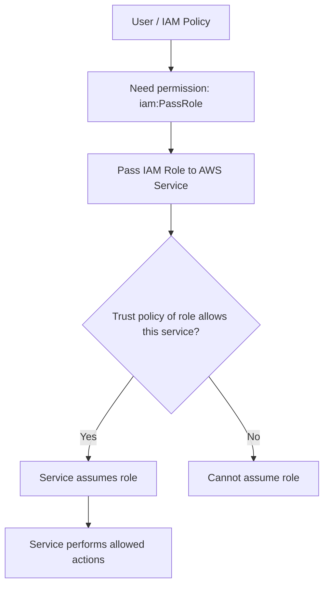

# 406. Granting a User Permissions to Pass a Role to an AWS Service

## 🎯 Giới thiệu
- Đây là một cơ chế rất hay gặp trong AWS IAM: **gán IAM role cho một AWS service** để service đó có thể **assume the role** và thực hiện các hành động cần thiết.
- Khi làm việc với **EC2 instance role**, **Lambda execution role**, hoặc **CodePipeline role**, thực chất là đang **pass a role** cho service đó.
- Điểm cốt lõi của bài này là:
  - Người dùng cần quyền **`iam:PassRole`** để pass role.
  - Role chỉ có thể được pass cho service phù hợp với **trust policy** của role.

## 1. `iam:PassRole` và `iam:GetRole` 🛠️
- Khi muốn **pass một role cho một AWS service**, cần quyền IAM:
  - **`iam:PassRole`**: quyền chính để pass role.
  - Thường đi kèm **`iam:GetRole`**: để xem thông tin role đang được pass.
- Ví dụ trong transcript:
  - Một IAM policy có thể cho phép thao tác trên **EC2**.
  - Đồng thời chỉ cho phép pass đúng một role cụ thể, ví dụ **`S3Access`**.
- Ý nghĩa thực tế:
  - Không phải role nào cũng được gán tùy ý.
  - User chỉ có thể gán những role mà policy cho phép qua `iam:PassRole`.

## 2. Trust policy quyết định service nào được assume role 🔐
- Không phải service nào cũng nhận được bất kỳ role nào.
- Một role chỉ có thể được pass nếu **trust policy** của role cho phép service đó **assume** role.
- **Trust policy** là policy gắn với role, dùng để xác định:
  - Service nào là **trusted entity**
  - Service nào được phép assume role đó
- Ví dụ từ transcript:
  - Với role cho **EC2**, trust policy cho phép **`ec2.amazonaws.com`** assume role.
  - Với role cho **CodePipeline**, trust policy cho phép **`codepipeline.amazonaws.com`** assume role.
  - Với role cho **Lambda**, trust policy cho phép **`lambda.amazonaws.com`** assume role.

## 3. Quy trình đúng để pass role cho AWS service ⚙️
- Để một service dùng được role, cần đủ **2 điều kiện**:
  1. Tạo **trust relationship** đúng để service đó được phép assume role.
  2. User phải có quyền **`iam:PassRole`** để pass role cho service.
- Quy trình logic:
  - Tạo role
  - Thiết lập trust policy cho đúng service
  - Gán quyền `iam:PassRole` cho user hoặc principal cần thực hiện việc pass role
  - Service nhận role, assume role, rồi thực hiện các hành động cần thiết

## 📊 Bảng tóm tắt
| Tiêu chí | Mô tả |
|----------|------|
| Mục đích | Cho phép một AWS service nhận và dùng IAM role |
| Quyền IAM cần có | `iam:PassRole`, thường kèm `iam:GetRole` |
| Vai trò của trust policy | Xác định service nào được phép assume role |
| Trusted entity | Service cụ thể như `ec2.amazonaws.com`, `lambda.amazonaws.com`, `codepipeline.amazonaws.com` |
| Điều kiện thành công | Vừa có `iam:PassRole` vừa có trust policy phù hợp |
| Ví dụ dịch vụ | EC2, Lambda, CodePipeline |

## 💡 Mẹo ghi nhớ cho kỳ thi AWS
- Nhớ công thức:
  - **Pass role = `iam:PassRole`**
  - **Assume role = trust policy**
- Nếu câu hỏi hỏi:
  - “User cần quyền gì để gán role cho service?” → nghĩ ngay đến **`iam:PassRole`**
  - “Service nào được phép assume role?” → xem **trust policy**
- Đừng nhầm:
  - **Permission policy** cho biết user được làm gì
  - **Trust policy** cho biết ai được phép assume role
- Trong đề thi, nếu role không gán được cho service, hãy kiểm tra:
  - trust relationship có đúng service chưa
  - user có `iam:PassRole` chưa

## ✅ Kết luận
- Để gán một IAM role cho AWS service, cần hiểu rõ **2 lớp kiểm soát**:
  - **`iam:PassRole`** cho user/principal thực hiện hành động pass role
  - **trust policy** của role để service được phép assume role
- Đây là nền tảng quan trọng khi làm việc với **EC2**, **Lambda**, **CodePipeline** và nhiều AWS service khác trong các câu hỏi AWS exam.
