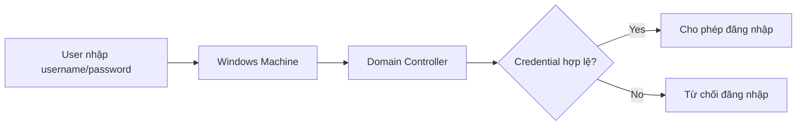
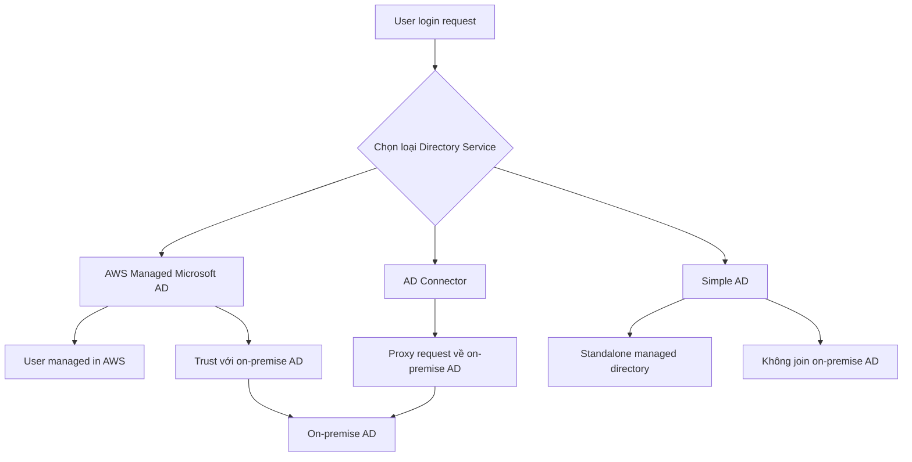

# 407. AWS Directory Services

## 🎯 Giới thiệu
AWS Directory Services là dịch vụ giúp bạn tạo và dùng directory/Active Directory trên AWS, đặc biệt hữu ích khi làm việc với **Windows EC2 instances** và nhu cầu quản lý user, password, permission tập trung.

Transcript tập trung vào 3 lựa chọn chính trong **Directory Service**:
- **AWS Managed Microsoft AD**
- **AD Connector**
- **Simple AD**

Ngoài ra, transcript có nhắc đến **Amazon Cognito User Pool** trong console, nhưng đây **không được tính là một phần của Directory Services** trong bài này.

## 1. Microsoft Active Directory là gì? 🏢
Microsoft Active Directory (AD) là một software có trên **Windows Server với AD Domain Services**.

### Đặc điểm chính
- Là một **database of objects**
- Object có thể là:
  - user accounts
  - computers
  - printers
  - file shares
  - security groups
- Dùng để quản lý user trong toàn bộ Microsoft ecosystem on-premise
- Có **centralized security management**
  - tạo account
  - assign permissions
- Object được tổ chức theo **tree**
- Một group of tree được gọi là **forest**

### Ý tưởng hoạt động
- Có một **domain controller**
- User được tạo trên domain controller
- Các Windows machines trong network sẽ kết nối đến domain controller
- Khi đăng nhập, máy sẽ kiểm tra credential trên controller để xác thực
- Kết quả: user có thể đăng nhập trên nhiều máy trong cùng network

## 2. Các loại AWS Directory Services 🔐
AWS Directory Services cung cấp 3 lựa chọn chính với mục đích khác nhau:

### 2.1 AWS Managed Microsoft AD
- Tạo **own active directory in AWS**
- **Manage users locally** trên AWS
- Hỗ trợ **MFA**
- Có thể tạo **trust connection** với on-premise AD
- Ý nghĩa trust:
  - AWS AD tin cậy on-premise AD
  - on-premise AD cũng tin cậy AWS AD
- User có thể được kiểm tra qua hệ thống còn lại nếu cần

### 2.2 AD Connector
- Là một **direct gateway proxy**
- Dùng để **redirect authentication request** về on-premise AD
- Hỗ trợ **MFA**
- User **chỉ được manage trên on-premise AD**
- AWS không lưu user management chính, chỉ proxy request

### 2.3 Simple AD
- Là một **AD-compatible managed directory on AWS**
- **Không dùng Microsoft directory**
- **Không thể join với on-premise active directory**
- Phù hợp khi:
  - không có on-premise AD
  - chỉ cần directory standalone cho AWS cloud

### Flow so sánh hoạt động

## 3. Các điểm cần nhớ khi ôn thi AWS 🧠
### AWS Managed Microsoft AD
- Có **MFA**
- Có thể **trust** với on-premise AD
- Có 2 edition:
  - **Standard edition**: up to **30,000 objects**
  - **Enterprise edition**: up to **500,000 objects**

### AD Connector
- Là **proxy** cho directory request
- Redirect về **existing Microsoft AD on-premise**
- Có 2 mức:
  - up to **500 users**
  - up to **5,000 users**

### Simple AD
- Standalone
- AD-compatible API
- **Không connect với on-premise AD**

### Khi nào chọn gì?
- Cần **proxy user về on-premise** → chọn **AD Connector**
- Cần **manage user trên AWS** và có **MFA** → chọn **AWS Managed Microsoft AD**
- Chỉ cần **directory đơn giản, không có on-premise** → chọn **Simple AD**

## 📊 Bảng tóm tắt
| Tiêu chí | Mô tả |
|----------|------|
| **AWS Managed Microsoft AD** | Managed Active Directory trên AWS, có MFA, có thể trust với on-premise AD |
| **AD Connector** | Proxy/gateway redirect request về on-premise AD, user chỉ manage ở on-premise |
| **Simple AD** | Directory standalone trên AWS, AD-compatible nhưng không join on-premise AD |
| **Standard edition** | Tối đa 30,000 objects |
| **Enterprise edition** | Tối đa 500,000 objects |
| **AD Connector limit** | Up to 500 users hoặc 5,000 users |
| **MFA** | Có trong AWS Managed Microsoft AD và AD Connector |
| **On-premise integration** | Có với AWS Managed Microsoft AD và AD Connector, không có với Simple AD |

## 💡 Mẹo ghi nhớ cho kỳ thi AWS
- **Managed = Manage user trên AWS** → nhớ ngay **AWS Managed Microsoft AD**
- **Connector = Connect/Proxy** → nhớ ngay **AD Connector**
- **Simple = Standalone** → nhớ ngay **Simple AD**
- Nếu đề bài nhấn mạnh:
  - **trust với on-premise** → **AWS Managed Microsoft AD**
  - **redirect request về on-premise** → **AD Connector**
  - **không có on-premise, chỉ cần directory đơn giản** → **Simple AD**
- Từ khóa thi rất hay gặp: **MFA**, **trust relationship**, **proxy**, **standalone**, **on-premise**

## ✅ Kết luận
AWS Directory Services trong transcript chủ yếu xoay quanh việc chọn đúng loại directory cho đúng nhu cầu:
- **AWS Managed Microsoft AD**: quản lý directory trên AWS, hỗ trợ MFA và trust
- **AD Connector**: proxy request về on-premise AD
- **Simple AD**: directory đơn giản, standalone trên AWS

Nếu nắm được 3 keyword này:
- **Manage**
- **Proxy**
- **Standalone**

thì bạn sẽ dễ chọn đáp án đúng trong câu hỏi AWS exam.
