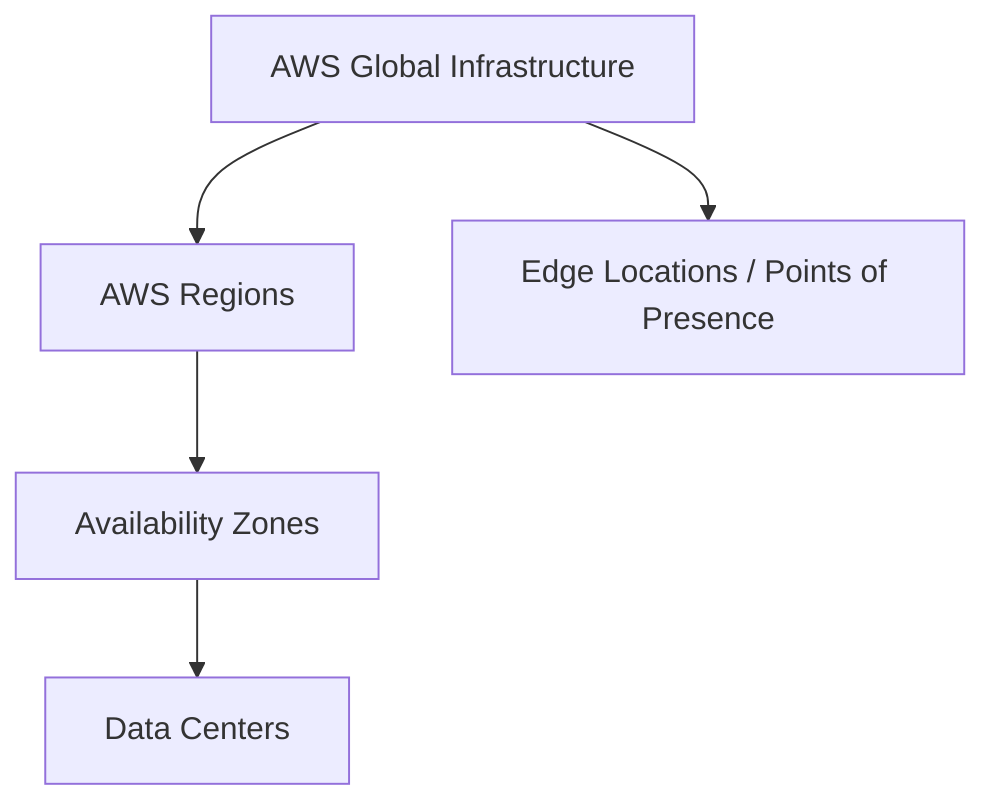

# 8. AWS Cloud Overview - Regions & AZ

## 🎯 Giới thiệu

Bài học giới thiệu tổng quan về AWS Cloud, lịch sử hình thành, vị thế thị trường, các use case phổ biến và những khái niệm nền tảng của AWS global infrastructure: **Regions**, **Availability Zones**, **Data Centers**, **Edge Locations** và **Points of Presence**.

## 1. AWS Cloud và vị thế trên thị trường

AWS bắt đầu từ nhu cầu nội bộ của Amazon.com, khi Amazon nhận ra năng lực hạ tầng IT có thể được cung cấp như một dịch vụ cho bên ngoài.

📌 Các mốc chính:

- **2002**: AWS được khởi động nội bộ tại Amazon.com.
- **2004**: Dịch vụ công khai đầu tiên là **SQS**.
- **2006**: AWS mở rộng với **SQS**, **S3** và **EC2**.
- AWS tiếp tục mở rộng ra ngoài nước Mỹ, bao gồm cả châu Âu và nhiều khu vực khác.

Theo transcript, AWS là leader trong **Gartner Magic Quadrant**, có doanh thu khoảng **$90 billion năm 2023**, chiếm khoảng **31% market share trong Q1 2024**, là pioneer và leader trong **13 năm liên tiếp**, với hơn **1 million active users**.

## 2. Có thể xây dựng gì trên AWS?

AWS cho phép xây dựng các ứng dụng phức tạp, có khả năng mở rộng và phù hợp với nhiều ngành khác nhau.

Các ví dụ được nhắc đến:

- Dropbox
- Netflix
- Airbnb
- NASA
- McDonald's
- 21st Century Fox
- Activision

📌 Use cases phổ biến:

- Chuyển đổi enterprise IT lên cloud.
- Backup và storage.
- Big data analytics.
- Host website.
- Backend cho mobile application và social application.
- Gaming servers chạy trên cloud.

## 3. AWS Global Infrastructure

AWS là một nền tảng global, gồm nhiều thành phần hạ tầng được phân bố trên toàn thế giới.

Các thành phần chính:

- **AWS Regions**
- **Availability Zones**
- **Data Centers**
- **Edge Locations**
- **Points of Presence**

Các **Regions** được kết nối với nhau thông qua private network của AWS. Bên trong mỗi Region có nhiều **Availability Zones**.

## 4. AWS Regions

**Region** là một cụm data centers nằm tại một khu vực địa lý, ví dụ như Ohio, Singapore, Sydney hoặc Tokyo.

Mỗi Region có một tên và mã định danh, ví dụ:

- **us-east-1**
- **eu-west-3**
- **ap-southeast-2**

Phần lớn AWS services có phạm vi theo **Region**. Điều này có nghĩa là nếu sử dụng một service trong Region này rồi chuyển sang Region khác, bạn sẽ thấy như đang dùng một môi trường mới của service đó.

## 5. Cách chọn AWS Region

Khi triển khai ứng dụng, việc chọn Region phụ thuộc vào nhiều yếu tố.

📌 Các tiêu chí quan trọng:

- **Compliance**: Một số yêu cầu pháp lý bắt buộc data phải ở trong cùng quốc gia hoặc khu vực. Ví dụ, data tại France có thể cần nằm trong France.
- **Latency**: Nên triển khai gần người dùng để giảm độ trễ. Nếu user ở America nhưng application chạy ở Australia, trải nghiệm có thể bị lag.
- **Service availability**: Không phải Region nào cũng có tất cả AWS services. Cần kiểm tra service có khả dụng trong Region định dùng hay không.
- **Pricing**: Giá có thể khác nhau giữa các Region, nên cần kiểm tra pricing page của service.

## 6. Availability Zones

Mỗi Region có nhiều **Availability Zones**, thường là **3**, tối thiểu **3** và tối đa **6**.

Ví dụ với Sydney Region:

- Region code: **ap-southeast-2**
- Availability Zones:
  - **ap-southeast-2a**
  - **ap-southeast-2b**
  - **ap-southeast-2c**

Mỗi Availability Zone gồm một hoặc nhiều discrete data centers, có **redundant power**, **networking** và **connectivity**.

📌 Điểm quan trọng:

- Các Availability Zones được tách biệt để cô lập sự cố.
- Nếu có sự cố ở **ap-southeast-2a**, thiết kế nhằm tránh lan sang **ap-southeast-2b** hoặc **ap-southeast-2c**.
- Các Availability Zones được kết nối bằng mạng **high bandwidth** và **ultra-low latency**.

## 7. Edge Locations và Points of Presence

AWS có hơn **400 Points of Presence** tại **90 cities** trên **40 countries**.

Các **Points of Presence** và **Edge Locations** giúp phân phối nội dung đến end users với độ trễ thấp nhất có thể. Nội dung này sẽ được học chi tiết hơn trong phần global của khóa học.

## 8. Global services và Region-scoped services

Một số AWS services là **global services**, trong khi phần lớn services khác là **Region scoped**.

Ví dụ global services:

- **IAM**
- **Route 53**
- **CloudFront**
- **WAF**

Ví dụ Region-scoped services:

- **Amazon EC2**
- **Elastic Beanstalk**
- **Lambda**
- **Rekognition**

Để biết một service có sẵn trong Region nào, cần kiểm tra **AWS Region Table**.

## 📊 Bảng tóm tắt

| Tiêu chí | Mô tả |
|----------|------|
| AWS khởi đầu | Bắt đầu nội bộ tại Amazon.com năm 2002 |
| Dịch vụ công khai đầu tiên | SQS năm 2004 |
| Dịch vụ mở rộng năm 2006 | SQS, S3, EC2 |
| Region | Cụm data centers trong một khu vực địa lý |
| Availability Zone | Một hoặc nhiều data centers tách biệt trong Region |
| AZ mỗi Region | Thường là 3, tối thiểu 3, tối đa 6 |
| Edge Locations / Points of Presence | Hỗ trợ phân phối nội dung với latency thấp |
| Global services | IAM, Route 53, CloudFront, WAF |
| Region-scoped services | EC2, Elastic Beanstalk, Lambda, Rekognition |

## 💡 Mẹo ghi nhớ cho kỳ thi AWS

- Khi câu hỏi nhắc đến chọn Region, hãy nghĩ đến **compliance**, **latency**, **service availability** và **pricing**.
- Phần lớn AWS services là **Region scoped**, nhưng một số service như **IAM**, **Route 53**, **CloudFront** và **WAF** là **global**.
- **Availability Zones** được thiết kế để cách ly sự cố và được kết nối bằng mạng tốc độ cao, độ trễ thấp.

## ✅ Kết luận

AWS là cloud provider toàn cầu với hạ tầng gồm Regions, Availability Zones, Data Centers, Edge Locations và Points of Presence. Đối với kỳ thi AWS Certified Developer Associate DVA-C02, cần nắm rõ sự khác nhau giữa **global services** và **Region-scoped services**, cách chọn Region và vai trò của Availability Zones trong việc tăng khả năng chịu lỗi.
