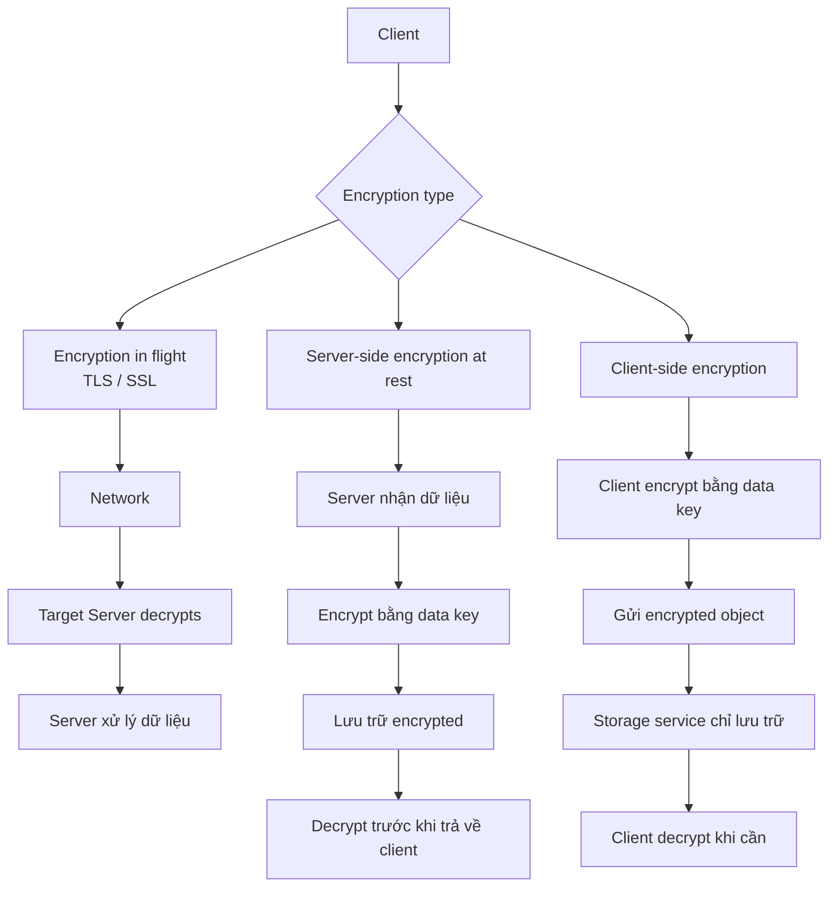

# 409. Encryption 101

## 🎯 Giới thiệu
Bài này giới thiệu 3 cơ chế encryption ở mức tổng quan để ôn thi AWS:

- **Encryption in flight**: dữ liệu được mã hóa khi đang truyền qua network
- **Server-side encryption at rest**: dữ liệu được mã hóa sau khi server nhận và lưu trữ
- **Client-side encryption**: dữ liệu được mã hóa và giải mã ngay ở phía client

Mục tiêu là hiểu rõ **nơi mã hóa/giải mã xảy ra** và **ai có thể đọc được dữ liệu**.

## 1. 🔐 Encryption in Flight
Đây là kiểu mã hóa khi dữ liệu di chuyển giữa **client** và **server**.

- Còn được gọi là **TLS** hoặc **SSL**
- **TLS** là phiên bản mới hơn của **SSL**
- Dữ liệu được **encrypt trước khi gửi**
- Dữ liệu được **decrypt sau khi nhận**
- Thường thấy dưới dạng **HTTPS**
- **TLS certificates** được dùng để thực hiện mã hóa

### Vì sao cần?
- Dữ liệu đi qua network, có thể là **public network**
- Dữ liệu có thể đi qua nhiều server trung gian
- Tránh **man in the middle attacks**
- Chỉ **target server** mới có thể decrypt dữ liệu

### Ví dụ trong transcript
- Client gửi **username/password**
- Client-side tự động áp dụng **TLS encryption**
- Dữ liệu đi qua network ở dạng mã hóa
- Chỉ server đích mới decrypt được và đọc được thông tin đăng nhập

## 2. 🗄️ Server-side Encryption at Rest
Đây là kiểu mã hóa khi dữ liệu đã được server nhận và được lưu trữ.

- Dữ liệu được **encrypt sau khi server nhận**
- Dữ liệu được **decrypt trước khi gửi lại cho client**
- Dữ liệu được lưu ở dạng mã hóa nhờ một **key**
- Key này thường là **data key**
- Việc quản lý key phải được hệ thống/server truy cập được

### Ví dụ trong transcript với Amazon S3
- Gửi object lên S3 qua **HTTP**
- Có thể có thêm **HTTPS** cho encryption in flight
- S3 nhận object ở dạng đã decrypt
- Server dùng **data key** để mã hóa object khi lưu
- Khi trả lại cho client:
  - object mã hóa + data key được dùng để decrypt
  - object được đưa về dạng decrypt
  - sau đó gửi lại qua **HTTPS**

### Ý chính
- Toàn bộ quá trình mã hóa và giải mã diễn ra ở **server**
- Dữ liệu lưu trữ ở trạng thái **encrypted form**

## 3. 🧑‍💻 Client-side Encryption
Đây là kiểu mã hóa mà client tự thực hiện trước khi gửi dữ liệu.

- Dữ liệu được **encrypt và decrypt ở phía client**
- **Server không được phép decrypt dữ liệu**
- Phù hợp khi không muốn tin tưởng server

### Cách hoạt động
- Client có object và **data key**
- Client encrypt object thành **encrypted object**
- Object mã hóa có thể gửi đến:
  - **FTP server**
  - **Amazon S3**
  - **EBS volumes**
  - hoặc storage service khác
- Server chỉ lưu trữ dữ liệu ở dạng mã hóa
- Khi lấy lại dữ liệu:
  - nhận lại encrypted object
  - nếu còn data key ở client
  - client decrypt để lấy object gốc

### Ý chính
- Server **không thể đọc contents**
- Chỉ client giữ khả năng decrypt nếu còn **data key**

## 4. 🔁 Flow Tổng Quan

## 📊 Bảng tóm tắt
| Tiêu chí | Mô tả |
|----------|------|
| **Encryption in flight** | Mã hóa khi dữ liệu di chuyển qua network, dùng **TLS/SSL** và thường thấy qua **HTTPS** |
| **Server-side encryption at rest** | Mã hóa sau khi server nhận dữ liệu và trước khi lưu trữ |
| **Client-side encryption** | Client tự mã hóa và giải mã; server không thể đọc nội dung |
| **Mục tiêu chính** | Bảo vệ dữ liệu khi truyền tải, lưu trữ, hoặc khi không muốn server đọc được dữ liệu |
| **Thuật ngữ quan trọng** | **TLS**, **SSL**, **HTTPS**, **TLS certificates**, **data key** |

## 💡 Mẹo ghi nhớ cho kỳ thi AWS
- **In flight = đang đi trên network** → nhớ **TLS / HTTPS**
- **At rest = đang nằm trong storage** → nhớ **server-side encryption**
- **Client-side = client tự giữ quyền đọc dữ liệu** → server chỉ thấy dữ liệu mã hóa
- Nếu đề bài nói về **man in the middle**, nghĩ ngay đến **encryption in flight**
- Nếu đề bài nói về **lưu trữ an toàn**, nghĩ đến **encryption at rest**
- Nếu đề bài nhấn mạnh **server không được decrypt**, đó là **client-side encryption**

## ✅ Kết luận
Bài học này tập trung vào 3 cơ chế encryption cơ bản trong Cloud:

- **Encryption in flight** bảo vệ dữ liệu khi truyền qua network
- **Server-side encryption at rest** bảo vệ dữ liệu khi lưu trữ trên server
- **Client-side encryption** giữ quyền mã hóa/giải mã ở phía client

Điểm quan trọng nhất để ôn thi là xác định đúng **nơi mã hóa và giải mã xảy ra** trong từng mô hình.
