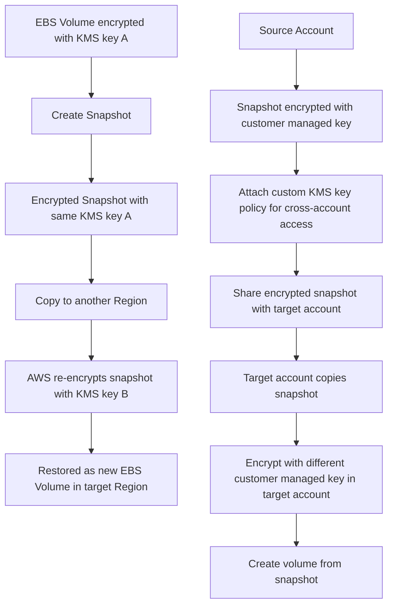

# 410. KMS Overview

## 🎯 Giới thiệu
- **AWS KMS (Key Management Service)** là dịch vụ quản lý key của AWS.
- Mục tiêu chính: **AWS quản lý encryption keys** thay cho bạn, giúp giảm việc phải tự xử lý bảo mật.
- KMS được dùng rất nhiều trong các dịch vụ AWS khi nhắc đến **encryption**.
- KMS **tích hợp chặt với IAM** để kiểm soát authorization.
- Một điểm rất quan trọng cho kỳ thi: có thể **audit mọi API call** dùng key thông qua **CloudTrail**.
- KMS dùng được trong nhiều dịch vụ AWS như:
  - **EBS** encryption at rest
  - **S3**
  - **RDS**
  - **SSM**
  - gần như mọi dịch vụ cần encryption
- Bạn cũng có thể tự dùng KMS thông qua:
  - **API calls**
  - **AWS CLI**
  - **SDK**
- Pattern tốt: không lưu secret ở dạng plain text trong code, mà **encrypt secret bằng KMS key** rồi lưu trong code hoặc environment variables.

## 1. 🔑 Các loại KMS key
- Hiện tại gọi là **KMS key**.
- Trước đây từng gọi là **KMS customer master key**, nhưng cách gọi này dễ gây nhầm lẫn.
- Có 2 loại chính:

| Loại key | Mô tả |
|----------|------|
| **Symmetric KMS keys** | Chỉ có **1 key** dùng để cả encrypt và decrypt. Đây là loại được các AWS services tích hợp với KMS sử dụng. Khi tạo hoặc dùng key, bạn **không truy cập trực tiếp vào key**, chỉ dùng qua KMS API calls. |
| **Asymmetric keys** | Có **public key** để encrypt và **private key** để decrypt. Dùng cho các kiểu **encrypt/decrypt** hoặc **sign/verify**. Public key có thể download ra, còn private key chỉ truy cập qua API calls. |

- **Asymmetric key** phù hợp khi việc encrypt diễn ra **bên ngoài AWS cloud**, bởi người dùng không có quyền truy cập KMS API private key.
- Luồng sử dụng:
  - người dùng bên ngoài dùng **public key** để encrypt
  - gửi dữ liệu vào AWS
  - bạn dùng **private key** trong account để decrypt

## 2. 💰 Phân loại key, giá và rotation
- Trong thế giới KMS key có các loại sau:

| Loại key | Mô tả | Chi phí |
|----------|------|---------|
| **AWS owned keys** | Key do AWS sở hữu, thường xuất hiện trong các kiểu encryption như **SSE-S3** hoặc **DynamoDB encryption** | **Free** |
| **AWS managed keys** | Key do AWS quản lý, nhận diện bằng prefix như `AWS/RDS`, `AWS/EBS`, `AWS/DynamoDB` | **Free** |
| **Customer managed keys** | Key do bạn tự tạo và quản lý | **$1 per month** |
| **Imported keys** | Key bạn import vào | **$1 per month** |

- **KMS API calls** cũng tính phí:
  - khoảng **3 cents per 10,000 API calls**
- **Automatic key rotation**:
  - **AWS managed KMS key**: tự động rotation **mỗi 1 năm**
  - **Customer managed key**: có thể bật automatic rotation và tự chọn chu kỳ, cũng có thể **on-demand rotation**
  - **Imported KMS key**: chỉ **manual rotation**
- Với rotation cho imported key, cần dùng **alias**

## 3. 🌍 Region scope, policy và cross-account flow
- **KMS keys là regional**.
- Một KMS key không thể “sống” ở 2 region cùng lúc.
- Nếu muốn copy một **encrypted EBS snapshot** sang region khác:
  - tạo snapshot từ EBS volume đã encrypt
  - snapshot cũng được encrypt bằng cùng KMS key
  - AWS sẽ **re-encrypt** snapshot bằng KMS key khác khi copy sang region khác
  - restore snapshot thành EBS volume mới ở region đích

### 🔄 Flow copy snapshot cross-region / cross-account

### 🛡️ KMS key policies
- **KMS key policy** dùng để kiểm soát access vào KMS key.
- Tương tự **S3 bucket policy**.
- Điểm khác rất quan trọng:
  - nếu **không có KMS key policy** trên key, thì **không ai** access được
- Có 2 kiểu:
  - **Default policy**:
    - được tạo nếu bạn không cung cấp custom policy
    - cho phép **everyone in your account** access key
    - nếu IAM policy đã allow user/role dùng key thì có thể dùng được
  - **Custom key policy**:
    - chỉ định rõ **users**, **roles** nào được access key
    - chỉ định ai được **administer** key
    - hữu ích cho **cross-account access**
- Use case cross-account:
  - tạo snapshot encrypted bằng **customer managed key**
  - attach **custom key policy**
  - share encrypted snapshot sang target account
  - target account copy snapshot và encrypt lại bằng **customer managed key** của chính họ
  - tạo volume từ snapshot ở target account

## 📊 Bảng tóm tắt
| Tiêu chí | Mô tả |
|----------|------|
| Mục đích của KMS | AWS quản lý encryption keys cho bạn |
| Tích hợp | IAM, CloudTrail, nhiều AWS services |
| Loại key chính | **Symmetric keys** và **Asymmetric keys** |
| Loại key theo quản lý | **AWS owned**, **AWS managed**, **Customer managed**, **Imported** |
| Chi phí | AWS owned / AWS managed: free; Customer managed / Imported: **$1/month** |
| API call cost | Khoảng **3 cents / 10,000 API calls** |
| Rotation | AWS managed: tự động 1 năm; Customer managed: bật tự động hoặc on-demand; Imported: manual |
| Scope | **Regional** |
| Policy | **KMS key policy** quyết định ai được access key |
| Cross-account | Dùng **custom key policy** để authorize account khác |

## 💡 Mẹo ghi nhớ cho kỳ thi AWS
- Nhớ rằng **KMS = key management + encryption control + auditing**.
- Gặp câu hỏi về **encryption với AWS services** như EBS, S3, RDS, SSM thì nghĩ ngay đến **KMS integration**.
- Nếu đề bài hỏi về **audit key usage**, đáp án thường liên quan đến **CloudTrail**.
- Nếu nói đến **public key / private key**, **sign/verify**, hoặc encrypt bên ngoài AWS thì đó là **Asymmetric keys**.
- Nếu key được dùng bởi dịch vụ AWS và bạn không thấy trực tiếp key, thường là **Symmetric KMS key**.
- Nhớ phân biệt:
  - **AWS managed key**: free, tên dạng `AWS/...`
  - **Customer managed key**: bạn quản lý, mất phí
- **KMS key policy** rất quan trọng:
  - không có policy thì không ai access được
  - dùng **custom policy** khi cần kiểm soát chặt hoặc **cross-account**
- KMS key là **regional**, nên khi copy giữa region phải nghĩ tới bước **re-encrypt**.

## ✅ Kết luận
- **AWS KMS** là dịch vụ quản lý encryption keys, tích hợp sâu với **IAM**, **CloudTrail** và nhiều dịch vụ AWS.
- Có hai loại key chính: **Symmetric** và **Asymmetric**.
- Về quản lý và chi phí, cần nhớ các nhóm key: **AWS owned**, **AWS managed**, **Customer managed**, **Imported**.
- KMS key là **regional**, và **KMS key policy** là thành phần cốt lõi để kiểm soát access, đặc biệt trong bài toán **cross-account** và snapshot encryption.
