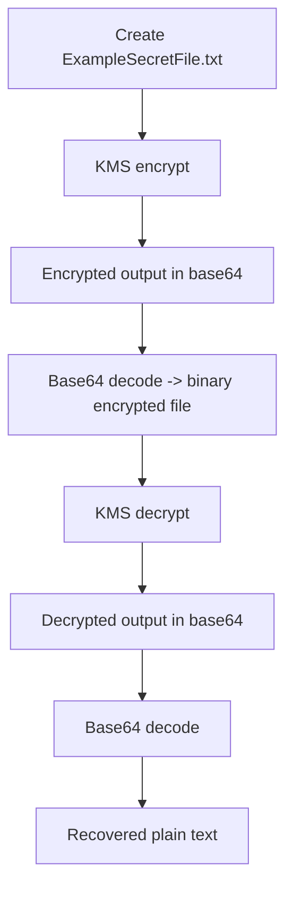

# 411. KMS Hands On w/ CLI

## 🎯 Giới thiệu
Bài này demo cách làm việc với **AWS KMS** theo hướng thực hành:

- Quan sát **AWS managed keys** trong console
- Tạo **customer managed key** của riêng mình
- Hiểu vai trò của **key policy**
- Dùng **AWS CLI** để **encrypt** và **decrypt** một file
- Thấy rõ luồng **base64 encode/decode** khi làm việc với dữ liệu mã hóa

## 1. AWS managed keys và key policy
### 🔑 AWS managed keys
- AWS managed keys xuất hiện khi đã dùng KMS encryption trong course.
- Ví dụ:
  - **EBS managed key**: thuộc về EBS service
  - **SQS managed key**: thuộc về SQS service

### 📜 Key policy
- Mỗi key có **key policy**, tương tự như **IAM policy** cho KMS key.
- Policy xác định:
  - Ai được truy cập key
  - Service nào được phép gọi key
  - Điều kiện truy cập

### 🧩 Điều kiện quan trọng trong policy
- Với **EBS key**:
  - Caller account phải là account của mình
  - **Via Service** phải là **EC2**
- Với **SQS key**:
  - **Via Service** phải là **SQS**

### 🔐 Cryptographic configuration
- Key được mô tả là:
  - **symmetric**
  - dùng để **encrypt** và **decrypt**

## 2. Tạo customer managed key
### 🛠️ Các loại key được nhắc đến
- **Customer managed keys**
- **Custom key store**: dùng với **CloudHSM**, nhưng phần này **out of scope**

### ⚙️ Lựa chọn khi tạo key
- **Key type**
  - **Symmetric**: dùng cho encrypt/decrypt
  - **Asymmetric**: có thể dùng cho encrypt/decrypt hoặc sign/verify, nhưng không đi sâu
- **Key origin**
  - **KMS**: để KMS tự tạo key
  - Các kiểu khác như import key / custom key store không đi sâu
- **Regionality**
  - Chọn **single region key**
  - Đây là kiểu phổ biến và cơ bản nhất trong bài
- **Key alias**
  - Đặt alias là `tutorial`

### 👮 Key administrators và key users
- Có thể cấu hình:
  - **Key administrators**
  - Ai được dùng key
  - Có cho account khác truy cập hay không
- Nếu không cấu hình gì thêm:
  - Sẽ dùng **default KMS key policy**
- Default policy này cho phép sử dụng KMS nếu có **IAM permissions** phù hợp

### ♻️ Key rotation
- Có thể bật **automatic key rotation**
- Có thể chỉnh chu kỳ rotation từ **90 days** đến **2560 days**
- Có thể trigger **on-demand key rotation**
- Lịch sử rotation sẽ xuất hiện trong **key rotation history**

### ⛔ Key actions
- Có thể:
  - **Disable** key
  - **Schedule key deletion**

## 3. Encrypt và decrypt bằng CLI
### 📝 Tạo file gốc
- Tạo file `ExampleSecretFile.txt`
- Nội dung ví dụ: `SuperSecretPassword`

### 🔒 Encrypt
- Dùng lệnh **KMS encrypt**
- Cần chỉ định:
  - **key ID**: có thể dùng `alias/tutorial`, key ID, hoặc full ARN
  - **plaintext**: file đầu vào
  - **query** để lấy phần **CiphertextBlob**
  - **region**
- Output ban đầu là file **base64** chứa nội dung đã mã hóa

### 🧱 Base64 decode sau khi encrypt
- Decode file base64 để tạo file binary:
  - `ExampleSecretFileEncrypted`
- File này không đọc được như text bình thường vì là binary/unsupported encoding

### 🔓 Decrypt
- Dùng **KMS decrypt**
- Truyền vào:
  - file binary đã mã hóa
  - query lấy **Plaintext**
  - output ra file base64 khác
  - region
- KMS tự biết key nào cần dùng vì key information đã nằm trong encrypted blob

### 📄 Base64 decode sau khi decrypt
- Decode file decrypted base64 để lấy lại file text gốc
- Kết quả là nội dung ban đầu: `SuperSecretPassword`

### 🧠 Ý nghĩa thực hành
- Đây là mức low-level của KMS CLI
- SDK sẽ abstract nhiều bước này
- Ví dụ cho thấy rõ luồng **encrypt -> binary encrypted file -> decrypt -> plain text**

## 📊 Bảng tóm tắt
| Tiêu chí | Mô tả |
|----------|------|
| AWS managed keys | Key do AWS quản lý cho từng service như EBS, SQS |
| Key policy | Policy điều khiển ai được truy cập key và qua service nào |
| Customer managed key | Key do người dùng tạo trực tiếp trong KMS |
| Key type | Bài này dùng **symmetric** để encrypt/decrypt |
| Key origin | Chọn **KMS** để KMS tự tạo key |
| Regionality | Dùng **single region key** |
| Alias | Key được đặt alias là `tutorial` |
| Rotation | Có **automatic rotation** và **on-demand rotation** |
| CLI flow | `encrypt` -> base64 decode -> binary file -> `decrypt` -> base64 decode |
| Kết quả | Khôi phục lại nội dung gốc của file secret |

## 💡 Mẹo ghi nhớ cho kỳ thi AWS
- **Key policy** là phần rất quan trọng của KMS, không chỉ là IAM policy thông thường.
- Nhớ điều kiện **Via Service** khi AWS service dùng AWS managed key.
- **Customer managed key** cho phép bạn tự tạo và kiểm soát key trong KMS.
- **Symmetric key** là lựa chọn cơ bản cho **encrypt/decrypt**.
- Nếu thấy file encrypted output ở dạng **base64** hoặc binary, đó là luồng bình thường khi dùng KMS CLI.
- **KMS decrypt** có thể tự xác định key từ encrypted blob, không cần luôn chỉ rõ key thủ công.
- Bật **key rotation** khi muốn quản lý lifecycle của key rõ ràng hơn.
- `alias/...` thường tiện hơn ARN dài khi tham chiếu key trong thao tác CLI.

## ✅ Kết luận
Bài này tập trung vào cách **KMS hoạt động ở mức thực hành**: hiểu **AWS managed key**, tạo **customer managed key**, xem **key policy**, bật **key rotation**, và dùng **CLI** để **encrypt/decrypt** một file. Đây là nền tảng quan trọng để ôn thi AWS và hiểu luồng xử lý dữ liệu mã hóa bằng KMS.
