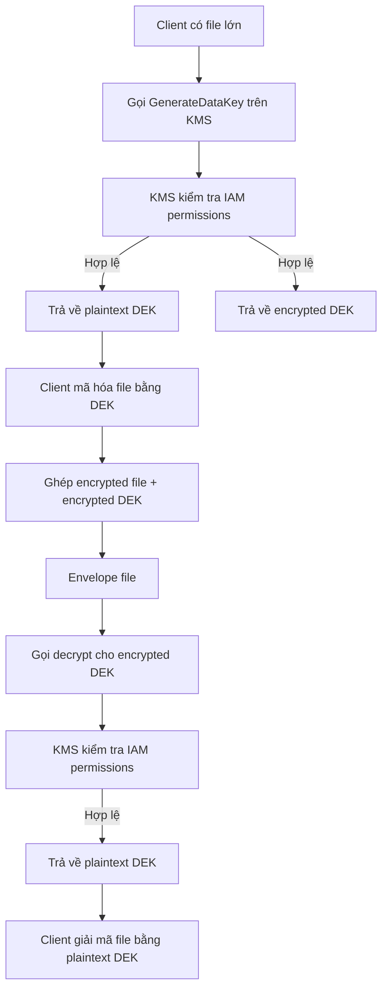

# 412. KMS Encryption Patterns and Envelope Encryption

## 🎯 Giới thiệu
Bài này giải thích cách KMS xử lý `encrypt` / `decrypt` API và cách dùng `envelope encryption` cho dữ liệu lớn hơn giới hạn `4 kilobytes`.

Mấu chốt cần nhớ cho kỳ thi AWS:
- `encrypt` / `decrypt` dùng trực tiếp cho dữ liệu nhỏ, tối đa `4 KB`
- Dữ liệu lớn phải dùng `GenerateDataKey` theo mô hình `envelope encryption`
- KMS luôn kiểm tra quyền qua `IAM` trước khi thực hiện thao tác

## 1. `Encrypt` và `Decrypt` với KMS
### 🔐 Encrypt
- Gửi secret như password lên `KMS` bằng `SDK` hoặc `CLI`
- Chỉ áp dụng cho dữ liệu nhỏ hơn `4 KB`
- Chỉ định `CMK` muốn dùng
- `KMS` kiểm tra quyền với `IAM`
- Nếu hợp lệ, `KMS` trả về dữ liệu đã mã hóa

### 🔓 Decrypt
- Gọi `decrypt` bằng `SDK` hoặc `CLI`
- `KMS` tự nhận biết `CMK` đã dùng lúc mã hóa
- `KMS` kiểm tra quyền với `IAM`
- Nếu hợp lệ, `KMS` trả về secret dạng plain-text

### ✅ Ý nghĩa thi cử
- `encrypt` và `decrypt` là các API đơn giản
- Giới hạn quan trọng: `4 KB`

## 2. `Envelope Encryption` với `GenerateDataKey`
### 📦 Khi nào dùng
- Khi cần mã hóa dữ liệu lớn hơn `4 KB`
- Ví dụ transcript nêu file có thể rất lớn, như `10 MB` hoặc hơn

### 🧩 Flow của `GenerateDataKey`
1. Gọi `GenerateDataKey` bằng `SDK`
2. Chỉ định `CMK`
3. `KMS` kiểm tra quyền `IAM`
4. Nếu hợp lệ, `KMS` trả về:
   - `plaintext DEK`
   - `encrypted DEK`
5. Dùng `plaintext DEK` để mã hóa file lớn ở phía client
6. Ghép:
   - file đã mã hóa
   - `encrypted DEK`
7. Tạo thành một file cuối cùng dạng `envelope`

### 🔁 Decrypt `envelope`
1. Lấy file `envelope` chứa:
   - `encrypted DEK`
   - encrypted file
2. Gọi `decrypt` cho `encrypted DEK`
3. `KMS` kiểm tra quyền `IAM`
4. Nhận lại `plaintext DEK`
5. Dùng `plaintext DEK` để giải mã file lớn ở phía client

### Mermaid

## 3. AWS Encryption SDK và caching
### 🛠️ AWS Encryption SDK
- AWS đã triển khai sẵn `envelope encryption`
- Có thể dùng `AWS encryption SDK`
- Có cả `CLI tool`
- Có SDK cho:
  - `Java`
  - `Python`
  - `C`
  - `JavaScript`

### ♻️ Data key caching
- Có tính năng `data key caching`
- Thay vì tạo `DEK` mới mỗi lần mã hóa, có thể tái sử dụng
- Lợi ích:
  - ít gọi `KMS` hơn
  - giảm chi phí API calls
- Trade-off:
  - giảm một phần an toàn vì dùng cùng `DEK` cho nhiều file

### 📌 `LocalCryptoMaterialsCache`
- Dùng để cấu hình cache của data key
- Có thể giới hạn:
  - `max age` của key
  - `max number of bytes` được mã hóa
  - `max number of messages` được mã hóa bởi `DEK`

## 📊 Bảng tóm tắt
| Tiêu chí | Mô tả |
|----------|------|
| `encrypt` API | Mã hóa dữ liệu nhỏ, tối đa `4 KB` |
| `decrypt` API | Giải mã dữ liệu nhỏ, tối đa `4 KB` |
| `GenerateDataKey` | Dùng cho `envelope encryption`, trả về cả `plaintext DEK` và `encrypted DEK` |
| `GenerateDataKeyWithoutPlaintext` | Tạo key mã hóa nhưng không trả về bản plain-text, phải giải mã sau |
| `GenerateRandom` | Trả về random byte string |
| `Envelope encryption` | Mã hóa dữ liệu lớn bằng `DEK`, KMS chỉ dùng để tạo và giải key |
| `AWS encryption SDK` | AWS cung cấp sẵn implementation cho pattern này |
| `Data key caching` | Giảm số lần gọi `KMS`, đổi lại có trade-off về security |

## 💡 Mẹo ghi nhớ cho kỳ thi AWS
- `<= 4 KB` thì nghĩ ngay đến `encrypt` / `decrypt`
- `> 4 KB` thì nghĩ ngay đến `Envelope Encryption` và `GenerateDataKey`
- `GenerateDataKey` trả về **2 bản**:
  - `plaintext DEK`
  - `encrypted DEK`
- `GenerateDataKeyWithoutPlaintext` không phù hợp nếu muốn dùng ngay để mã hóa envelope
- `KMS` làm phần `key generation` và `key protection`, còn phần mã hóa dữ liệu lớn xảy ra `client side`
- Nhớ từ khóa `IAM permissions` luôn được kiểm tra trước khi KMS xử lý

## ✅ Kết luận
Bài này nhấn mạnh 3 ý chính:
- `KMS encrypt/decrypt` chỉ phù hợp cho dữ liệu nhỏ, tối đa `4 KB`
- Dữ liệu lớn phải dùng `envelope encryption` với `GenerateDataKey`
- `AWS encryption SDK` giúp triển khai dễ hơn, và `data key caching` giúp giảm số lần gọi `KMS` nhưng có trade-off về security
