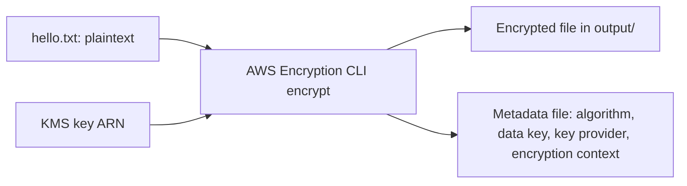
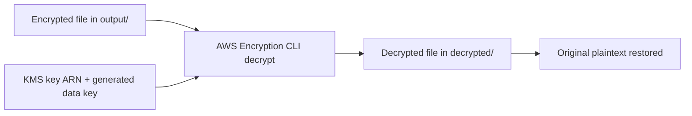

# 413. Encryption SDK CLI Hands On

## 🎯 Giới thiệu
- Bài học này minh họa cách dùng **AWS Encryption CLI** để **encrypt** và **decrypt** một file lớn bằng **KMS key**.
- Mục tiêu chính là hiểu luồng làm việc của **Encryption SDK** khi sử dụng **data key** và **master key ARN**.
- Nội dung mang tính thực hành, không phải phần bắt buộc phải nhớ chi tiết lệnh cho kỳ thi.

## 1. Cài đặt AWS Encryption CLI
- Cài đặt bằng **Python** và **pip**.
- Có thể kiểm tra phiên bản bằng `--version`.
- Đây chỉ là phần thực hành để quan sát cơ chế encryption, không phải kiến thức trọng tâm cho exam.

## 2. Encrypt file bằng KMS key
- Trước khi encrypt, cần:
  - Có **full ARN** của **KMS key**.
  - Tạo một file đầu vào, ví dụ `hello.txt`, chứa dữ liệu bí mật.
- Khi chạy **encrypt command**:
  - Input là file gốc.
  - Master key là **KMS ARN**.
  - Có thể xuất thêm **metadata** nếu muốn.
  - **Encryption context** là tùy chọn, và trong bài này đã bỏ qua để đơn giản.
- Lưu ý:
  - File metadata không được đặt cùng thư mục output.
  - Sau khi sửa thư mục output riêng, lệnh chạy thành công.
- Kết quả:
  - File gốc vẫn tồn tại.
  - File được mã hóa nằm trong thư mục output.
  - File output trông như dữ liệu rác vì đã được encrypt.

## 3. Decrypt file đã mã hóa
- Dùng **decrypt command** để giải mã file đã encrypt.
- Input là file `.encrypted` trong thư mục output.
- Vì không dùng **encryption context** lúc encrypt nên có thể bỏ qua khi decrypt.
- Có thể xuất **metadata** nếu cần.
- Cần tạo trước thư mục **decrypted** để chứa kết quả.
- Kết quả:
  - File được giải mã thành công.
  - Nội dung gốc được khôi phục lại đúng như ban đầu.

## 📊 Bảng tóm tắt
| Tiêu chí | Mô tả |
|----------|------|
| Công cụ | AWS Encryption CLI |
| Mục đích | Encrypt và decrypt file bằng KMS |
| Yêu cầu quan trọng | Dùng **full ARN** của key, không chỉ alias |
| Input | File plaintext như `hello.txt` |
| Output | File encrypted trong thư mục output |
| Metadata | Chứa thông tin như algorithm, data key, key provider |
| Decrypt | Khôi phục lại nội dung gốc từ file đã mã hóa |

## 💡 Mẹo ghi nhớ cho kỳ thi AWS
- Nhớ rằng **Encryption CLI** là công cụ để quan sát cách **encryption** hoạt động với **KMS**, không phải trọng tâm nhớ lệnh chi tiết.
- Khi làm việc với **KMS key**, bài này nhấn mạnh cần dùng **full ARN**.
- **Metadata** có thể được tạo ra để mô tả quá trình mã hóa, nhưng không bắt buộc cho quá trình chính.
- Luồng cơ bản cần nhớ:
  - `plaintext` → **encrypt** → `encrypted file`
  - `encrypted file` → **decrypt** → `plaintext`
- Đây là ví dụ thực tế cho thấy **Encryption SDK** dùng **generated data key** để hỗ trợ decrypt về sau.

## ✅ Kết luận
- Bài học trình diễn cách dùng **AWS Encryption CLI** để mã hóa và giải mã một file lớn.
- Điểm mấu chốt là sử dụng **KMS key ARN**, tạo file plaintext, chạy **encrypt**, rồi dùng **decrypt** để khôi phục dữ liệu.
- Kết quả cuối cùng xác nhận file sau giải mã trả về đúng nội dung ban đầu.
