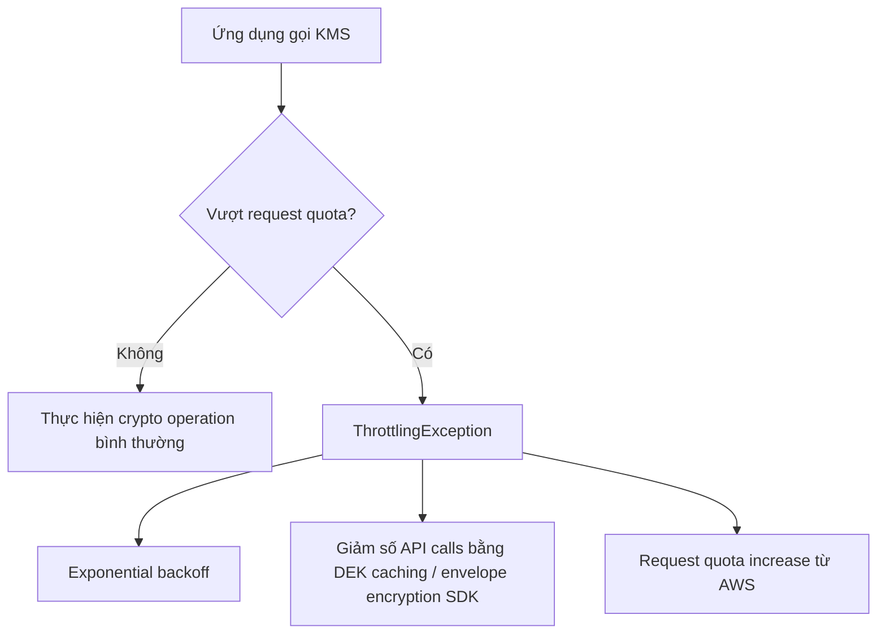

# 414. KMS Limits

## 🎯 Giới thiệu
- `KMS` là một managed service quan trọng nhưng có **request quotas**.
- Khi vượt quota trong các thao tác như `encryption` hoặc `decryption`, KMS sẽ trả về `ThrottlingException`.
- Lỗi thường có dạng:
  - `Status Code: 400`
  - `Error Code: ThrottlingException`

## 1. KMS request quota và ThrottlingException
- KMS có giới hạn số lần gọi API trong một khoảng thời gian.
- Khi vượt giới hạn, bạn sẽ gặp `ThrottlingException`.
- Cách phản ứng cơ bản với lỗi này là dùng `exponential backoff`:
  - retry lại sau các khoảng thời gian tăng dần
  - phù hợp khi lỗi mang tính tạm thời

## 2. Quota được chia sẻ giữa các cryptographic operations
- Các `cryptographic operations` của KMS đều **chia sẻ cùng một quota**.
- Bao gồm các thao tác như:
  - `Decrypt`
  - `Encrypt`
  - `GenerateDataKey`
  - `GenerateRandom`
  - và các thao tác crypto khác
- Quota này được chia sẻ:
  - theo `account`
  - theo `region`
  - across all cryptographic operations
- Nếu service khác gọi KMS thay bạn, ví dụ `S3` dùng `SSE-KMS`, thì các request đó cũng tính vào quota.

## 3. Cách xử lý khi chạm quota KMS
- Có 3 cách chính để xử lý `KMS Throttling`:
  - **`Exponential backoff`** nếu lỗi chỉ là tạm thời
  - **Giảm số lần gọi KMS**
    - dùng `GenerateDataKey`
    - dùng `DEK caching`
    - dùng `envelope encryption SDK` để cache data encryption key cục bộ
  - **Request quota increase**
    - qua API call
    - hoặc mở ticket với `AWS Support`
- Quota cụ thể phụ thuộc `region`.
- Transcript nhắc đến quota cho `symmetric CMK`:
  - có nơi là `5,500` shared
  - có nơi lên tới `10,000`
  - có nơi là `30,000` per second
- Khi đạt giới hạn, cần `service limit increase` để nâng shared quota.

## 📊 Bảng tóm tắt
| Tiêu chí | Mô tả |
|----------|------|
| Vấn đề chính | Vượt `KMS` request quota sẽ gây `ThrottlingException` |
| Phạm vi quota | Shared across all cryptographic operations trong cùng `account` và `region` |
| Ví dụ dịch vụ liên quan | `S3` dùng `SSE-KMS` cũng tiêu tốn quota |
| Cách xử lý 1 | `Exponential backoff` |
| Cách xử lý 2 | Giảm API calls bằng `DEK caching` / `envelope encryption SDK` |
| Cách xử lý 3 | Request quota increase từ AWS |
| Điểm cần nhớ | `Encrypt`, `Decrypt`, `GenerateDataKey`, `GenerateRandom` dùng chung quota |

## 💡 Mẹo ghi nhớ cho kỳ thi AWS
- Nhớ rằng `KMS` không chỉ giới hạn theo một API call riêng lẻ, mà **chia quota cho toàn bộ cryptographic operations**.
- Nếu gặp `ThrottlingException`, ưu tiên nghĩ đến:
  - `exponential backoff`
  - `caching` cho `DEK`
  - `quota increase`
- Nếu đề bài nhắc đến `SSE-KMS` trên `S3`, hãy nhớ request đó vẫn tính vào quota của `KMS`.
- Từ khóa quan trọng cần nhận diện nhanh: `ThrottlingException`, `shared quota`, `cryptographic operations`, `DEK caching`, `service limit increase`.

## ✅ Kết luận
- `KMS` có giới hạn request quota và các crypto operations dùng chung quota theo `account` và `region`.
- Khi vượt ngưỡng, hệ thống sẽ trả về `ThrottlingException`.
- Ba cách xử lý cần nhớ là:
  - `exponential backoff`
  - giảm số lần gọi bằng `DEK caching`
  - yêu cầu tăng quota từ AWS
