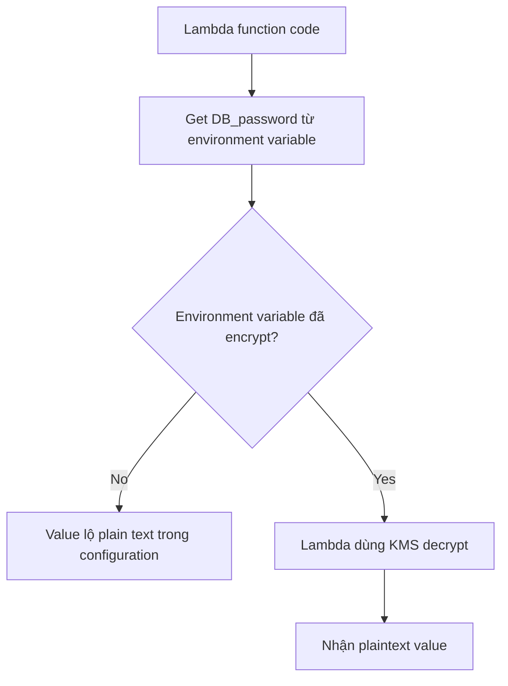

# 415. KMS and AWS Lambda Practice

## 🎯 Giới thiệu
Bài thực hành này minh họa cách dùng **Lambda** kết hợp với **KMS** để bảo vệ **environment variables** chứa dữ liệu nhạy cảm, ví dụ `DB_password`.

- Mục tiêu là tránh để giá trị bí mật như `super secret` xuất hiện trực tiếp trong code hoặc ở dạng plain text trong configuration.
- Dùng **KMS key** để encrypt environment variable tại rest.
- Trong Lambda, cần dùng đoạn code decrypt để lấy lại giá trị gốc khi chạy.

## 1. Vấn đề cần giải quyết 🔐
Nếu đặt mật khẩu database trực tiếp trong code Lambda:

- Người có quyền xem code có thể đọc được ngay `DB_password = super secret`.
- Đây là cách không an toàn.

Nếu chuyển sang **environment variables**:

- Code chỉ gọi `os.getenv('DB_password')` hoặc `os.environ['DB_password']`.
- Code không lộ giá trị.
- Nhưng nếu ai đó xem được phần configuration của Lambda, họ vẫn thấy giá trị plain text.

➡️ Vì vậy, cần **encrypt environment variables** bằng **KMS**.

## 2. Cách triển khai trong Lambda + KMS ⚙️
Quy trình được làm như sau:

- Tạo Lambda function từ scratch.
- Chọn **Python runtime**.
- Dùng **tutorial key** đã tạo sẵn trong **KMS**.
- Trong phần **Encryption configuration** của Lambda:
  - bật các tùy chọn hỗ trợ encryption,
  - chọn **KMS key**,
  - bấm **Encrypt** để mã hóa environment variable.

Sau đó:

- Trong code Lambda, dùng đoạn decrypt snippet do console cung cấp.
- Code sẽ:
  - lấy encrypted environment variable,
  - tạo **KMS client** bằng AWS SDK,
  - gọi `decrypt`,
  - lấy `PlainText`,
  - decode sang `UTF-8`.

Kết quả khi chạy:

- function in ra **encrypted value**,
- rồi in ra **decrypted value** là `super secret`.

## 3. Lỗi gặp phải và cách xử lý 🛠️
Trong quá trình test, có 2 vấn đề chính:

### a. Timeout
- Lần test đầu bị **timeout** vì Lambda mặc định chỉ có hơn 3 giây.
- Cách xử lý:
  - vào **Configuration**,
  - mở **General configuration**,
  - tăng **timeout** lên **10 seconds**,
  - save và test lại.

### b. Access denied khi decrypt
- Lần test tiếp theo bị lỗi **access denied**.
- Nguyên nhân:
  - Lambda đang gọi **KMS decrypt**,
  - nhưng **IAM role** của Lambda chưa có quyền dùng key đó.

Cách xử lý:

- vào **Configuration > Permissions**,
- lấy **Lambda role**,
- thêm **inline policy**:
  - service: **KMS**
  - action: **decrypt**
  - resource: chỉ định **key ARN** cụ thể của KMS key,
- review policy,
- đặt tên như `allow decrypt KMS`,
- tạo policy.

Sau khi thêm quyền:

- test lại Lambda,
- function chạy thành công,
- có thể decrypt được environment variable.

## 📊 Bảng tóm tắt
| Tiêu chí | Mô tả |
|----------|------|
| Mục tiêu | Bảo vệ `DB_password` trong Lambda bằng **KMS** |
| Vấn đề ban đầu | Nếu để secret trong code hoặc plain text configuration thì dễ bị lộ |
| Cách cải thiện | Dùng **environment variables** và encrypt bằng **KMS key** |
| Thành phần chính | **Lambda**, **KMS**, **AWS SDK**, **IAM role**, **inline policy** |
| Lỗi thường gặp | **Timeout** và **Access denied** khi gọi `decrypt` |
| Cách khắc phục | Tăng timeout và cấp quyền `kms:Decrypt` cho Lambda role |
| Kết quả cuối | Lambda đọc được encrypted secret và giải mã thành `super secret` |

## 💡 Mẹo ghi nhớ cho kỳ thi AWS
- **Environment variable** trong Lambda không tự động an toàn nếu vẫn là plain text.
- Muốn bảo vệ secret, hãy nhớ chuỗi: **Lambda + KMS + decrypt at runtime**.
- Gặp lỗi **Access denied** khi decrypt thì nghĩ ngay đến **IAM role** và quyền **KMS decrypt**.
- Gặp lỗi **timeout** thì kiểm tra **general configuration > timeout** trước.
- Trong thực tế, key ý là: **code không nên chứa secret**, secret nên được **encrypt at rest** và chỉ decrypt khi cần.

## ✅ Kết luận
Bài thực hành cho thấy cách **Lambda** tích hợp với **KMS** để bảo vệ **environment variables** chứa thông tin nhạy cảm. Khi đã cấu hình đúng **KMS key**, tăng **timeout**, và cấp quyền **kms:Decrypt** cho **IAM role** của Lambda, function có thể giải mã secret thành công và giữ bí mật tốt hơn so với việc lưu plain text.
