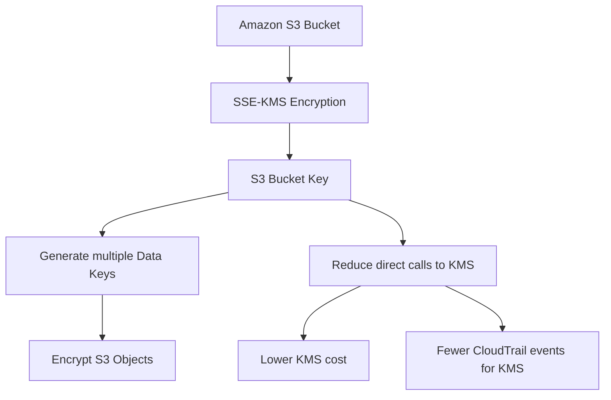

# 416. S3 Bucket Key

## 🎯 Giới thiệu
- **S3 Bucket Key** là một setting mới cho **S3 Buckets** khi dùng **SSE-KMS encryption**.
- Mục tiêu chính:
  - Giảm số lượng **API calls** từ **Amazon S3** đến **KMS**
  - Giảm chi phí KMS khoảng **99%**
  - Giữ nguyên mức độ bảo mật khi mã hóa dữ liệu

## 1. Cơ chế hoạt động
- **KMS Customer Master Key** được dùng để tạo **data key** cho S3 theo từng thời điểm.
- Thay vì mỗi lần upload đều gọi trực tiếp đến **KMS**, S3 sẽ dùng thêm một khóa trung gian gọi là **S3 Bucket Key**.
- **S3 Bucket Key** sẽ được dùng để tạo ra nhiều **data keys** cho việc mã hóa object trong bucket theo kiểu **envelope encryption**.
- Kết quả:
  - Ít gọi **KMS** hơn
  - Giảm chi phí mạnh
  - Không làm giảm security

## 2. Lợi ích chính
- Giảm đến **99%** số lượng **KMS API calls** từ **Amazon S3**
- Giảm đến **99%** chi phí KMS liên quan đến S3
- Khi triển khai ở quy mô lớn, giúp tránh:
  - Hóa đơn KMS cao
  - Vượt giới hạn encryption trong S3 bucket
- Bạn sẽ thấy:
  - Ít **CloudTrail events** hơn liên quan đến **KMS**
  - Chi phí thấp hơn rõ rệt

## 3. Cách bật trong S3 Console
- Tạo bucket mới trong **S3 Console**
- Bật:
  - **Encryption**
  - Chọn **SSE-KMS**
  - Chọn **managed key**
  - Bật **bucket keys**
- Theo transcript:
  - Mặc định hiện tại là **enabled**
  - Có thể tắt nếu muốn mọi lần upload đều nói chuyện trực tiếp với **KMS**
- Khi bật, S3 sẽ dùng **bucket key** để giảm số lần gọi KMS mà vẫn giữ security

## 📊 Bảng tóm tắt
| Tiêu chí | Mô tả |
|----------|------|
| Công nghệ liên quan | **SSE-KMS**, **S3 Bucket Key**, **KMS** |
| Mục tiêu | Giảm số lượng **KMS API calls** |
| Mức giảm | Khoảng **99%** |
| Tác động | Giảm chi phí, giảm CloudTrail events |
| Bảo mật | Không compromise security |
| Cách dùng | Bật **bucket keys** trong cấu hình encryption của S3 bucket |

## 💡 Mẹo ghi nhớ cho kỳ thi AWS
- Ghi nhớ công thức: **SSE-KMS + S3 Bucket Key = ít call KMS hơn, rẻ hơn**
- Nếu đề bài nói về:
  - **giảm cost**
  - **giảm KMS API calls**
  - **vẫn dùng SSE-KMS**
  - **S3 at scale**
  thì đáp án rất dễ liên quan đến **S3 Bucket Key**
- Từ khóa cần nhớ: **S3 Bucket Key**, **SSE-KMS**, **KMS API calls**, **CloudTrail events**

## ✅ Kết luận
- **S3 Bucket Key** là một tối ưu hóa cho **SSE-KMS** trong **Amazon S3**.
- Nó giảm mạnh số lần gọi đến **KMS**, từ đó giảm chi phí và số lượng event liên quan, mà vẫn giữ nguyên bảo mật.
- Đây là một setting rất đáng nhớ khi ôn thi AWS, đặc biệt trong các tình huống **SSE-KMS at scale**.
