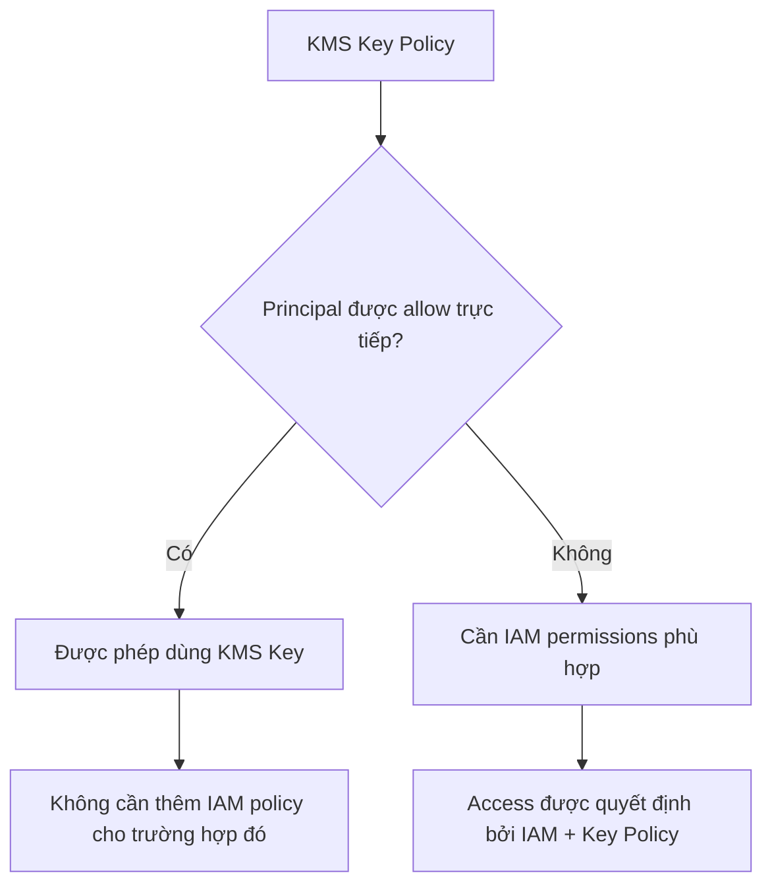

# 417. KMS Key Policies & IAM Principals

## 🎯 Giới thiệu
- **KMS Key Policy** dùng để xác định **ai được truy cập KMS Key**.
- Default KMS Key Policy khi tạo qua **AWS Console** cho phép **mọi principal trong cùng account** truy cập KMS Key, **nếu** họ có đủ **IAM permissions**.
- Có thể **explicitly authorize** một principal cụ thể như:
  - `IAM user`
  - `IAM role`
  - `federated user`
  - `service`

## 1. Cách KMS Key Policy cấp quyền
- Trong key policy, bạn có thể chỉ định rõ:
  - **principal** nào được phép dùng key
  - **KMS actions** nào được phép, ví dụ: `encrypt`, `decrypt`, ...
- Nếu một **federated user** được cho phép trực tiếp trong **KMS Key Policy**, thì **không cần thêm IAM policy** riêng để dùng KMS key đó.
- Ý chính:
  - **Key Policy** là lớp kiểm soát truy cập trực tiếp cho KMS Key
  - **IAM permissions** vẫn có thể cần thiết trong trường hợp không được allow trực tiếp

## 2. Các loại principal có thể được allow
- Có thể explicit allow các principal sau trong **KMS Key Policies** và cũng là các dạng principal quan trọng trong IAM:
  - **Account và root user**: dùng `AWS` account number hoặc `account number + root` để cho phép mọi principal trong account
  - **Specific IAM role**: chỉ định trực tiếp **role ARN**
  - **IAM role sessions**: khi có **assumed role** hoặc **assumed identity** thông qua Federation, ví dụ `Cognito identity` hoặc `SAML`
  - **IAM users**: chỉ định một user cụ thể trong account hoặc account khác
  - **Federated user sessions**: chỉ định một federated user cụ thể
  - **Service**: cho phép một service cụ thể dùng KMS key
  - **Wildcard**: dùng `*` hoặc `AWS *` nếu muốn cho phép tất cả

## 3. Flow của quyền truy cập KMS Key

## 📊 Bảng tóm tắt
| Tiêu chí | Mô tả |
|----------|------|
| Mục đích của KMS Key Policy | Xác định ai có thể truy cập KMS Key |
| Default behavior | Cho phép principal trong cùng account nếu có IAM permissions phù hợp |
| Explicit allow | Có thể chỉ định rõ user, role, federated user, service |
| KMS actions | Có thể giới hạn như `encrypt`, `decrypt` |
| Trường hợp không cần IAM policy thêm | Khi principal đã được allow trực tiếp trong KMS Key Policy |
| Principal đặc biệt | Account/root, IAM role, role session, IAM user, federated user session, service, `*` |

## 💡 Mẹo ghi nhớ cho kỳ thi AWS
- **Key Policy** là lớp quyền **đặc thù của KMS** để quyết định ai dùng được key.
- Nếu thấy câu hỏi về **KMS access**, hãy kiểm tra:
  - principal có được allow trong **Key Policy** chưa
  - principal có đủ **IAM permissions** chưa
- Nhớ rằng:
  - **Account/root** trong policy có thể đại diện cho mọi principal trong account
  - **Explicit allow** trong key policy có thể loại bỏ nhu cầu thêm IAM policy riêng trong trường hợp đó
- Từ khóa dễ gặp: `IAM role`, `federated user`, `service`, `root`, `AWS *`

## ✅ Kết luận
- **KMS Key Policy** kiểm soát ai được truy cập **KMS Key**.
- Có thể cấp quyền trực tiếp cho nhiều loại **IAM principals** khác nhau.
- Nếu principal đã được cho phép rõ ràng trong key policy, họ có thể không cần thêm **IAM policy** để dùng key.
- Đây là phần kiến thức quan trọng khi ôn thi AWS về **KMS authorization flow** và **principal-based access**.
