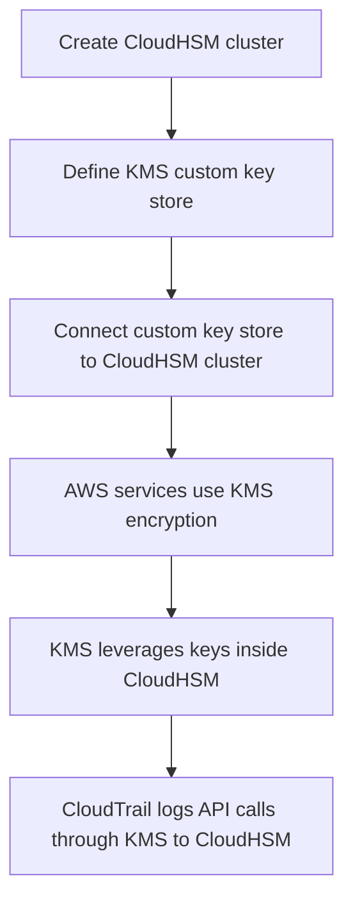

# 418. CloudHSM Overview

## 🎯 Giới thiệu
- **CloudHSM** là dịch vụ dùng **dedicated hardware** cho mã hóa, dưới dạng **HSM device** trong AWS.
- Khác với **KMS**, ở CloudHSM:
  - AWS quản lý phần **hardware**
  - Bạn tự quản lý **encryption keys** hoàn toàn
- HSM là **tamper resistant** và đạt **FIPS 140-2 Level 3 compliance**.
- CloudHSM hỗ trợ cả:
  - **symmetric keys**
  - **asymmetric keys**
- Có thể dùng cho các key như **SSL/TLS keys**.
- Không có **free tier**.
- Muốn sử dụng CloudHSM cần **client software** để kết nối vào dịch vụ.

## 1. Cách CloudHSM hoạt động 🔐
- AWS sẽ provision một **HSM device** trong AWS cloud.
- Bạn dùng **CloudHSM client** để establish connection.
- Sau khi kết nối:
  - bạn quản lý **keys**
  - bạn quản lý **users**
  - bạn quản lý **permissions** để truy cập keys
- **IAM permissions** chỉ dùng ở mức cao để:
  - create
  - read
  - update
  - delete
  - cho **HSM cluster**
- Việc quản lý keys bên trong CloudHSM là thông qua **CloudHSM software**, không phải IAM như trong KMS.

### Mermaid: flow tích hợp CloudHSM với AWS services

## 2. High Availability và tích hợp 🌐
- CloudHSM clusters có thể **high availability** và được trải trên **multiple AZ**.
- Có thể có **2 AZ**, trong đó một HSM được replicate từ AZ kia.
- HSM client có thể kết nối vào **either** device.
- Có integration giữa **CloudHSM** và **KMS**:
  - tạo **KMS custom key store**
  - custom key store đó trỏ tới **CloudHSM cluster**
- Khi đó có thể dùng CloudHSM cho encryption của:
  - **EBS**
  - **S3**
  - **RDS**
  - và các dịch vụ khác theo cơ chế KMS
- Ví dụ trong transcript:
  - tạo **RDS database instance**
  - có encrypted **EBS volume with KMS encryption**
  - KMS sẽ dùng encryption keys nằm trong **CloudHSM cluster**
- Lợi ích:
  - thật sự dùng CloudHSM cluster của bạn
  - mọi API call qua KMS chạm tới CloudHSM sẽ được log trong **CloudTrail**

## 3. So sánh với KMS 📘
- **KMS**
  - mang tính **multi-tenant**
  - có 3 loại master key:
    - **AWS owned**
    - **AWS managed**
    - **customer managed CMK**
  - access và authentication dùng **IAM**
  - là managed service và luôn available
  - có **CloudTrail** và **CloudWatch**
  - nằm trong **free tier**
- **CloudHSM**
  - mang tính **single tenant**
  - chỉ có **customer-managed CMK**
  - AWS không thể access HSM device của bạn
  - có cơ chế bảo mật riêng để quản lý:
    - users
    - permissions
    - keys
  - triển khai trong **VPC**
  - có thể share across VPCs bằng **VPC sharing**
  - có thể dùng cho cryptographic acceleration:
    - **SSL/TLS acceleration** ở load balancer level
    - **Oracle and TDE acceleration** cho database
  - có **MFS support**
  - **không có free tier**

## 📊 Bảng tóm tắt
| Tiêu chí | Mô tả |
|----------|------|
| Mô hình quản lý | AWS quản lý hardware, bạn quản lý keys |
| Kiểu triển khai | Dedicated **HSM device** trong AWS cloud |
| Bảo mật | **Tamper resistant**, **FIPS 140-2 Level 3** |
| Key support | **symmetric** và **asymmetric** |
| Quản trị | Dùng **CloudHSM client** và software riêng |
| IAM | Chỉ dùng cho quản lý cluster ở mức cao |
| High availability | Có thể HA, trải trên **multiple AZ** |
| Tích hợp | Có thể tích hợp với **KMS** qua **KMS custom key store** |
| AWS services hỗ trợ | **EBS, S3, RDS** và các dịch vụ qua KMS |
| So với KMS | **Single tenant** vs KMS **multi-tenant** |
| Free tier | Không có |
| Logging | API calls qua KMS tới CloudHSM được log trong **CloudTrail** |

## 💡 Mẹo ghi nhớ cho kỳ thi AWS
- Nhớ nhanh: **KMS = AWS quản lý nhiều thứ hơn**, còn **CloudHSM = bạn giữ quyền kiểm soát keys**.
- Nếu câu hỏi nhấn mạnh:
  - **dedicated hardware**
  - **single tenant**
  - **FIPS 140-2 Level 3**
  - **tamper resistant**
  - **own keys entirely**
  → rất dễ là **CloudHSM**
- Nếu đề bài nói:
  - cần dùng **KMS custom key store**
  - muốn encryption cho **EBS/S3/RDS** nhưng keys nằm trong HSM của bạn
  → liên quan đến **CloudHSM + KMS integration**
- Nhớ phân biệt:
  - **KMS**: quản lý bằng **IAM**
  - **CloudHSM**: quản lý users/permissions/keys bằng cơ chế riêng
- CloudHSM thường được nhắc cùng các use case như:
  - **SSE-C on S3**
  - **SSL/TLS**
  - **Oracle TDE**
- Có thể xuất hiện câu hỏi về **HA across multiple AZ** cho CloudHSM cluster.

## ✅ Kết luận
- **CloudHSM** phù hợp khi bạn cần kiểm soát hoàn toàn **encryption keys** trên **dedicated HSM hardware**.
- Dịch vụ này khác **KMS** ở chỗ AWS không quản lý keys cho bạn, và CloudHSM có thể tích hợp với **KMS custom key store** để phục vụ encryption cho các dịch vụ AWS như **EBS, S3, RDS**.
- Điểm cần nhớ nhất khi ôn thi: **CloudHSM = single tenant, customer quản lý keys, hardware chuyên dụng, HA qua multiple AZ**.
