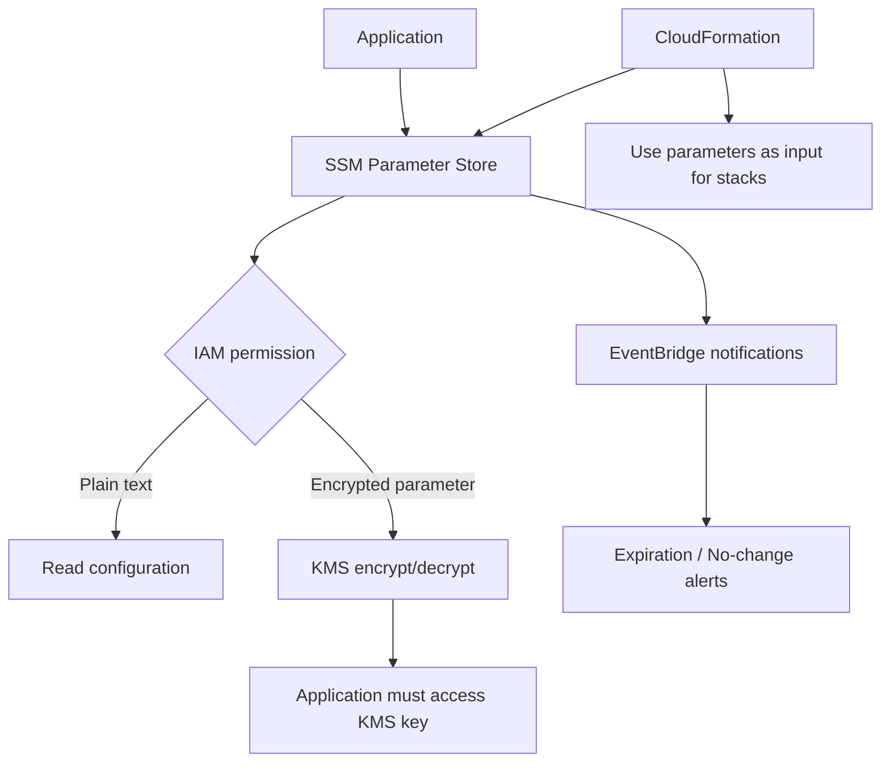

# 419. SSM Parameter Store Overview

## 🎯 Giới thiệu
SSM Parameter Store là nơi lưu trữ **configuration** và **secrets** theo cách **secure**, **serverless**, **scalable**, và **durable**.  
Dịch vụ này hỗ trợ:
- Lưu **plain text configuration** hoặc **encrypted configuration**
- **Version tracking** khi parameter được cập nhật
- Tích hợp với **IAM**, **KMS**, **EventBridge**, và **CloudFormation**
- SDK rất dễ sử dụng

## 1. Cách hoạt động của Parameter Store
Parameter Store được dùng như một lớp lưu trữ cấu hình cho application, với quyền truy cập được kiểm soát bằng **IAM**.

- Với **plain text**, application đọc parameter trực tiếp nếu có quyền **IAM** phù hợp.
- Với **encrypted configuration**, Parameter Store dùng **KMS** để **encrypt/decrypt**.
- Application phải có quyền truy cập vào **KMS key** tương ứng.
- **CloudFormation** có thể lấy parameter từ Parameter Store làm **input parameters** cho stack.

## 2. Hierarchy, access và tích hợp
Parameter Store hỗ trợ tổ chức parameter theo **hierarchy** để quản lý rõ ràng theo:
- department
- app
- environment như `Dev`, `Prod`

Ví dụ cấu trúc:
- `my-department/my-app/Dev/Dev-DB-URL`
- `my-department/my-app/Dev/DB-password`
- `my-department/my-app/Prod/Prod-DB-URL`
- `my-department/my-app/Prod/Prod-DB-password`

Lợi ích:
- Sắp xếp parameter có cấu trúc
- Dễ cấp quyền IAM theo:
  - cả department
  - cả app
  - hoặc một path cụ thể theo environment

Ngoài ra:
- Có thể tham chiếu **Secrets of Secrets Manager** thông qua Parameter Store
- Có **Public Parameters** do AWS cung cấp, ví dụ để lấy **latest AMI** cho **Amazon Linux 2** theo region

## 3. Parameter tiers và Parameter policies
Systems Manager có 2 loại parameter tier:

| Tier | Kích thước | Parameter policies | Chi phí |
|------|------------|--------------------|---------|
| `standard` | 4 KB | Không có | Miễn phí |
| `advanced` | 8 KB | Có | `$0.05`/tháng |

### Parameter policies chỉ có ở `advanced`
Các policy này cho phép:
- Gán **TTL / expiration date**
- Buộc người dùng cập nhật hoặc xóa dữ liệu nhạy cảm như password
- Gán **multiple policies** cùng lúc

### EventBridge integration
Khi có policy:
- **Expiration policy** có thể gửi notification vào **EventBridge**
- Ví dụ: trước khi parameter hết hạn **15 ngày**, EventBridge nhận alert
- Có thể dùng **no change notification**:
  - nếu parameter không được cập nhật trong **20 ngày**
  - EventBridge cũng phát thông báo

## 📊 Bảng tóm tắt
| Tiêu chí | Mô tả |
|----------|------|
| Mục đích | Lưu `configuration` và `secrets` một cách secure |
| Tính chất | `serverless`, `scalable`, `durable` |
| Bảo mật | `IAM` kiểm soát truy cập, `KMS` dùng cho mã hóa/giải mã |
| Quản lý | Có `version tracking` khi parameter thay đổi |
| Tổ chức dữ liệu | Hỗ trợ `hierarchy` theo department/app/environment |
| Tích hợp | `CloudFormation`, `EventBridge`, `Secrets Manager` |
| Tiers | `standard` (4 KB, free), `advanced` (8 KB, $0.05/tháng) |
| Policies | Chỉ có ở `advanced`, gồm `expiration` và `no change` |
| Dữ liệu public | Có `Public Parameters` do AWS cung cấp, ví dụ AMI |

## 💡 Mẹo ghi nhớ cho kỳ thi AWS
- `Parameter Store` = nơi lưu **config** và **secrets**
- Muốn mã hóa thì nhớ đến **KMS**
- Quyền truy cập luôn xoay quanh **IAM**
- `advanced tier` mới có **parameter policies**
- **standard = free, 4 KB**
- **advanced = 8 KB, $0.05/month**
- **EventBridge** nhận notification khi:
  - parameter sắp hết hạn
  - parameter lâu không thay đổi
- **CloudFormation** có thể dùng Parameter Store làm input cho stack

## ✅ Kết luận
SSM Parameter Store là dịch vụ lưu trữ **configuration** và **secrets** an toàn, dễ tích hợp và dễ mở rộng.  
Điểm cần nhớ nhất là:
- **IAM** kiểm soát truy cập
- **KMS** xử lý encryption/decryption
- **advanced tier** mới có **parameter policies**
- **EventBridge** dùng để nhận cảnh báo về expiration hoặc no-change
