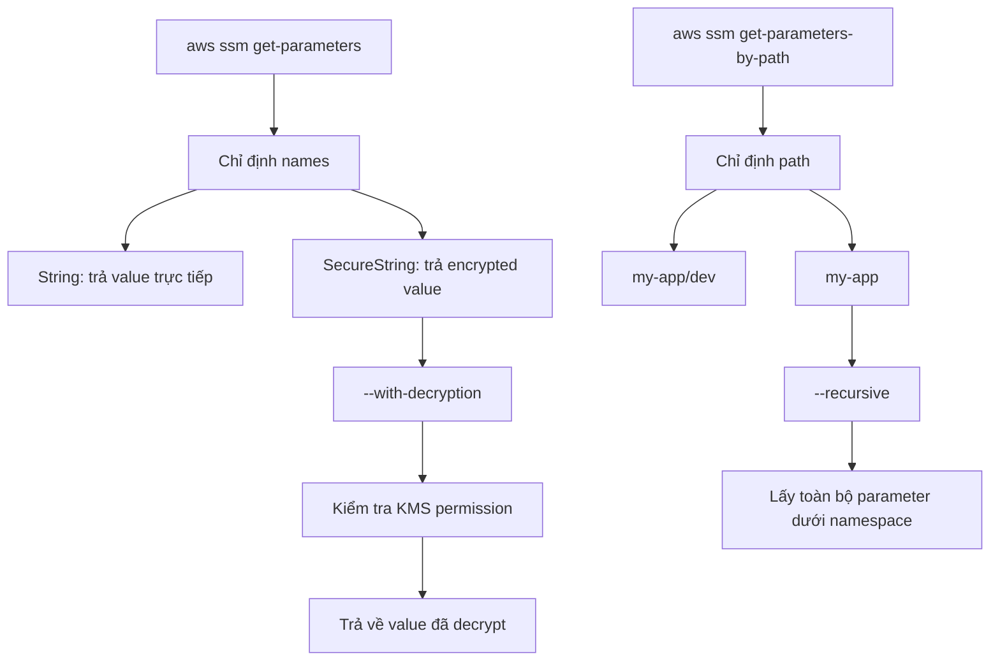

# 420. SSM Parameter Store Hands On (CLI)

## 🎯 Giới thiệu
- **SSM Parameter Store** là một feature của **Systems Manager** dùng để:
  - tạo và lưu **parameters**
  - gán **type** và **value**
  - tham chiếu lại trong **comments** hoặc **code**
- Điểm quan trọng trong bài:
  - tổ chức parameter theo **hierarchy**
  - phân biệt **Standard** và **Advanced**
  - truy xuất bằng **AWS CLI**
  - xử lý **SecureString** với **KMS** và **with-decryption**

## 1. Tạo và tổ chức Parameter
- Tạo parameter với tên dạng hierarchy, ví dụ:
  - `/my-app/dev/db-url`
  - `/my-app/dev/db-password`
  - `/my-app/prod/db-url`
  - `/my-app/prod/db-password`
- Ý nghĩa của cấu trúc này:
  - `my-app` là application
  - `dev` và `prod` là môi trường
  - phần cuối là tên parameter cụ thể
- **Tier** có 2 loại:
  - **Standard**
    - tối đa **10,000** parameters
    - value tối đa **4 KB**
    - không share với account khác
  - **Advanced**
    - tối đa **100,000** parameters
    - value tối đa **8 KB**
    - có thể share với account khác
- **Type** có 3 loại:
  - **String**
  - **StringList**
  - **SecureString**
- Với **String**:
  - dùng cho text
  - transcript cũng nhắc đến khả năng reference **AWS EC2 image**
- Với **SecureString**:
  - dùng cho giá trị nhạy cảm như password
  - được **encrypt bằng KMS key**
  - có thể dùng key mặc định của SSM: `alias/aws/ssm`
  - hoặc một KMS key đã tạo trước đó, ví dụ `Tutorial`
- Parameter có **version history**:
  - khi update, vẫn có thể xem lại các version trước

```mermaid
flowchart TD
    A[Parameter Store] --> B[/my-app/dev/db-url]
    A --> C[/my-app/dev/db-password]
    A --> D[/my-app/prod/db-url]
    A --> E[/my-app/prod/db-password]

    B --> F[String]
    C --> G[SecureString + KMS]
    D --> F
    E --> G
```

## 2. Truy xuất Parameter bằng CLI
- Dùng **CloudShell** vì đã có **AWS CLI** và đã được cấu hình sẵn
- Lệnh lấy nhiều parameter cùng lúc:
  - `aws ssm get-parameters`
  - cần truyền danh sách `names`
- Kết quả:
  - **String** trả về giá trị trực tiếp
  - **SecureString** ban đầu trả về dạng encrypted

### Decrypt SecureString
- Dùng flag:
  - `--with-decryption`
- Khi thêm flag này:
  - hệ thống kiểm tra quyền **KMS**
  - nếu được phép thì trả về giá trị đã decrypt

### Lấy theo path
- Dùng:
  - `aws ssm get-parameters-by-path`
- Nếu chỉ chỉ định path như:
  - `my-app/dev`
  - thì lấy các parameter trong namespace đó
- Nếu chỉ chỉ định:
  - `my-app`
  - thì ban đầu không ra kết quả
- Muốn lấy **đệ quy** toàn bộ parameter bên dưới namespace:
  - dùng flag **Recursion**
- Khi đó có thể lấy cả:
  - `dev`
  - `prod`
- Lệnh này cũng có thể kết hợp với **with-decryption** để decrypt toàn bộ SecureString



## 3. Ý nghĩa thực hành và ôn thi
- **Parameter Store** hỗ trợ quản lý cấu hình theo môi trường rất rõ ràng:
  - `dev`
  - `prod`
- **SecureString** là lựa chọn cho dữ liệu nhạy cảm
- **KMS** là phần liên quan trực tiếp đến việc encrypt/decrypt SecureString
- **CLI** giúp dùng Parameter Store trong scripts rất hiệu quả
- Hai lệnh cần nhớ:
  - `aws ssm get-parameters`
  - `aws ssm get-parameters-by-path`

## 📊 Bảng tóm tắt
| Tiêu chí | Mô tả |
|----------|------|
| Dịch vụ | **SSM Parameter Store** thuộc **Systems Manager** |
| Mục đích | Lưu parameter, tổ chức theo hierarchy, dùng lại trong code/comment |
| Naming | Ví dụ: `/my-app/dev/db-url` |
| Tier | **Standard** và **Advanced** |
| Standard | Tối đa 10,000 parameters, 4 KB/value, không share account khác |
| Advanced | Tối đa 100,000 parameters, 8 KB/value, có thể share account khác |
| Type | **String**, **StringList**, **SecureString** |
| SecureString | Được encrypt bằng **KMS** |
| CLI chính | `aws ssm get-parameters`, `aws ssm get-parameters-by-path` |
| Decrypt | Dùng `--with-decryption` |
| Theo namespace | Dùng `get-parameters-by-path` với `--recursive` để lấy toàn bộ dưới path |

## 💡 Mẹo ghi nhớ cho kỳ thi AWS
- **String** = dữ liệu thường, trả về trực tiếp.
- **SecureString** = dữ liệu nhạy cảm, liên quan **KMS** và cần `--with-decryption` để đọc value.
- Nhớ cấu trúc hierarchy:
  - `app / environment / parameter-name`
- Khi cần lấy nhiều parameter theo nhánh, nghĩ ngay đến:
  - `aws ssm get-parameters-by-path`
- Khi cần đọc secret bằng CLI, nhớ kiểm tra:
  - quyền **KMS**
  - flag `--with-decryption`
- **Standard vs Advanced** là cặp so sánh rất dễ ra thi:
  - số lượng
  - kích thước value
  - khả năng share account

## ✅ Kết luận
- Bài này tập trung vào cách dùng **SSM Parameter Store** để tạo parameter, tổ chức theo **hierarchy**, và truy xuất bằng **AWS CLI**.
- Điểm cốt lõi cần nhớ:
  - `String` vs `SecureString`
  - **KMS** cho encrypt/decrypt
  - `get-parameters` và `get-parameters-by-path`
  - `--with-decryption` và `--recursive`
