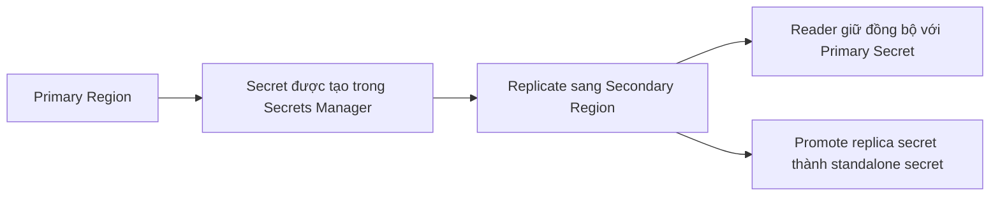

# 421. Secrets Manager - Overview

## 🎯 Giới thiệu
AWS Secrets Manager là service dùng để **lưu trữ secrets** một cách an toàn và là một service **mới hơn** so với SSM Parameter Store.

- Điểm nổi bật chính:
  - Có thể **force rotation** secrets theo chu kỳ X ngày.
  - Có thể **tự động tạo secret mới** khi rotate bằng **Lambda function**.
  - Tích hợp tốt với nhiều AWS services, đặc biệt là các database như **Amazon RDS**, **Aurora**, và các database khác được hỗ trợ sẵn.
  - Secrets có thể được **encrypt bằng KMS**.

## 1. Secrets Manager vs SSM Parameter Store
- Secrets Manager khác SSM Parameter Store ở chỗ:
  - Hỗ trợ **secret rotation** theo lịch.
  - Có khả năng **automate generation** của secret trong quá trình rotation.
- Đây là lựa chọn nên nghĩ đến khi bài thi nhắc đến:
  - **Secrets**
  - **RDS integration**
  - **Aurora secrets**

## 2. Rotation và Lambda
- Secrets Manager có thể ép secrets **xoay vòng định kỳ**.
- Khi cần tạo secret mới, phải định nghĩa một **Lambda function** để sinh ra secret mới.
- Điều này giúp có một **secret management schedule** tốt hơn.

## 3. Tích hợp database và Multi-Region Secrets
- Secrets Manager tích hợp sẵn với các database như:
  - **RDS**
  - **MySQL**
  - **PostgreSQL**
  - **SQL**
  - **Aurora**
- Username và password của database có thể được lưu trực tiếp trong **Secrets Manager** và được rotate.
- Secrets cũng có thể được **replicate across multiple AWS regions**.

### 🌍 Multi-Region Secrets flow

- Lợi ích của Multi-Region Secrets:
  - Khi có sự cố ở một region, có thể **promote replica secret** thành secret độc lập.
  - Hỗ trợ **multi-region apps**.
  - Hỗ trợ **disaster recovery**.
  - Nếu **RDS** cũng replicate giữa các region, có thể dùng **cùng secret** để truy cập database tương ứng ở region tương ứng.

## 📊 Bảng tóm tắt
| Tiêu chí | Mô tả |
|----------|------|
| Mục đích | Lưu trữ secrets an toàn |
| Điểm khác biệt chính | Hỗ trợ **secret rotation** theo chu kỳ |
| Tự động hóa rotation | Dùng **Lambda function** để tạo secret mới |
| Tích hợp | RDS, Aurora và các database khác |
| Mã hóa | Có thể dùng **KMS** |
| Multi-Region | Replicate secret sang nhiều AWS regions |
| Use case thi AWS | Khi thấy **Secrets**, **RDS**, **Aurora** thì nghĩ đến **Secrets Manager** |

## 💡 Mẹo ghi nhớ cho kỳ thi AWS
- Thấy từ khóa **rotation** thì nghĩ ngay đến **Secrets Manager**.
- Thấy **RDS/Aurora secrets** thì ưu tiên chọn **Secrets Manager**.
- Nếu cần **encrypt secret**, nhớ đến **KMS**.
- Nếu có nhu cầu **multi-region secret replication** hoặc **disaster recovery**, đây cũng là dấu hiệu của **Secrets Manager**.
- Khi rotation cần sinh secret mới, nhớ vai trò của **Lambda**.

## ✅ Kết luận
AWS Secrets Manager là dịch vụ lưu trữ secrets có hỗ trợ **rotation**, **Lambda-based generation**, **KMS encryption**, và **multi-region replication**. Trong đề thi, các từ khóa như **Secrets**, **RDS**, **Aurora**, và **rotation** là tín hiệu mạnh để chọn **Secrets Manager**.
