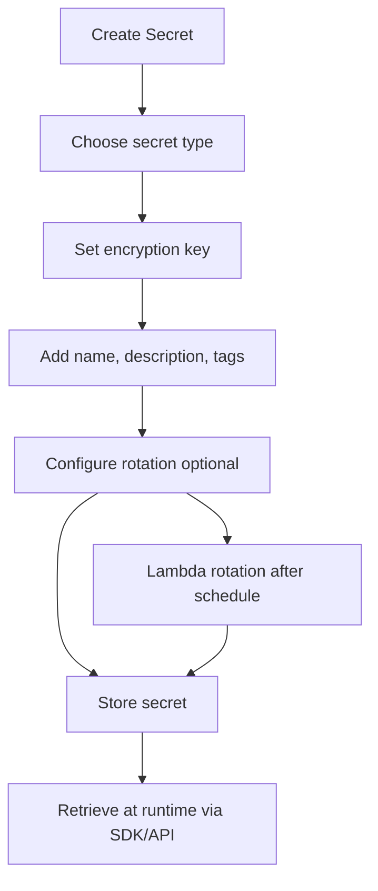

# 422. Secrets Manager - Hands On

## 🎯 Giới thiệu
- **Secrets Manager** là dịch vụ dùng để **store, retrieve, manage, rotate secrets** thông qua API calls.
- Điểm khác với kiểu lưu secret như **secure string** trong parameter store là:
  - Có thể cấu hình **rotation**
  - Có thể liên kết với **Lambda** để tự động rotate credentials
  - Tích hợp chặt với **RDS / PostgreSQL / Redshift / DocumentDB** và các database khác
- Mục tiêu chính: **lưu secret an toàn và lấy ra lúc runtime**.

## 1. Lưu trữ secret trong Secrets Manager
- Có thể lưu nhiều loại secret:
  - **Database credentials**
  - **API key**
  - Các loại **key-value pairs** khác
- Với database, thường sẽ có:
  - **username**
  - **password**
- Với secret kiểu khác:
  - Có thể lưu **nhiều key-value pairs**
  - Ví dụ: `API key` và `secret value`
- Khi tạo secret, có thể:
  - Nhập thủ công trên UI
  - Hoặc dùng **plaintext / JSON** để copy-paste nhanh hơn
- Có thể chọn:
  - **default encryption key**
  - Hoặc **customer-managed KMS key**

## 2. Rotation và tích hợp dịch vụ
- **Automatic rotation** có thể bật hoặc tắt.
- Khi bật rotation:
  - Secrets Manager sẽ kích hoạt **Lambda function**
  - Lambda sẽ thực hiện việc đổi secret theo chu kỳ
- Có thể đặt chu kỳ như:
  - **every 60 days**
  - Tối đa **1 year**
- Lambda cần có **role** phù hợp để rotate secret.
- Với tích hợp đặc biệt như **RDS / Redshift / DocumentDB**:
  - Secrets Manager không chỉ giữ `username/password`
  - Nó còn có thể **set các giá trị này vào database linked** tự động
- Đây là lý do Secrets Manager được xem là **mạnh hơn và tiện hơn** cho quản lý credential.

## 3. Cách truy xuất và quản lý vòng đời secret
- Secret được quản lý bằng **IAM** để kiểm soát access.
- Khi dùng application, có thể lấy secret bằng SDK, ví dụ:
  - tạo client
  - gọi **`get_secret_value`**
  - truyền vào **secret name** và **region**
- Kết quả trả về sẽ chứa value cần dùng, thường là:
  - **`SecretString`**
- Secret có thể được:
  - **tạo**
  - **retrieve**
  - **rotate**
  - **delete**
- Khi delete, có thể có **waiting period** để tránh xóa nhầm quá nhanh.

## 📊 Bảng tóm tắt
| Tiêu chí | Mô tả |
|----------|------|
| Mục đích | Store, retrieve, manage secrets |
| Loại dữ liệu | Database credentials, API key, key-value pairs |
| Bảo mật | Dùng **IAM** và **encryption key** |
| Rotation | Có thể bật **automatic rotation** qua **Lambda** |
| Tích hợp | **RDS**, **PostgreSQL**, **Redshift**, **DocumentDB** |
| Truy xuất | Dùng SDK / API, ví dụ **`get_secret_value`** |
| Xóa secret | Có thể đặt **waiting period** trước khi delete |
| Chi phí | **40 cents / secret / month**, **5 cents / 10,000 API calls**, có **30-day free trial** |

## 💡 Mẹo ghi nhớ cho kỳ thi AWS
- **Secrets Manager** = nơi lưu **secret** + có **rotation**.
- Nhớ điểm khác biệt quan trọng với storage kiểu simple encrypted value:
  - Secrets Manager có **rotation** và tích hợp **Lambda**
- Khi đề bài nhắc đến:
  - **database credentials**
  - **API key**
  - **automatic rotation**
  - **retrieval at runtime**
  
  thì rất có thể đang nói đến **Secrets Manager**.
- Với tích hợp database, nhớ rằng Secrets Manager có thể:
  - giữ `username/password`
  - đồng thời cập nhật chúng vào hệ thống liên kết
- Khi application cần secret, thường dùng SDK và gọi **`get_secret_value`** để lấy **`SecretString`**.

## ✅ Kết luận
- **Secrets Manager** là dịch vụ quản lý secret an toàn, linh hoạt và có hỗ trợ **rotation**.
- Nó phù hợp cho:
  - **database credentials**
  - **API key**
  - các **key-value pairs**
- Điểm cốt lõi cần nhớ khi ôn thi:
  - **IAM access**
  - **encryption**
  - **Lambda-based rotation**
  - **SDK retrieval at runtime**
