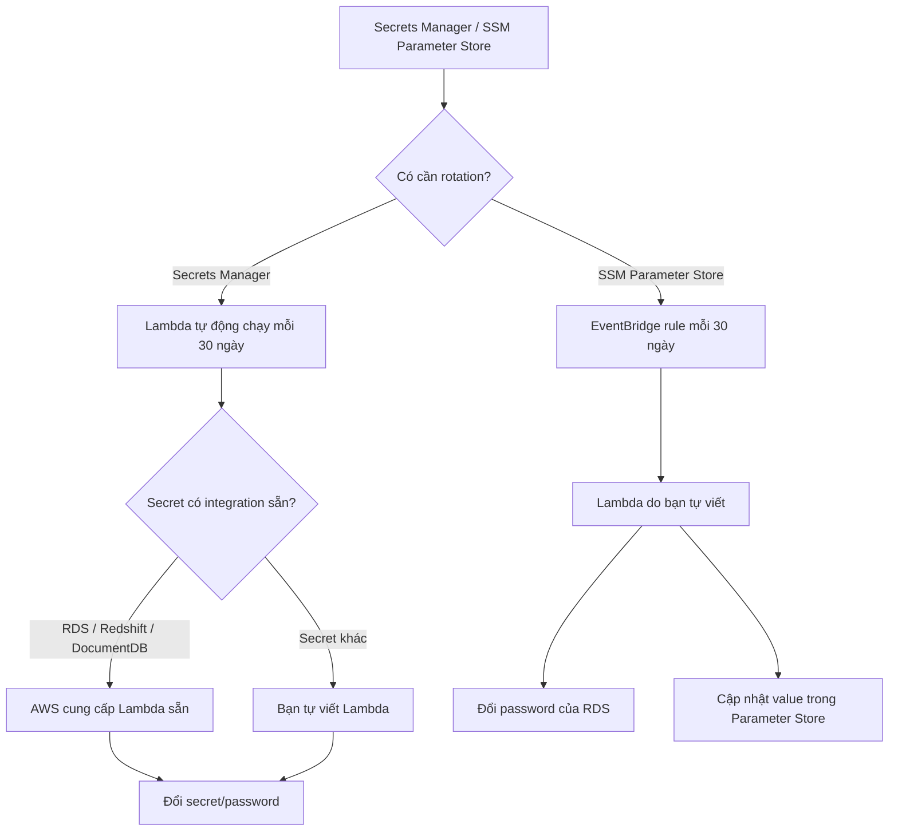

# 423. SSM Parameter Store vs Secrets Manager

## 🎯 Giới thiệu
Bài này so sánh hai dịch vụ lưu trữ cấu hình/bí mật trong AWS:

- **Secrets Manager**: tập trung vào **secrets**, chi phí cao hơn, có **rotation automation** bằng **Lambda**.
- **SSM Parameter Store**: phạm vi sử dụng rộng hơn, chi phí thấp hơn, API đơn giản hơn, nhưng **không có native secret rotation**.

## 1. So sánh tổng quan giữa hai dịch vụ
### 🔐 Secrets Manager
- **Đắt hơn** so với Parameter Store.
- Có thể **tự động rotation secrets** bằng **Lambda functions**.
- Một số Lambda phục vụ rotation đã được AWS cung cấp sẵn, đặc biệt cho:
  - **RDS**
  - **Redshift**
  - **DocumentDB**
- **KMS encryption là bắt buộc** cho secrets.
- Có thể **tích hợp với CloudFormation**.

### 📦 SSM Parameter Store
- **Rẻ hơn** và có **nhiều use case hơn**.
- Có **simple API**.
- **Không có secret rotation native**.
- **KMS encryption là optional** vì có thể lưu cả:
  - **secrets**
  - hoặc chỉ **parameters**
- Cũng có thể **tích hợp với CloudFormation**.
- Có thể dùng **SSM Parameter Store API** để lấy secret từ **Secrets Manager**.

## 2. Rotation flow của Secrets Manager và Parameter Store
### 🔄 Secrets Manager rotation
- Với ví dụ **Amazon RDS password**:
  - Secrets Manager sẽ **tự động invoke Lambda function mỗi 30 ngày**.
  - Nếu là trường hợp **RDS**, AWS cung cấp sẵn Lambda để đổi password.
  - Nếu là secret khác, bạn cần **tự viết Lambda function**.
- Đây là **native functionality** của Secrets Manager.

### ⏱️ Parameter Store rotation
- Parameter Store **không có rotation native**.
- Nếu lưu password của **Amazon RDS** trong Parameter Store:
  - Tạo **Amazon EventBridge rule** chạy **mỗi 30 ngày**.
  - Rule này sẽ trigger **Lambda function** do bạn tự viết.
  - Lambda sẽ:
    - đổi password của **Amazon RDS**
    - cập nhật lại giá trị trong **SSM Parameter Store**

## 3. Ý chính cần nhớ khi ôn thi
- **Secrets Manager** phù hợp khi cần:
  - quản lý **secrets**
  - **rotation tự động**
  - tích hợp mạnh với một số dịch vụ như **RDS**, **Redshift**, **DocumentDB**
- **SSM Parameter Store** phù hợp khi cần:
  - **chi phí thấp hơn**
  - **use case rộng hơn**
  - lưu **parameters** hoặc secrets đơn giản
  - tự xây rotation bằng **EventBridge + Lambda**
- Cả hai đều có thể **integrate with CloudFormation**.
- **KMS encryption**:
  - **bắt buộc** với Secrets Manager
  - **tùy chọn** với Parameter Store

## 📊 Bảng tóm tắt
| Tiêu chí | Mô tả |
|----------|------|
| Chi phí | **Secrets Manager** đắt hơn, **Parameter Store** rẻ hơn |
| Mục đích | Secrets Manager chuyên cho **secrets**; Parameter Store có **use case rộng hơn** |
| Rotation | Secrets Manager có **native rotation**; Parameter Store **không có native rotation** |
| Cơ chế rotation | Secrets Manager dùng **Lambda** tự động; Parameter Store thường cần **EventBridge + Lambda** tự viết |
| Tích hợp sẵn | Secrets Manager có Lambda sẵn cho **RDS, Redshift, DocumentDB** |
| Encryption | Secrets Manager: **KMS bắt buộc**; Parameter Store: **KMS optional** |
| API | Parameter Store có **simple API** |
| CloudFormation | Cả hai đều **integrate with CloudFormation** |
| Truy xuất secret | Có thể dùng **SSM Parameter Store API** để lấy secret từ **Secrets Manager** |

## 💡 Mẹo ghi nhớ cho kỳ thi AWS
- **Secrets Manager = Secrets + Rotation + KMS mandatory**
- **Parameter Store = Parameters + cheaper + no native rotation**
- Nếu đề bài nhấn mạnh:
  - **rotation tự động** -> nghĩ đến **Secrets Manager**
  - **rẻ hơn / nhiều use case hơn** -> nghĩ đến **SSM Parameter Store**
  - **RDS password rotation** -> Secrets Manager có thể làm sẵn bằng Lambda của AWS
  - **Parameter Store rotation** -> cần **EventBridge + Lambda** do bạn tự xây

## ✅ Kết luận
- **Secrets Manager** là lựa chọn mạnh hơn cho **quản lý secrets** và **rotation tự động**.
- **SSM Parameter Store** là lựa chọn linh hoạt, **rẻ hơn**, nhưng nếu cần rotation thì phải tự thiết kế bằng **EventBridge + Lambda**.
- Khi làm bài thi AWS, hãy chú ý nhất vào 3 điểm: **cost**, **rotation**, và **KMS encryption**.
