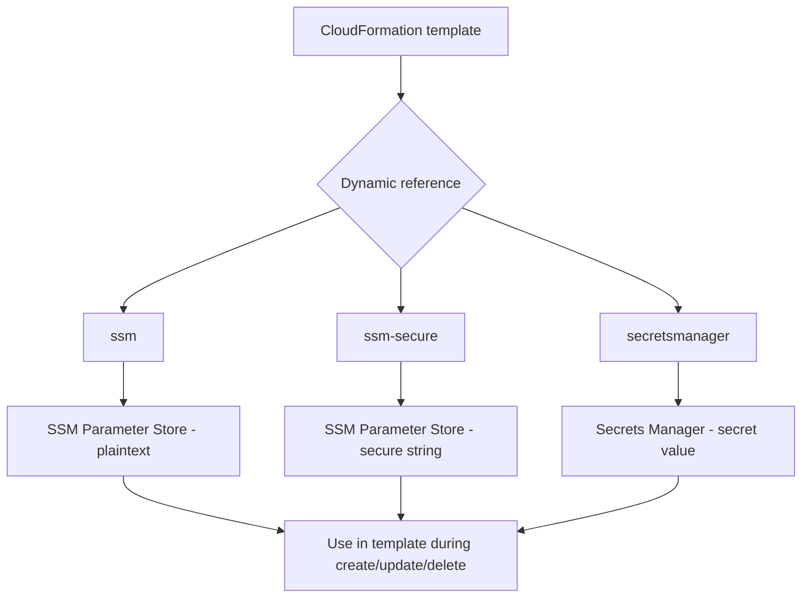
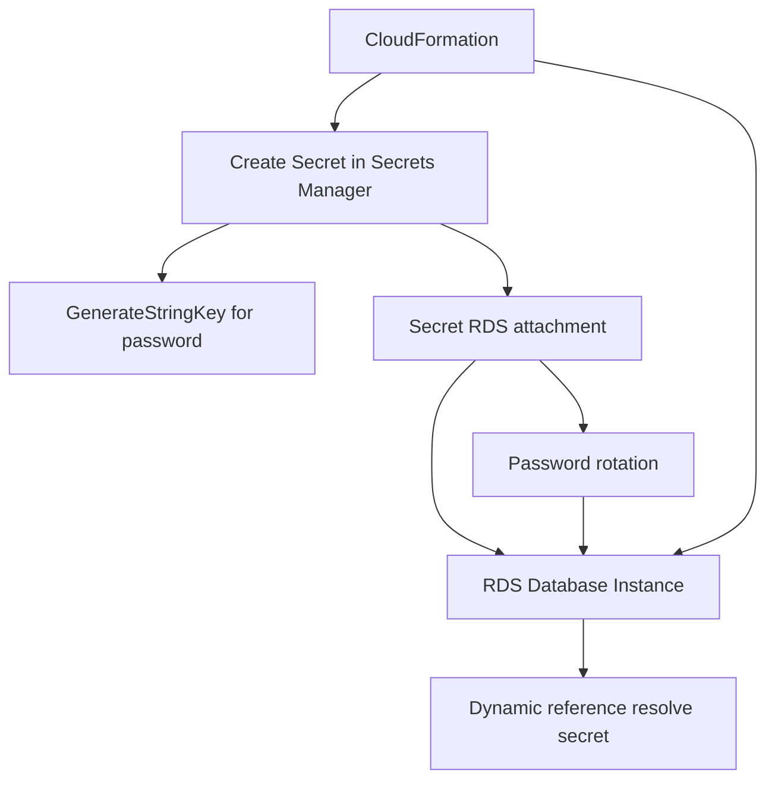

# 424. CloudFormation - Secrets Manager & SSM Integration

## 🎯 Giới thiệu
CloudFormation có thể tham chiếu trực tiếp các giá trị được lưu trong:
- `Systems Manager Parameter Store`
- `Secrets Manager`

Ý chính:
- CloudFormation sẽ truy xuất giá trị của reference trong lúc `create`, `update` hoặc `delete`.
- Cách này dùng để đưa secret hoặc parameter vào template mà không hardcode.

## 1. Dynamic references trong CloudFormation
CloudFormation hỗ trợ 3 loại reference chính:

- `ssm`: lấy `plaintext value` từ `Systems Manager Parameter Store`
- `ssm-secure`: lấy `secure string` từ `Systems Manager Parameter Store`
- `secretsmanager`: lấy `secret value` từ `Secrets Manager`

Cú pháp:
- `{{resolve:service-name:reference-key}}`

Ví dụ theo transcript:
- `SSM Parameter Store` được dùng để resolve trực tiếp giá trị cho `Amazon S3 bucket access control settings`
- `ssm-secure` được dùng cho `IAM user password`
- `secretsmanager` được dùng để lấy `master username` và `master password` của `RDS Database Instance`

## 2. CloudFormation + RDS + Secrets Manager
Transcript nêu 2 cách tích hợp chính:

### Cách 1: `RDS` tự quản lý secret
- Khi tạo `RDS Database cluster` như `Aurora`
- Nếu bật `ManageMasterUserPassword: true`
- Thì `RDS service` sẽ tự động tạo secret trong `Secrets Manager`
- Secret này dùng để quản lý:
  - `Master User Password`
  - `password rotation`

Để lấy `secret ARN`:
- Dùng `GetAtt` intrinsic function
- Lấy từ `Master User secret`

### Cách 2: CloudFormation tự tạo secret rồi nối với RDS
- Secret được tạo ngay trong `CloudFormation template`
- Dùng `GenerateStringKey` cho `password` để tự sinh secret password
- `RDS Database Instance` sẽ tham chiếu secret đó bằng dynamic reference (`resolve`)
- Sau đó tạo `secret RDS attachment`
- Mục đích:
  - liên kết database với secret trong `Secrets Manager`
  - cho phép `password rotation`
  - RDS tự cập nhật theo secret mới

## 3. Điểm cần nhớ khi ôn thi
- `CloudFormation` có thể đọc giá trị từ `SSM Parameter Store` và `Secrets Manager`
- Dùng `dynamic references` để nhúng giá trị vào template
- `ssm` dùng cho `plaintext`
- `ssm-secure` dùng cho `secure string`
- `secretsmanager` dùng cho secret trong `Secrets Manager`
- Với `RDS`, có 2 kiểu:
  - `RDS` tự tạo và quản lý secret khi `ManageMasterUserPassword: true`
  - CloudFormation tạo secret rồi gắn vào RDS bằng `secret RDS attachment`

## 📊 Bảng tóm tắt
| Tiêu chí | Mô tả |
|----------|------|
| Nguồn giá trị | `SSM Parameter Store` và `Secrets Manager` |
| Cơ chế | `CloudFormation` dùng `dynamic references` để resolve giá trị |
| Cú pháp | `{{resolve:service-name:reference-key}}` |
| `ssm` | Lấy `plaintext value` từ `Parameter Store` |
| `ssm-secure` | Lấy `secure string` từ `Parameter Store` |
| `secretsmanager` | Lấy `secret value` từ `Secrets Manager` |
| RDS + secret | `RDS` có thể tự tạo secret khi `ManageMasterUserPassword: true` |
| Liên kết secret với RDS | Dùng `secret RDS attachment` |
| Mục tiêu | Quản lý password và rotation cho database |

## 💡 Mẹo ghi nhớ cho kỳ thi AWS
- Nhớ 3 keyword: `ssm`, `ssm-secure`, `secretsmanager`
- `ssm` = plaintext
- `ssm-secure` = encrypted/secure string
- `Secrets Manager` = secret value
- Nếu đề bài nói `RDS` tự tạo secret, hãy nghĩ ngay đến `ManageMasterUserPassword: true`
- Nếu cần `rotation`, transcript nhấn mạnh việc tạo `secret RDS attachment`
- `GetAtt` được dùng để lấy `secret ARN` từ `Master User secret`

## ✅ Kết luận
CloudFormation có thể tích hợp trực tiếp với `SSM Parameter Store` và `Secrets Manager` thông qua `dynamic references`. Với `RDS`, transcript nhấn mạnh 2 mô hình: hoặc để `RDS` tự quản lý secret, hoặc để CloudFormation tạo secret rồi gắn vào database để hỗ trợ `password rotation`.
