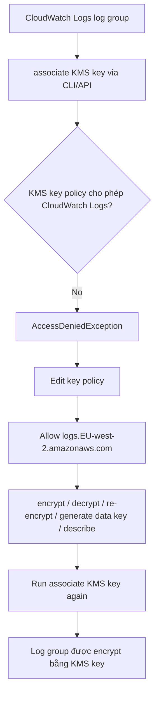

# 425. CloudWatch Logs Encryption

## 🎯 Giới thiệu
- Bài này nói về cách **encrypt CloudWatch Logs bằng KMS keys**.
- Việc encryption diễn ra ở **log group level**, không phải **log stream level**.
- Có 2 cách chính:
  - Gắn **CMK** vào một **existing log group**
  - Tạo **new log group** và gắn luôn **CMK** khi tạo
- **Không thể** làm việc này từ **CloudWatch console/UI**.
- Phải dùng **CloudWatch Logs API** thông qua **CLI** hoặc **SDK**.

## 1. Encrypt CloudWatch Logs bằng KMS
- CloudWatch Logs có thể được bảo vệ bằng **KMS key**.
- Một log group có thể được liên kết với KMS key để dữ liệu trong log group đó được mã hóa.
- Transcript nhấn mạnh: nếu nhìn trong UI, log group ban đầu **chưa có KMS key ID**.

## 2. Gắn KMS key cho log group hiện có
- Dùng lệnh **associate KMS key** để gắn KMS key vào **existing log group**.
- Khi chạy lệnh lần đầu, bị **AccessDeniedException**.
- Nguyên nhân không phải vì key không tồn tại, mà vì **key policy chưa cho phép CloudWatch Logs service dùng key**.
- Cần chỉnh **key policy** của KMS key để cho phép service:
  - `logs.EU-west-2.amazonaws.com`
  - các quyền: `encrypt`, `decrypt`, `re-encrypt`, `generate data key`, `describe`

## 3. Tạo log group mới đã encrypt sẵn
- Cách thứ hai là dùng **create-log-group** và truyền trực tiếp **KMS key ID**.
- Log group mới được tạo ra sẽ được gắn KMS key ngay từ đầu.
- Sau khi refresh danh sách log groups, log group mới cũng hiển thị **KMS key ID**.

## 📊 Bảng tóm tắt
| Tiêu chí | Mô tả |
|----------|------|
| Phạm vi encryption | Ở **log group level** |
| Công cụ hỗ trợ | **CLI** / **SDK** / **API** |
| Không hỗ trợ | Không làm được qua **CloudWatch console/UI** |
| Cách 1 | Dùng **associate KMS key** cho **existing log group** |
| Cách 2 | Dùng **create-log-group** để tạo log group mới và gắn **KMS key** ngay |
| Lỗi thường gặp | **AccessDeniedException** nếu **key policy** chưa cho phép CloudWatch Logs |
| Điều kiện bắt buộc | **KMS key policy** phải cho phép `logs.<region>.amazonaws.com` |

## 💡 Mẹo ghi nhớ cho kỳ thi AWS
- Nhớ câu: **CloudWatch Logs encryption = log group level, not log stream level**.
- Nếu đề hỏi “**gắn KMS key bằng console được không?**” → **Không**, phải dùng **API/CLI/SDK**.
- Nếu gặp lỗi khi associate key, nghĩ ngay đến **KMS key policy** chứ không chỉ nghĩ đến key ID.
- Hai lệnh cần nhớ:
  - **associate KMS key** cho log group đã tồn tại
  - **create-log-group** để tạo log group mới kèm KMS key

## ✅ Kết luận
- CloudWatch Logs có thể được encrypt bằng **KMS keys** ở mức **log group**.
- Có thể **associate** key cho log group hiện có hoặc **tạo mới** log group với key.
- Muốn thành công, phải đảm bảo **KMS key policy** cho phép **CloudWatch Logs service** truy cập key.
