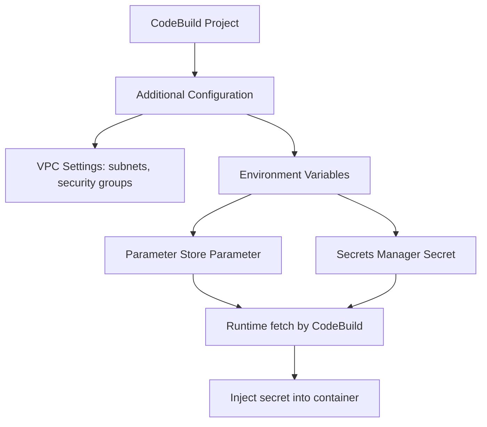

# 426. CodeBuild Security

## 🎯 Giới thiệu
- Bài này nói về **CodeBuild Security** và các cách xử lý **secret** an toàn khi dùng CodeBuild.
- Điểm chính:
  - **CodeBuild** mặc định là **out of your VPC**.
  - Tuy nhiên, bạn có thể **launch CodeBuild inside your VPC** để truy cập tài nguyên trong VPC.
  - Không nên lưu secret dưới dạng **plaintext** trong **environment variables**.

## 1. Chạy CodeBuild trong VPC
- CodeBuild có thể được cấu hình để chạy trong **VPC**.
- Khi đó, bạn có thể chỉ định:
  - **subnets**
  - **security groups**
- Cách này hữu ích khi build cần truy cập tài nguyên nội bộ như **RDS** trong VPC.

## 2. Quản lý secret an toàn
- Không nên đặt mật khẩu trực tiếp như `DB_PASSWORD = "supersecret"` trong environment variables vì đây là **plaintext secret** và có thể bị lộ.
- Thay vào đó, có 2 lựa chọn:
  - Environment variables trỏ tới **Systems Manager Parameter Store**
  - Environment variables trỏ tới **Secrets Manager secrets**
- Trong ví dụ của transcript:
  - Tạo parameter trong Parameter Store với tên `/CodeBuild/DBPassword`
  - Loại parameter là **SecureString**
  - Gắn với **KMS Key ID / AWS CMK**
  - Giá trị là `"SuperSecret"`
- Sau đó, CodeBuild có thể tham chiếu tên parameter này trong environment variable.
- Khi chạy build, CodeBuild sẽ **fetch value at runtime** và inject giá trị vào container.

## 3. Quyền truy cập cần có
- **IAM role** gắn với CodeBuild project phải có quyền truy cập:
  - **Systems Manager Parameter Store**
  - **Secrets Manager**
- Nếu không có quyền này, CodeBuild không thể lấy secret lúc runtime.

## 📊 Bảng tóm tắt
| Tiêu chí | Mô tả |
|----------|------|
| Mặc định của CodeBuild | Chạy **outside your VPC** |
| Chạy trong VPC | Có thể cấu hình **subnets** và **security groups** |
| Secret trong env vars | Không lưu **plaintext** |
| Cách an toàn 1 | Dùng **Parameter Store** |
| Cách an toàn 2 | Dùng **Secrets Manager** |
| Bảo vệ dữ liệu | Có thể dùng **KMS Key ID / AWS CMK** cho **SecureString** |
| Điều kiện quyền | **IAM role** của CodeBuild phải có quyền truy cập Parameter Store và Secrets Manager |

## 💡 Mẹo ghi nhớ cho kỳ thi AWS
- Nhớ nguyên tắc: **không để secret dạng plaintext trong environment variables**.
- Nếu đề bài nhắc đến:
  - **Config secret cho CodeBuild**
  - **RDS password**
  - **secure runtime injection**
  - hãy nghĩ ngay đến **Parameter Store** hoặc **Secrets Manager**.
- Nếu cần truy cập tài nguyên trong VPC, nhớ rằng **CodeBuild có thể chạy inside VPC**.
- Nếu transcript nhắc **SecureString**, hãy gắn với **KMS / AWS CMK**.

## ✅ Kết luận
- **CodeBuild Security** tập trung vào 2 ý chính:
  - chạy CodeBuild trong **VPC** khi cần truy cập tài nguyên nội bộ
  - quản lý **secret** an toàn bằng **Parameter Store** hoặc **Secrets Manager**
- Để build hoạt động đúng, **IAM role** của CodeBuild phải có quyền phù hợp để đọc các secret này tại runtime.
