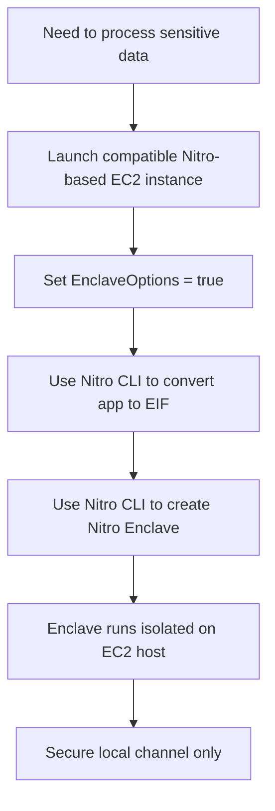

# 427. AWS Nitro Enclaves

## 🎯 Giới thiệu
- **AWS Nitro Enclaves** là môi trường compute **cô lập mạnh** dùng khi cần xử lý dữ liệu **rất nhạy cảm** trong cloud.
- Các loại dữ liệu được nhắc đến trong transcript:
  - **PII** (personally identifiable information)
  - dữ liệu y tế
  - dữ liệu tài chính
  - dữ liệu thẻ tín dụng
- Mục tiêu chính:
  - giảm **attack surface**
  - hạn chế tối đa truy cập ngoài ý muốn
  - đảm bảo chỉ code được phép mới chạy trong Enclave
  - bảo vệ dữ liệu nhạy cảm bằng **KMS encryption**

## 1. Đặc điểm của Nitro Enclaves 🔒
- Là một **virtual machine** rất cô lập, được **hardened** và **highly constrained**.
- Không phải container.
- Không có:
  - **persistent storage**
  - **interactive access**
  - **SSH**
  - **external networking**
- Chỉ có thể giao tiếp với EC2 host qua **secure local channel**.
- Chạy trên **Nitro Hypervisor**, nên tận dụng nền tảng Nitro của EC2.

## 2. Cách hoạt động / triển khai ⚙️
- Bước triển khai được nhắc đến trong transcript:
  1. Launch một **compatible Nitro-based EC2 instance**
  2. Set **`EnclaveOptions` = `true`**
  3. Dùng **Nitro CLI** để chuyển app thành **Enclave Image File (EIF)**
  4. Dùng **Nitro CLI** tạo **Enclave** từ EIF trên EC2 instance
- Enclave sẽ chia sẻ:
  - **vCPU / CPU**
  - **memory**
  - **kernel**
  với host, nhưng vẫn bị cô lập rất chặt.
- EC2 host và Enclave có sự tách biệt rõ ràng, chỉ giao tiếp qua kênh cục bộ an toàn.

## 3. Bảo mật và use cases 🛡️
- **Cryptographic Attestation**:
  - đảm bảo chỉ **authorized code** mới được chạy trong Enclave
  - code cần được **sign** để được chấp nhận
- **KMS encryption**:
  - đảm bảo chỉ Enclave mới có thể truy cập dữ liệu nhạy cảm
- Use cases được nêu:
  - **private key processing**
  - **processing credit cards**
  - **secure multi-party computation**
- Đây là mức bảo mật rất cao trên **EC2**.

## 📊 Bảng tóm tắt
| Tiêu chí | Mô tả |
|----------|------|
| Mục đích | Xử lý dữ liệu cực kỳ nhạy cảm trong môi trường cô lập |
| Tính chất | Virtual machine hardened, highly constrained |
| Không có | Persistent storage, interactive access, SSH, external networking |
| Nền tảng | Chạy trên Nitro Hypervisor của EC2 |
| Triển khai | EC2 compatible + `EnclaveOptions=true` + Nitro CLI + EIF |
| Bảo mật | Cryptographic Attestation, KMS encryption |
| Use cases | Private key processing, credit cards, secure multi-party computation |

## 💡 Mẹo ghi nhớ cho kỳ thi AWS
- **Nitro Enclaves = “EC2 nhưng siêu cô lập”**.
- Nhớ 4 điểm không có:
  - **No storage**
  - **No SSH**
  - **No interactive access**
  - **No external networking**
- Nhớ 3 từ khóa bảo mật:
  - **Cryptographic Attestation**
  - **KMS encryption**
  - **authorized code only**
- Nếu đề hỏi về xử lý dữ liệu nhạy cảm trên EC2, nghĩ ngay đến **Nitro Enclaves**.
- Nếu đề hỏi cách tạo Enclave, nhớ chuỗi:
  - **Nitro-based EC2 instance**
  - **EnclaveOptions=true**
  - **Nitro CLI**
  - **EIF**

## ✅ Kết luận
- **AWS Nitro Enclaves** cung cấp một môi trường xử lý cực kỳ cô lập cho dữ liệu nhạy cảm trên **EC2**.
- Nó giảm attack surface, không có networking bên ngoài, không SSH, không storage bền vững, và hỗ trợ bảo vệ bằng **Cryptographic Attestation** cùng **KMS**.
- Đây là một khái niệm quan trọng khi học AWS về bảo mật và xử lý dữ liệu nhạy cảm.
