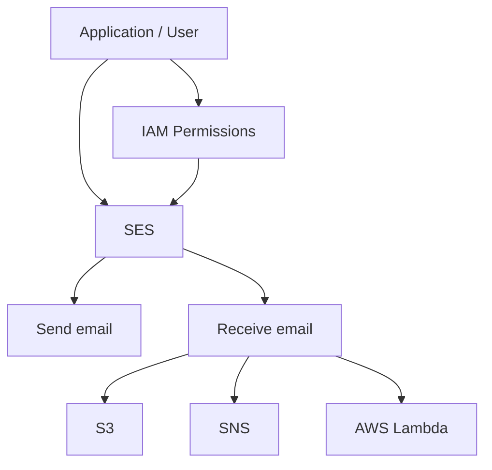

# 429. AWS SES

## 🎯 Giới thiệu
- **SES (Simple Email Service)** là service rất đơn giản trong AWS, dùng cho **email**.
- Điểm chính cần nhớ cho kỳ thi: nếu câu hỏi liên quan đến **gửi hoặc nhận email**, SES là ứng viên phù hợp nhất.

## 1. Gửi email với SES ✉️
- SES cho phép **send emails**.
- Có thể gửi email qua:
  - **SMTP interface**
  - **AWS SDK**
- Đây là trọng tâm chính của SES trong transcript.

## 2. Nhận email và tích hợp 📥
- SES cũng có thể **receive emails**.
- Khi nhận email, SES có thể tích hợp với:
  - **S3**
  - **SNS**
  - **AWS Lambda**
- Ý nghĩa thực tế: SES không chỉ để gửi mail mà còn có thể dùng trong luồng xử lý email đầu vào.

## 3. IAM permissions và mẹo làm bài thi 🔐
- Khi dùng SES để gửi hoặc nhận email, sẽ cần **IAM permissions**.
- SES được mô tả là **fully integrated with IAM**.
- Mẹo thi:
  - Nếu đề bài nhắc đến **email**, hãy nghĩ đến **SES** trước.
  - Nếu không liên quan email, SES thường **không phải lựa chọn đúng**.

## 📊 Bảng tóm tắt
| Tiêu chí | Mô tả |
|----------|------|
| Mục đích chính | Gửi và nhận email |
| Cách sử dụng | SMTP interface hoặc AWS SDK |
| Tính năng nhận email | Có thể receive emails |
| Tích hợp | S3, SNS, AWS Lambda |
| Bảo mật truy cập | Cần IAM permissions |
| Từ khóa thi cử | Email = SES |

## 💡 Mẹo ghi nhớ cho kỳ thi AWS
- **SES = Email Service**.
- Thấy đề cập đến **send email** hoặc **receive email** thì ưu tiên nghĩ đến **SES**.
- Nhớ 2 hướng sử dụng:
  - **SMTP / SDK** để gửi
  - **S3 / SNS / Lambda** để xử lý email nhận vào
- Nếu đề bài không nói gì về email, đừng cố gán SES.

## ✅ Kết luận
- **AWS SES** là service đơn giản dùng cho **email**.
- Nó hỗ trợ **gửi email**, **nhận email**, tích hợp với **S3, SNS, Lambda**, và dùng **IAM permissions** để kiểm soát truy cập.
- Trong bài thi, chỉ cần nhớ: **email = SES**.
