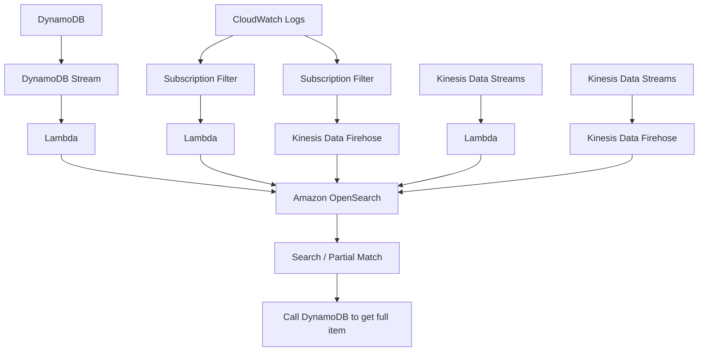

# 430. Amazon OpenSearch Service - Overview

## 🎯 Giới thiệu
- **Amazon OpenSearch Service** là dịch vụ kế thừa của **Amazon Elasticsearch**; việc đổi tên liên quan đến **licensing issues**.
- Dịch vụ này thường dùng để **search** cho application, và cũng có thể dùng cho **analytics queries**.
- OpenSearch thường là **dịch vụ bổ sung** cho database chính, không thay thế hoàn toàn database đó.

## 1. Khả năng chính của OpenSearch
- Có thể **search trên bất kỳ field nào**, kể cả **partial matches**.
- Khác với **DynamoDB**, nơi bạn chủ yếu query theo **primary key** hoặc **indexes**.
- Có thể dùng cho:
  - **Search capability** trong application
  - **Analytic queries**
  - **Visualizations** qua **OpenSearch Dashboards**
- OpenSearch có **query language riêng**.
- Không hỗ trợ **SQL** mặc định, nhưng có thể bật **SQL compatibility** bằng **plugin**.

## 2. Triển khai và bảo mật
- Có 2 cách provision OpenSearch Cluster:
  - **Managed cluster**: AWS provision các **physical instances** cho bạn.
  - **Serverless**: AWS quản lý từ **scaling** đến **operations**.
- Dữ liệu có thể được bảo vệ bằng:
  - Tích hợp với **Cognito**
  - Tích hợp với **IAM**
  - **At rest encryption**
  - **In-flight encryption**

## 3. Các pattern tích hợp phổ biến
- **DynamoDB + OpenSearch**
  - User ghi dữ liệu vào **DynamoDB**.
  - **DynamoDB Stream** được **Lambda** đọc.
  - Lambda insert dữ liệu vào **OpenSearch** theo thời gian thực.
  - Application dùng OpenSearch để **search item**:
    - tìm theo tên hoặc partial match
    - lấy ra **item ID**
    - sau đó gọi lại **DynamoDB** để lấy full item
- **CloudWatch Logs ingestion**
  - Dùng **CloudWatch Logs Subscription Filter**.
  - Có 2 hướng:
    - gửi real-time đến **Lambda** rồi vào OpenSearch
    - gửi đến **Kinesis Data Firehose**, sau đó vào OpenSearch theo **near real time**
- **Kinesis ingestion**
  - **Kinesis Data Firehose**:
    - near real time
    - có thể dùng **Lambda** để transform dữ liệu trước khi đẩy vào OpenSearch
  - **Kinesis Data Streams**:
    - dùng **Lambda** đọc stream theo real time
    - Lambda viết custom code để đẩy dữ liệu vào OpenSearch real time

## 📊 Bảng tóm tắt
| Tiêu chí | Mô tả |
|----------|------|
| Mục đích chính | Search cho application và analytics queries |
| Điểm khác với DynamoDB | Search được nhiều field, kể cả partial matches |
| Vai trò thường gặp | Dịch vụ bổ sung cho database chính |
| Cách triển khai | Managed cluster hoặc Serverless |
| Query language | Có query language riêng, SQL chỉ qua plugin |
| Nguồn ingest | Kinesis Data Firehose, IoT, CloudWatch Logs, custom application |
| Bảo mật | Cognito, IAM, at rest encryption, in-flight encryption |
| Trực quan hóa | OpenSearch Dashboards |
| Pattern phổ biến | DynamoDB Stream + Lambda + OpenSearch |

## 💡 Mẹo ghi nhớ cho kỳ thi AWS
- **OpenSearch = search + analytics**, không chỉ là search.
- **DynamoDB giữ data chính**, **OpenSearch giữ khả năng tìm kiếm**.
- Nhớ 2 kiểu cluster:
  - **Managed cluster** = AWS provision instance
  - **Serverless** = AWS lo scaling và operations
- Nhớ các luồng ingest hay gặp:
  - **DynamoDB Stream -> Lambda -> OpenSearch**
  - **CloudWatch Logs -> Subscription Filter -> Lambda / Firehose -> OpenSearch**
  - **Kinesis Data Streams -> Lambda -> OpenSearch**
- **SQL không native**, chỉ có khi bật **plugin**.

## ✅ Kết luận
- **Amazon OpenSearch Service** là dịch vụ kế thừa từ **Amazon Elasticsearch**.
- Nó mạnh ở **search theo nhiều field**, **partial match**, và **analytics**.
- Các kiến trúc phổ biến nhất xoay quanh việc dùng OpenSearch như lớp **search layer** bên trên nguồn dữ liệu chính như **DynamoDB**, **CloudWatch Logs**, hoặc **Kinesis**.
