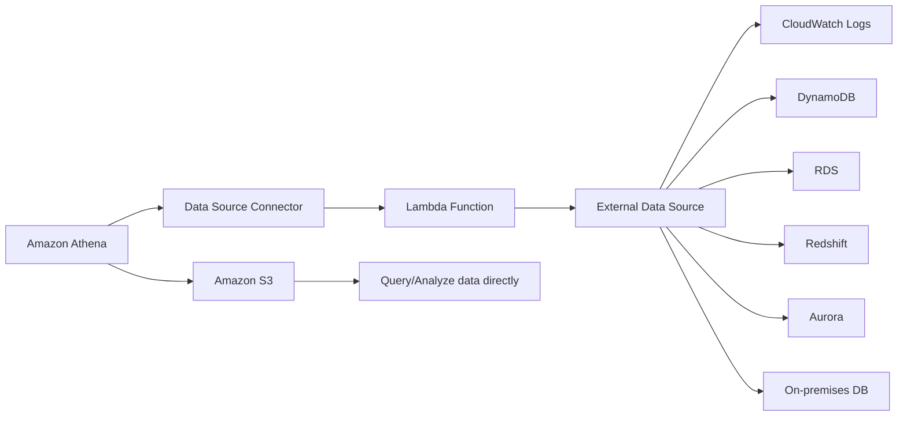

# 431. Amazon Athena - Overview

## 🎯 Giới thiệu
- Amazon Athena là một **serverless query service** dùng để phân tích dữ liệu lưu trong **Amazon S3 buckets**.
- Athena dùng **standard SQL** để query dữ liệu.
- Bên trong, Athena được xây dựng trên **Presto engine**.
- Điểm chính của Athena:
  - Query trực tiếp dữ liệu đang nằm trong S3
  - **Không cần di chuyển dữ liệu**
  - **Không cần provision database**
- Athena hỗ trợ nhiều định dạng dữ liệu như:
  - `CSV`
  - `JSON`
  - `ORC`
  - `Avro`
  - `Parquet`

## 1. Use case và mô hình sử dụng
- Athena thường được dùng cho:
  - **Ad hoc queries**
  - **Business intelligence**
  - **Analytics**
  - **Reporting**
  - Phân tích log từ các dịch vụ AWS
- Ví dụ log được nhắc trong transcript:
  - `VPC flow logs`
  - `load balancer logs`
  - `CloudTrail trails`
- Athena thường kết hợp với **Amazon QuickSight** để tạo **reports** và **dashboards**.
- Luồng sử dụng điển hình:
  - Dữ liệu nằm trong `S3`
  - Athena query dữ liệu bằng SQL
  - QuickSight kết nối vào Athena để trực quan hóa

## 2. Tối ưu hiệu năng và chi phí
- Athena tính phí theo **amount of data scanned per terabyte**.
- Vì vậy, mục tiêu là **scan less data** để giảm chi phí và tăng hiệu năng.

### Các cách tối ưu được nhắc trong transcript
- **Dùng columnar data format**
  - Khuyến nghị: **Apache Parquet** và **ORC**
  - Lợi ích: chỉ scan các cột cần thiết
- **Compress data**
  - Mục tiêu: giảm dung lượng và giảm dữ liệu phải đọc
- **Partition datasets**
  - Dữ liệu trong S3 được tổ chức theo path với các folder tương ứng với từng giá trị partition
  - Ví dụ trong transcript:
    - `year=1991`
    - `month=1`
    - `day=1`
  - Khi query filter theo `year`, `month`, `day`, Athena chỉ scan đúng phần dữ liệu cần thiết
- **Use bigger files**
  - Nên dùng file lớn hơn để giảm overhead
  - File lớn, ví dụ từ **128 MB** trở lên, sẽ dễ scan và retrieve hơn nhiều file nhỏ

## 3. Federated Query
- Athena không chỉ query dữ liệu trong `S3`.
- Athena còn có thể query dữ liệu ở:
  - **relational databases**
  - **non-relational databases**
  - **custom data sources**
  - dữ liệu trên **AWS** hoặc **on-premises**
- Cơ chế này gọi là **Federated Query**.
- Để làm được điều này, Athena dùng **Data Source Connector**.
- **Data Source Connector** là một **Lambda function**.
- Mỗi connector tương ứng với một Lambda function riêng.
- Athena có thể query các nguồn như:
  - `CloudWatch Logs`
  - `DynamoDB`
  - `RDS`
  - `ElastiCache`
  - `DocumentDB`
  - `Redshift`
  - `Aurora`
  - `SQL Server`
  - `MySQL`
  - `HBase on the EMR service`
  - các database on-premises khác
- Kết quả query có thể được lưu lại vào **Amazon S3 buckets** để phân tích sau.

## 📊 Bảng tóm tắt
| Tiêu chí | Mô tả |
|----------|------|
| Bản chất | `Serverless query service` |
| Ngôn ngữ truy vấn | `Standard SQL` |
| Engine | `Presto engine` |
| Nguồn dữ liệu chính | `Amazon S3` |
| Tính phí | Theo lượng dữ liệu scan |
| Định dạng hỗ trợ | `CSV`, `JSON`, `ORC`, `Avro`, `Parquet` |
| Dùng cho | `Ad hoc queries`, `BI`, `analytics`, `reporting`, log analysis |
| Tối ưu hiệu năng | `Parquet`, `ORC`, compression, partitioning, bigger files |
| Federated Query | Query dữ liệu ngoài S3 qua `Lambda` connector |

## 💡 Mẹo ghi nhớ cho kỳ thi AWS
- Khi thấy câu hỏi về **serverless SQL engine** để query dữ liệu trong **Amazon S3**, nghĩ ngay đến **Athena**.
- Muốn **giảm cost** và **tăng performance**:
  - ưu tiên **Parquet** hoặc **ORC**
  - dùng **partitioning**
  - dùng **larger files**
  - **compress data**
- Khi đề bài nói query dữ liệu không chỉ trong S3 mà còn từ database hoặc nguồn ngoài, đó là **Federated Query**.
- Nếu cần dashboard/reporting, nhớ mô hình: **S3 -> Athena -> QuickSight**.

## ✅ Kết luận
- Amazon Athena là dịch vụ **serverless**, dùng **SQL** để phân tích dữ liệu trong **S3** mà không cần di chuyển dữ liệu.
- Hiệu năng và chi phí phụ thuộc mạnh vào cách tổ chức dữ liệu: **columnar format**, **compression**, **partitioning**, và **file size**.
- Athena cũng hỗ trợ **Federated Query** thông qua **Lambda-based Data Source Connector**, mở rộng khả năng query ra nhiều nguồn dữ liệu khác nhau.
