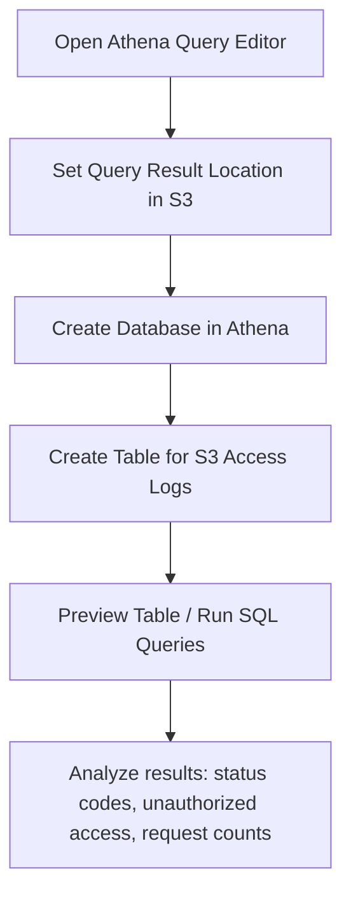

# 432. Amazon Athena - Hands On

## 🎯 Giới thiệu
- Bài giảng này demo cách dùng **Amazon Athena** để query dữ liệu trực tiếp từ **S3**.
- Điểm chính:
  - Athena là **serverless**.
  - Không cần setup server để phân tích dữ liệu.
  - Có thể dùng **SQL** để truy vấn log và dữ liệu trong S3.
- Luồng tổng quát:

## 1. Thiết lập Athena để lưu kết quả query
- Trước khi chạy query đầu tiên, cần cấu hình **query result location** trong **Amazon S3**.
- Thực hiện:
  - Mở **Athena Query Editor**.
  - Vào phần setting.
  - Chỉ định một **S3 bucket** để lưu kết quả query.
- Trong bài giảng:
  - Tạo một bucket mới trong S3.
  - Copy bucket name vào Athena.
  - Có thể browse S3 để chọn đúng bucket, tránh typo.
- Sau khi lưu, Athena sẽ dùng bucket này để lưu toàn bộ kết quả truy vấn.

## 2. Tạo database và table cho S3 Access Logs
- Sau khi set nơi lưu kết quả, bắt đầu query dữ liệu từ bucket **S3 access logs**.
- Bước đầu tiên là tạo **database** trong Athena:
  - Database được tạo là `S3 access logs DB`.
  - Database này xuất hiện ở panel bên trái trong Athena.
- Tiếp theo là tạo **table** để đại diện cho access logs:
  - Query tạo table được lấy từ **Amazon S3 and Athena documentation**.
  - Phần cần chỉnh sửa là:
    - **location**
    - **target bucket name**
    - **prefix** nếu dữ liệu nằm trong folder
- Trong bài:
  - Dữ liệu nằm ở top level nên không cần prefix.
  - Cần nhớ thêm **trailing slash** ở cuối đường dẫn.
- Sau khi tạo xong:
  - Table và các fields sẽ xuất hiện ở bên trái.
  - Có thể dùng **Preview table** để xem nhanh 10 rows dữ liệu.

## 3. Query dữ liệu và phân tích
- Athena cho phép chạy các truy vấn phân tích trực tiếp trên S3 data.
- Ví dụ trong bài:
  - Đếm request theo **HTTP status** và **request URI operation**.
  - Query này scan toàn bộ dữ liệu, nên mất thời gian hơn query preview.
- Kết quả cho thấy:
  - Có các trạng thái như `404`, `200`, `403`.
  - Có thể thấy số lượng dòng tương ứng cho từng loại.
- Ý nghĩa phân tích:
  - `404` có thể cho thấy có object không tìm thấy.
  - `403` cho thấy có thể có truy cập không được phép.
- Đây là cách dùng Athena để:
  - Kiểm tra tình trạng dữ liệu.
  - Tìm lỗi bất thường.
  - Phân tích truy cập trái phép vào S3 bucket.

## 📊 Bảng tóm tắt
| Tiêu chí | Mô tả |
|----------|------|
| Dịch vụ | **Amazon Athena** |
| Kiểu vận hành | **Serverless** |
| Nguồn dữ liệu | Dữ liệu trong **Amazon S3** |
| Bước bắt buộc đầu tiên | Set **query result location** trong S3 |
| Thành phần tạo trong Athena | **Database** và **Table** |
| Mục đích table | Đại diện cho **S3 access logs** |
| Ngôn ngữ truy vấn | **SQL** |
| Kiểu phân tích | Preview dữ liệu, aggregation, đếm theo status code |
| Lợi ích chính | Query dữ liệu S3 dễ dàng mà không cần server |

## 💡 Mẹo ghi nhớ cho kỳ thi AWS
- Athena = **SQL on S3**, chạy **serverless**.
- Luôn nhớ bước đầu tiên: cấu hình **query result location** trong S3.
- Muốn query dữ liệu log hiệu quả:
  - tạo **database**
  - tạo **table**
  - rồi mới chạy SQL
- Nếu thấy `404` hoặc `403` trong kết quả:
  - `404` gợi ý vấn đề **not found**
  - `403` gợi ý vấn đề **unauthorized access**
- Athena rất hữu ích khi cần phân tích dữ liệu nhanh mà không muốn quản lý server.

## ✅ Kết luận
- Bài này minh họa cách dùng **Athena** để query dữ liệu trong **S3** một cách đơn giản và hoàn toàn **serverless**.
- Quy trình cốt lõi là:
  - set nơi lưu kết quả query,
  - tạo database,
  - tạo table,
  - rồi chạy **SQL** để phân tích dữ liệu.
- Đây là một cách rất tiện để làm analytics trên S3 access logs và phát hiện bất thường trong truy cập.
