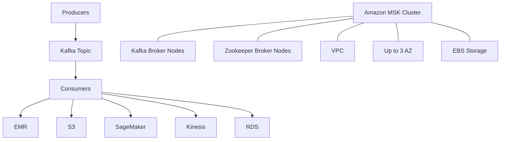

# 433. Amazon MSK - Overview

## 🎯 Giới thiệu
Amazon Managed Streaming for Apache Kafka, hay **Amazon MSK**, là dịch vụ giúp chạy **Kafka cluster** được quản lý hoàn toàn trên AWS.

- Kafka là một lựa chọn thay thế cho **Amazon Kinesis**
- Cả Kafka và Kinesis đều dùng để **stream data**
- MSK cho phép:
  - tạo, cập nhật, xóa cluster linh hoạt
  - AWS tự quản lý **Kafka broker nodes** và **Zookeeper broker nodes**
  - triển khai trong **VPC**, trải rộng tối đa **3 AZ** để tăng **high availability**
  - tự động khôi phục khi gặp các lỗi Kafka phổ biến
- Dữ liệu được lưu trên **EBS volumes** trong thời gian bạn muốn

## 1. Kiến trúc và cách hoạt động của MSK 🧩
MSK là cách để chạy Apache Kafka trên AWS mà không cần tự dựng phức tạp từ đầu.

- **Kafka cluster** gồm nhiều **brokers**
- **Producers** đẩy dữ liệu từ nhiều nguồn như:
  - Kinesis
  - IoT
  - RDS
  - các nguồn khác
- Dữ liệu được gửi vào **Kafka topic**
- Topic được replicate sang các broker khác
- **Consumers** sẽ pull dữ liệu từ topic và xử lý theo nhu cầu
- Dữ liệu sau đó có thể được đưa đến:
  - **EMR**
  - **S3**
  - **SageMaker**
  - **Kinesis**
  - **RDS**

## 2. MSK Serverless và điểm cần nhớ ⚙️
Ngoài MSK dạng cluster, còn có **MSK Serverless**.

- Bạn vẫn chạy **Apache Kafka** trên MSK
- Nhưng:
  - không cần provision servers
  - không cần quản lý capacity
  - MSK tự provision resources
  - MSK tự scale **compute** và **storage**

### Điểm nổi bật của MSK
- Dễ triển khai hơn nhiều so với việc tự setup Apache Kafka
- Có thể coi như “one-click deploy Kafka on AWS”
- Phù hợp khi muốn tập trung vào streaming thay vì vận hành hạ tầng

## 3. So sánh MSK với Kinesis Data Streams 📊
| Tiêu chí | Kinesis Data Streams | Amazon MSK |
|----------|----------------------|------------|
| Khái niệm tương đương | Data Streams | Kafka Topics |
| Thành phần tương đương | Shards | Partitions |
| Mở rộng | Shard Splitting / Merging | Chỉ có thể thêm partitions |
| In-flight encryption | Có | Plain text hoặc TLS |
| At-rest encryption | Có | Có |
| Message limit | 1 MB mặc định | Có thể cấu hình cao hơn, ví dụ 10 MB |
| Thời gian giữ dữ liệu | Theo cấu hình của dịch vụ | Giữ lâu tùy ý nếu trả phí EBS |
| Lưu trữ dữ liệu | Không nêu trong transcript | Trên **EBS** |

### Các điểm cần nhớ khi thi
- Trong **MSK**, bạn **không thể remove partitions**, chỉ có thể **add partitions**
- MSK có thể lưu dữ liệu **hơn 1 năm** nếu bạn tiếp tục trả phí cho **EBS storage**
- Về mặt ý tưởng, **Kinesis** và **Kafka/MSK** khá giống nhau, nhưng cách scale và encryption có khác

## 4. Cách consume dữ liệu từ MSK 🔄
Để produce vào MSK, bạn cần tạo **Kafka Producer**.

Các cách consume từ MSK theo transcript:
- **Kinesis Data Analytics for Apache Flink**
  - dùng **Flink Application** đọc trực tiếp từ MSK cluster
- **Glue**
  - dùng cho **streaming ETL jobs**
  - transcript nhắc đến **Apache Spark Streaming**
- **Lambda**
  - có thể dùng **Amazon MSK** làm **event source**
- **Tự viết Kafka consumer**
  - chạy trên:
    - **EC2**
    - **ECS**
    - **EKS**

## 📊 Bảng tóm tắt
| Tiêu chí | Mô tả |
|----------|------|
| Dịch vụ | **Amazon MSK** = Managed Streaming for Apache Kafka |
| Mục đích | Chạy Kafka trên AWS theo kiểu fully-managed |
| Triển khai | Trong **VPC**, đa AZ, tối đa 3 AZ |
| Quản lý bởi AWS | **Kafka broker nodes** và **Zookeeper broker nodes** |
| Độ tin cậy | Có automatic recovery từ lỗi Kafka phổ biến |
| Lưu trữ | **EBS volumes** |
| Phiên bản vận hành | Có **MSK Serverless** để không phải quản lý server/capacity |
| Thành phần luồng dữ liệu | Producers -> Topic -> Consumers |
| So với Kinesis | Tương tự về streaming, nhưng khác ở partitions, scale, encryption |

## 💡 Mẹo ghi nhớ cho kỳ thi AWS
- **MSK = Kafka được AWS quản lý**
- **Kafka Topics** trong MSK tương đương ý tưởng với **Shards** trong Kinesis Data Streams
- **MSK scale topic bằng cách thêm partitions**, không xóa partitions
- Nhớ rằng:
  - **Kinesis**: in-flight encryption
  - **MSK**: plain text hoặc **TLS** in-flight encryption
- **MSK lưu data trên EBS**, nên có thể giữ rất lâu nếu tiếp tục trả phí storage
- Muốn consume từ MSK, nhớ các đường phổ biến:
  - **Flink**
  - **Glue**
  - **Lambda**
  - **EC2 / ECS / EKS**

## ✅ Kết luận
Amazon MSK là dịch vụ giúp bạn chạy **Apache Kafka** trên AWS theo cách **fully-managed**.  
Điểm cốt lõi cần nhớ là MSK quản lý broker và Zookeeper, chạy trong VPC đa AZ, lưu dữ liệu trên EBS, hỗ trợ MSK Serverless, và có nhiều cách để consume dữ liệu như Flink, Glue, Lambda, hoặc custom Kafka consumers.
