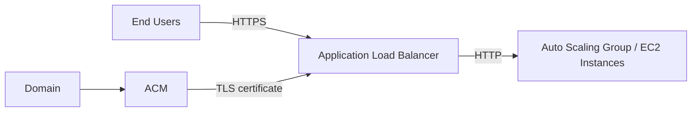

# 434. Amazon Certificate Manager (ACM)

## 🎯 Giới thiệu
Amazon Certificate Manager (ACM) là dịch vụ dùng để dễ dàng **provision, manage và deploy SSL/TLS certificates**.

Mục đích chính của ACM là:
- Cung cấp **in-flight encryption** cho website
- Tạo **HTTPS endpoint** cho người dùng cuối
- Hỗ trợ bảo mật kết nối trên web public

## 1. ACM dùng để làm gì?
ACM được dùng khi bạn muốn:
- Expose website qua **HTTPS**
- Quản lý và triển khai **TLS certificates** cho domain
- Bảo đảm dữ liệu truyền đi được mã hóa khi đi qua internet

Ví dụ trong transcript:
- Backend của application load balancer kết nối với Auto Scaling Group và EC2 instances qua **HTTP**
- Nhưng phía người dùng cuối cần **HTTPS**
- ACM sẽ cấp và duy trì certificate, sau đó load certificate lên **application load balancer**
- Load balancer sẽ cung cấp **HTTPS endpoint** cho client

## 2. Tính năng chính của ACM
Các điểm đáng nhớ của ACM trong transcript:

- Hỗ trợ cả **public** và **private TLS certificates**
- **Public TLS certificates** là **free of charge**
- Có **automatic TLS certificate renewal**
- Tích hợp với nhiều dịch vụ AWS để deploy certificate

Các dịch vụ tích hợp được nêu:
- **Elastic Load Balancer**
- **CloudFront distributions**
- **API Gateway**

## 3. Khi nào nghĩ đến ACM?
Khi gặp câu hỏi về:
- Dịch vụ giúp **in-flight encryption**
- Dịch vụ **generate certificates**
- Dịch vụ cấp **HTTPS endpoint** cho website hoặc application

Thì đáp án cần nghĩ tới là:
- **ACM**

## 📊 Bảng tóm tắt
| Tiêu chí | Mô tả |
|----------|------|
| Mục đích | Provision, manage, deploy SSL/TLS certificates |
| Bảo mật | Cung cấp in-flight encryption qua HTTPS |
| Loại certificate | Public và private TLS certificates |
| Chi phí | Public TLS certificates là free |
| Tính năng nổi bật | Automatic TLS certificate renewal |
| Tích hợp | Elastic Load Balancer, CloudFront, API Gateway |
| Tình huống điển hình | Dùng ACM để đưa HTTPS ra phía client, trong khi backend vẫn có thể là HTTP |

## 💡 Mẹo ghi nhớ cho kỳ thi AWS
- Nhìn thấy **HTTPS endpoint**, **TLS certificate**, **certificate renewal** thì nghĩ ngay đến **ACM**
- Nhớ mối liên hệ:
  - **ACM cấp certificate**
  - **Load Balancer / CloudFront / API Gateway dùng certificate đó**
- Public TLS certificates trong transcript được nhấn mạnh là **free**
- ACM giúp cho web có **in-flight encryption**

## ✅ Kết luận
ACM là dịch vụ của AWS để **quản lý và triển khai SSL/TLS certificates**, đặc biệt hữu ích khi bạn muốn bật **HTTPS** cho ứng dụng. Dịch vụ này hỗ trợ **public/private certificates**, có **auto renewal**, và tích hợp tốt với **Elastic Load Balancer, CloudFront, API Gateway**.
