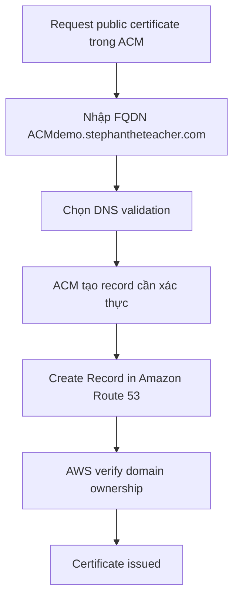
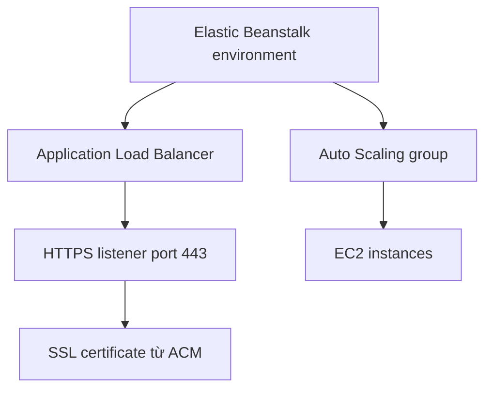
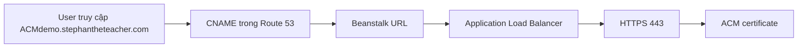

# 435. Amazon Certificate Manager (ACM) Hands On

## 🎯 Giới thiệu
- Bài thực hành này minh họa cách dùng **Amazon Certificate Manager (ACM)** để:
  - Request **public certificate**
  - Xác thực bằng **DNS validation** qua **Route 53**
  - Gắn certificate vào **Application Load Balancer** trong **Elastic Beanstalk**
  - Truy cập ứng dụng bằng **HTTPS** qua domain riêng
- Trọng tâm ôn thi:
  - ACM thường được dùng cùng **Route 53** để xác thực nhanh
  - Certificate được load trực tiếp vào **load balancer**
  - Truy cập HTTPS thành công khi DNS và certificate đều đúng

## 1. Request certificate trong ACM
- Mở **Certificate Manager**
- Chọn request **public certificate**
- Nhập **FQDN**:
  - `ACMdemo.stephantheteacher.com`
- Lý do dùng domain này:
  - Domain `stephantheteacher.com` đã được đăng ký trong AWS account
  - Domain được quản lý bởi **Route 53**
- Chọn **DNS validation**
  - Đây là cách đơn giản
  - Có tích hợp trực tiếp giữa **ACM** và **Route 53**
- Giữ nguyên **key algorithm** mặc định
- Sau khi request:
  - Certificate ở trạng thái **pending validation**
  - ACM hiển thị record DNS cần tạo
  - Có thể bấm **Create Record in Amazon Route 53**
- Khi Route 53 tạo record xong:
  - AWS xác minh quyền sở hữu domain
  - Certificate được **issued**

## 2. Gắn certificate vào Elastic Beanstalk và ALB
- Tạo application trong **Elastic Beanstalk**
- Chọn:
  - **Web server environment**
  - Tên ứng dụng: `Demo TLS certificates`
  - **Managed platform**
  - **Node.js**
  - **High availability**
  - **Custom configuration**
- Khi cấu hình:
  - Dùng **Application Load Balancer**
  - Tạo listener riêng
  - Port: **443**
  - Protocol: **HTTPS**
- Chọn **SSL certificate** vừa tạo từ ACM
- Chọn **TLS policy**
  - Có thể chọn policy mong muốn để quyết định mức độ mạnh của HTTPS security
- Kết quả sau khi launch:
  - Beanstalk tạo **load balancer**
  - **Auto Scaling group**
  - **EC2 instances**
  - Listener **443** được cấu hình trên load balancer
  - TLS/SSL certificate được load trực tiếp vào load balancer

## 3. Tạo CNAME và kiểm tra HTTPS
- Sau khi environment chạy xong, cần tạo DNS record trong **Route 53**
- Trong hosted zone của `stephantheteacher.com`:
  - Tạo record **CNAME**
  - Name: `ACMdemo`
  - Value: trỏ đến Beanstalk URL
  - Không thêm `http`
- Ý nghĩa:
  - Khi người dùng vào `ACMdemo.stephantheteacher.com`
  - Hệ thống sẽ trỏ đến Beanstalk URL phía sau
- Sau khi DNS propagate:
  - Truy cập được bằng domain mới
- Thêm `https://` vào URL:
  - Trình duyệt hiển thị **lock**
  - Kết nối được xác nhận là **secure**
  - Certificate được browser xác minh
- Kiểm tra trong AWS:
  - Vào **EC2 console**
  - Xem **load balancers**
  - Trong **listeners and rules**
  - Thấy listener **HTTPS 443**
  - Có **default SSL TLS certificate** load từ **ACM**
- Có thể:
  - Đổi default certificate
  - Thêm thêm certificates từ UI này
- Cuối cùng:
  - Xóa application để tránh phát sinh chi phí
  - Vào **Action** → **Delete Application**
  - Nhập đúng tên `Demo TLS certificates`

## 📊 Bảng tóm tắt
| Tiêu chí | Mô tả |
|----------|------|
| Dịch vụ chính | **ACM**, **Route 53**, **Elastic Beanstalk**, **Application Load Balancer** |
| Loại certificate | **Public certificate** |
| Cách validation | **DNS validation** |
| Domain dùng trong demo | `ACMdemo.stephantheteacher.com` |
| Listener quan trọng | **HTTPS 443** |
| Nguồn certificate trên ALB | Certificate được load từ **ACM** |
| DNS record cần tạo | **CNAME** trong **Route 53** |
| Kết quả cuối | Truy cập ứng dụng bằng **HTTPS** với lock biểu thị connection secure |

## 💡 Mẹo ghi nhớ cho kỳ thi AWS
- **ACM + Route 53**: dễ nhớ nhất cho **DNS validation**
- **ACM certificate** có thể gắn trực tiếp vào **ALB listener 443**
- **Elastic Beanstalk** có thể tự tạo hạ tầng gồm:
  - **Load balancer**
  - **Auto Scaling group**
  - **EC2 instances**
- Nếu domain riêng chưa vào được ngay:
  - Nghĩ đến **DNS propagation**
- Nếu browser có lock và secure connection:
  - Thường là HTTPS + certificate đã được cấu hình đúng
- Khi kiểm tra phía AWS:
  - Xem **listeners and rules** của load balancer để xác nhận certificate từ ACM đã được load

## ✅ Kết luận
- Bài lab cho thấy quy trình thực tế dùng **ACM** để cấp certificate, xác thực qua **Route 53**, rồi gắn vào **Application Load Balancer** trong **Elastic Beanstalk**.
- Sau khi thêm **CNAME** và chờ DNS propagate, ứng dụng truy cập được bằng **HTTPS** với certificate hợp lệ.
- Đây là mẫu kiến trúc quan trọng để ôn thi phần **TLS/SSL integration** trong AWS.
