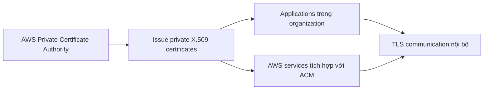

# 436. ACM Private CA - Overview

## 🎯 Giới thiệu
- AWS Certificate Manager (ACM) có thể cấp **public certificates**, nhưng cũng có thể cấp **private certificates**.
- Để làm điều này, bạn phải tạo một **AWS Private Certificate Authority (Private CA)**.
- Đây là **managed service**.
- Bạn có thể tạo:
  - **root Certificate Authority**
  - hoặc **subordinate Certificate Authorities** phụ thuộc vào root
- Private CA dùng để cấp **end-entity X.509 certificates** cho ứng dụng, không dùng để tạo ra certificate mới.

## 1. Private Certificate Authority là gì? 🔐
- **Private CA** là một **Certificate Authority riêng** trong tổ chức.
- Các certificate do Private CA cấp chỉ được tin cậy bởi các ứng dụng trong organization, với điều kiện chúng trust Private CA đó.
- Đây không phải thứ dùng được trên **public internet**.
- Vì là private, certificate này không thể deploy ra public internet để hoạt động như public certificate.

## 2. Luồng cấp phát và triển khai certificate 🔄
- Private CA tạo ra và cấp **end-entity certificates** cho:
  - applications
  - users
  - computers
  - API endpoints
  - HTTP endpoints
  - IoT devices
- Các AWS services có tích hợp với ACM cũng có thể dùng private certificate, ví dụ:
  - **application load balancer**
  - **CloudFront**
  - **API Gateway**
  - **load balancers**
  - **Kubernetes service**

## 3. Use cases và giới hạn quan trọng 📌
- **Use cases** của Private CA:
  - mã hóa **TLS communication** nội bộ
  - **cryptographically sign code**
  - xác thực **users, computers, API endpoints, IoT devices** bằng certificate
  - xây dựng **public key infrastructure** trong enterprise
- **Giới hạn quan trọng**:
  - chỉ dùng nội bộ trong organization
  - không deploy được trên public internet
  - end-entity certificates **không thể tạo ra certificate mới**

## 📊 Bảng tóm tắt
| Tiêu chí | Mô tả |
|----------|------|
| Dịch vụ | **AWS Private Certificate Authority** |
| Mục đích | Cấp **private certificates** |
| Loại CA | **root CA** hoặc **subordinate CA** |
| Loại certificate | **end-entity X.509 certificates** |
| Phạm vi tin cậy | Chỉ trong organization, nếu trust Private CA |
| Không dùng cho | **public internet** |
| Use cases | TLS nội bộ, sign code, xác thực users/computers/APIs/IoT, xây dựng PKI |
| Tích hợp AWS | **ALB, CloudFront, API Gateway, load balancers, Kubernetes service** |

## 💡 Mẹo ghi nhớ cho kỳ thi AWS
- Nhớ rằng **ACM** không chỉ có **public certificates** mà còn có thể cấp **private certificates** thông qua **AWS Private CA**.
- Nếu đề bài nói về:
  - certificate nội bộ
  - TLS trong enterprise
  - xác thực thiết bị/người dùng nội bộ
  - PKI trong tổ chức  
  thì nghĩ ngay đến **Private CA**.
- Nếu certificate cần dùng cho **public internet**, thì **Private CA** không phù hợp.
- Từ khóa hay gặp trong đề: **root CA**, **subordinate CA**, **end-entity X.509 certificates**, **trust within organization**.

## ✅ Kết luận
- **ACM Private CA** là dịch vụ managed để tạo **private root/subordinate Certificate Authority**.
- Nó dùng để cấp **private X.509 certificates** cho ứng dụng và thiết bị trong tổ chức.
- Điểm mấu chốt khi ôn thi: **nội bộ, trust trong organization, không dùng cho public internet**.
