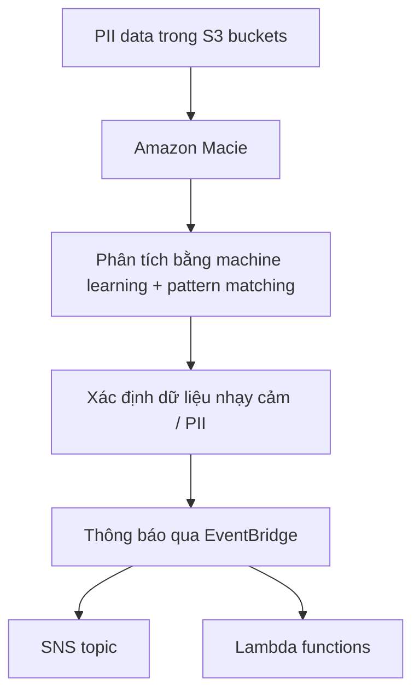

# 437. Amazon Macie

## 🎯 Giới thiệu
- **Amazon Macie** là dịch vụ **fully managed** về **data security** và **data privacy**.
- Dịch vụ này dùng **machine learning** và **pattern matching** để phát hiện và bảo vệ **sensitive data** trong AWS.
- Trọng tâm chính là phát hiện **PII (personally identifiable information)** trong các **S3 buckets**.

## 1. Macie làm gì
- Quét dữ liệu trong **S3 buckets** để xác định dữ liệu nào có thể được phân loại là **PII**.
- Khi phát hiện dữ liệu nhạy cảm, Macie sẽ **alert** cho bạn.
- Macie trong bài giảng này được mô tả là chỉ dùng để **find sensitive data in S3 buckets**.

## 2. Luồng hoạt động
- Bạn lưu **PII data** trong **S3 buckets**.
- **Macie** phân tích dữ liệu đó bằng **machine learning** và **pattern matching**.
- Macie xác định dữ liệu nào là **PII**.
- Sau đó Macie gửi thông báo qua **EventBridge**.
- Từ **EventBridge**, bạn có thể tích hợp tiếp với **SNS topic**, **Lambda functions**, và các dịch vụ khác.

## 3. Cách bật Macie
- Macie được mô tả là **one click to enable**.
- Bạn chỉ cần **specify the S3 buckets** muốn theo dõi.
- Sau đó Macie sẽ bắt đầu làm việc trên các bucket đã chọn.

## 📊 Bảng tóm tắt
| Tiêu chí | Mô tả |
|----------|------|
| Loại dịch vụ | **Fully managed** data security và data privacy service |
| Kỹ thuật sử dụng | **Machine learning**, **pattern matching** |
| Mục tiêu chính | Phát hiện và bảo vệ **sensitive data** |
| Dữ liệu được nhắm tới | **PII** trong **S3 buckets** |
| Cơ chế thông báo | Qua **EventBridge** |
| Tích hợp sau thông báo | **SNS topic**, **Lambda functions** |
| Cách triển khai | **One click to enable**, chỉ cần chọn các **S3 buckets** |

## 💡 Mẹo ghi nhớ cho kỳ thi AWS
- Ghi nhớ: **Macie = tìm PII trong S3**.
- Nếu đề bài nhắc đến:
  - **PII**
  - **S3 buckets**
  - **EventBridge alert**
  
  thì hãy nghĩ ngay tới **Amazon Macie**.
- Macie trong transcript được nhấn mạnh là tập trung vào **sensitive data discovery** trong **S3**, không phải một dịch vụ xử lý nhiều loại dữ liệu khác.

## ✅ Kết luận
- **Amazon Macie** là dịch vụ giúp phát hiện **sensitive data**, đặc biệt là **PII**, trong **S3 buckets**.
- Nó dùng **machine learning** và **pattern matching** để phân tích dữ liệu, rồi thông báo qua **EventBridge**.
- Cách dùng rất đơn giản: bật dịch vụ và chỉ định các **S3 buckets** cần theo dõi.
