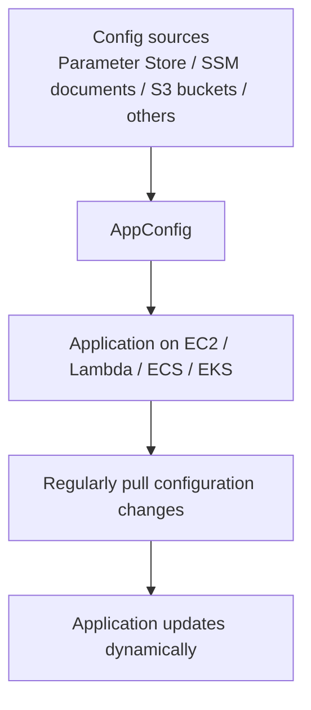
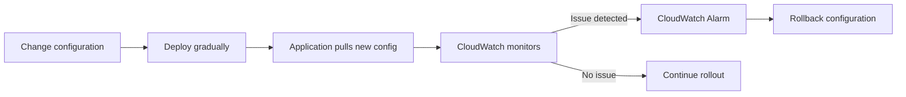

# 438. AWS AppConfig - Overview

## 🎯 Giới thiệu
AWS AppConfig là dịch vụ dùng để **configure, validate, deploy dynamic configurations** cho application.

- Thay vì nhúng configuration cùng code hoặc chỉ dựa vào environment variables, bạn có thể để configuration **nằm bên ngoài application**.
- Khi configuration thay đổi, application có thể thay đổi **mà không cần deploy code mới** và **không cần restart**.
- Rất hữu ích cho các ứng dụng chạy trên:
  - `EC2`
  - `Lambda`
  - `ECS`
  - `EKS`

---

## 1. AppConfig dùng để làm gì? 🚀
AppConfig giúp quản lý các loại configuration thay đổi theo thời gian:

- **Feature flags**
  - Deploy application trước, nhưng để feature ở trạng thái `off` hoặc `false`.
  - Khi sẵn sàng test, chỉ cần đổi feature flag trong `AppConfig`.
  - Application sẽ tự nhận cấu hình mới và bật feature lên.

- **Dynamic configuration**
  - Có thể thay đổi configuration để fine-tune performance.
  - Có thể cập nhật real-time các giá trị như:
    - `IP block list`
    - `allow list`

- Tất cả đều diễn ra mà **không cần đổi application code**.

---

## 2. Cách AppConfig hoạt động 🔄
AppConfig có thể lấy configuration từ nhiều nguồn:

- `Parameter Store`
- `SSM documents`
- `S3 buckets`
- hoặc các nguồn khác

Application chạy trên `EC2` và các môi trường tương tự sẽ **regularly pull** configuration changes từ AppConfig.

---

## 3. Validation, rollout và rollback 🛡️
Khi có configuration change, AppConfig hỗ trợ kiểm soát rủi ro:

- **Gradual deployment**
  - Không cần áp dụng thay đổi cho tất cả instances cùng lúc.
  - Có thể deploy dần dần để theo dõi vấn đề.

- **Monitoring bằng CloudWatch**
  - Sau khi thay đổi configuration, hệ thống được monitor bằng `CloudWatch`.
  - Nếu có vấn đề, alarm có thể được kích hoạt.

- **Rollback**
  - `CloudWatch alarm` có thể trigger rollback của configuration.

- **Validation**
  - Có thể validate configuration bằng:
    - `JSON Schema` để kiểm tra type và structure
    - `Lambda function` nếu cần logic phức tạp hơn

---

## 📊 Bảng tóm tắt
| Tiêu chí | Mô tả |
|----------|------|
| Mục đích | Quản lý `dynamic configurations` cho application |
| Điểm chính | Configuration tách khỏi code, thay đổi mà không cần deploy mới |
| Use case | `feature flags`, `IP block list`, `allow list`, fine-tune performance |
| Hỗ trợ nền tảng | `EC2`, `Lambda`, `ECS`, `EKS` |
| Nguồn config | `Parameter Store`, `SSM documents`, `S3 buckets`, hoặc nguồn khác |
| An toàn triển khai | Có thể deploy dần và rollback nếu `CloudWatch` phát hiện lỗi |
| Validation | `JSON Schema` hoặc `Lambda function` |

---

## 💡 Mẹo ghi nhớ cho kỳ thi AWS
- `AppConfig` = **configuration outside the app**.
- Nhớ 3 ý chính: **configure, validate, deploy**.
- Dùng cho các tình huống cần:
  - bật/tắt `feature flags`
  - thay đổi config nhanh
  - rollback khi có sự cố
- `CloudWatch` + alarm = cơ chế theo dõi và rollback.
- `JSON Schema` = validate đơn giản.
- `Lambda function` = validate phức tạp hơn.

---

## ✅ Kết luận
AWS AppConfig cho phép quản lý `dynamic configurations` một cách an toàn và linh hoạt, giúp application thay đổi độc lập với code deployment. Đây là dịch vụ rất phù hợp cho `feature flags`, thay đổi configuration theo thời gian thực, validation, gradual rollout và rollback bằng `CloudWatch`.
