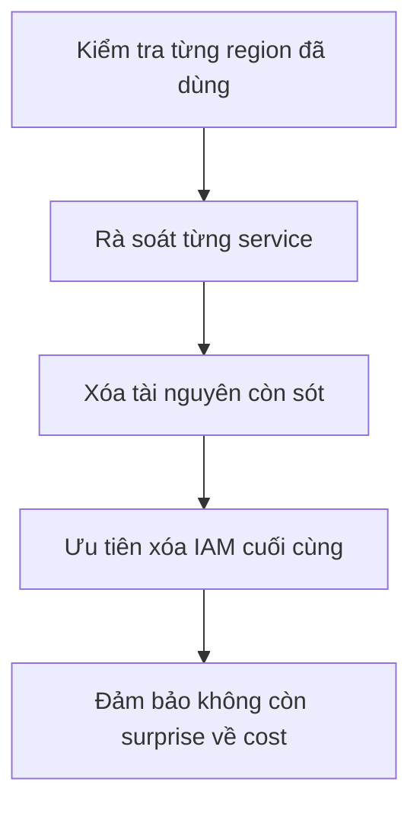

# 439. AWS Final Cleanup

## 🎯 Giới thiệu
Sau khi hoàn tất toàn bộ hands-on, mục tiêu tiếp theo là **clean up toàn bộ AWS** để:
- tránh **overpay**
- giữ đúng **best practice**
- không để lại tài nguyên gây “surprise” về chi phí

Việc clean up nên làm **methodical**, tức là đi theo từng **region** đã sử dụng, ví dụ:
- **Paris**
- **US East (North Virginia)**

## 1. Clean up theo region
- Bắt đầu từ từng **region** đã dùng trong bài học.
- Trong transcript, hai region cần rà soát là:
  - **Paris**
  - **US East, North Virginia**
- Mục tiêu là kiểm tra tất cả service đã tạo trong mỗi region và xóa phần không còn cần thiết.

## 2. Các service cần kiểm tra và xóa
### Compute và Platform
- **EC2**: xóa các instances còn lại, including các tài nguyên liên quan như **scaling group** và **load balancers**.
- **Lambda**: xóa toàn bộ **Lambda functions**.
- **Elastic Beanstalk**: xóa toàn bộ **applications** và **environments**.

### Storage và Database
- **S3**: kiểm tra **buckets** và các file còn sót.
- **RDS**: xóa database đã tạo.
- **DynamoDB**:
  - xóa toàn bộ **tables**, **indexes**, etc.
  - chú ý **total capacity** không vượt quá **10**
  - nếu vượt **10 RCU** và **10 WCU** thì sẽ bắt đầu bị tính phí

### Network và API
- **VPC / Route 53**: kiểm tra và xóa các tài nguyên đã tạo trong đó.
- **API Gateway**: xóa toàn bộ API đã tạo, trong transcript có nhắc là khoảng **3 APIs**.

### Developer Tools và Monitoring
- **CodeCommit**
- **CodeBuild**
- **CodeDeploy**
- **CodePipeline**
- **CloudWatch**: xóa các **alarms**, **events**, **dashboards**
- **CloudFormation**: xóa bằng cách vào **stack** rồi **delete**
- **Systems Manager**: xóa các **parameters** đã tạo

### Integration và Security
- **Kinesis**: xóa các **stream** vì chúng được nhắc là **rất expensive** và **không có free tier**
- **Cognito**: xóa tài nguyên đã dùng
- **IAM**: nên xóa **last**, vì mọi thứ đều phụ thuộc vào IAM
- **SNS**
- **SQS**
- **Step Functions**
- **SWF**

## 3. Điểm cần nhớ cho ôn thi
- Không phải service nào cũng cần theo dõi chi phí giống nhau, nhưng **cleanup vẫn là best practice**.
- **IAM** nên được xóa **cuối cùng**.
- **Kinesis** là điểm cần chú ý vì transcript nhấn mạnh:
  - **expensive**
  - **không có free tier**
- Với **DynamoDB**, phải để ý giới hạn **10 RCU / 10 WCU** để tránh phát sinh phí.
- **CloudFormation** là cách nhanh để dọn:
  - mở **stack**
  - right click
  - **delete**
- Hãy kiểm tra **từng region**, không chỉ một nơi duy nhất.

## 📊 Bảng tóm tắt
| Tiêu chí | Mô tả |
|----------|------|
| Mục tiêu | Dọn sạch AWS sau hands-on để tránh overpay |
| Cách làm | Kiểm tra theo từng region và từng service |
| Region được nhắc | Paris, US East (North Virginia) |
| Nhóm service nổi bật | EC2, Lambda, Beanstalk, S3, RDS, DynamoDB, API Gateway, CloudWatch, CloudFormation, Systems Manager, Kinesis, Cognito, IAM, SNS, SQS |
| Điểm cần nhớ | Xóa IAM last, Kinesis expensive, DynamoDB chú ý 10 RCU/10 WCU |
| Tác động thi cử | Nhận biết quy trình clean up và thứ tự ưu tiên xóa tài nguyên |

## 💡 Mẹo ghi nhớ cho kỳ thi AWS
- **“Region trước, service sau”**: luôn rà theo từng region như **Paris** và **North Virginia**.
- **“IAM last”**: mọi thứ phụ thuộc vào IAM nên xóa sau cùng.
- **“Kinesis = expensive”**: dễ được hỏi trong bối cảnh cleanup/cost.
- **“DynamoDB cap 10”**: nhớ mốc **10 RCU** và **10 WCU**.
- **“CloudFormation delete stack”**: đây là cách cleanup nhanh và gọn.
- Khi ôn thi, hãy nghĩ theo câu hỏi: **service nào đã dùng thì phải xóa gì?**

## ✅ Kết luận
Bài này tập trung vào việc **dọn dẹp toàn bộ AWS sau khi thực hành**. Trọng tâm là kiểm tra theo **từng region**, xóa các tài nguyên đã tạo ở các service như **EC2, Lambda, S3, RDS, DynamoDB, API Gateway, CloudWatch, CloudFormation, Kinesis, IAM, SNS, SQS**, và đặc biệt nhớ **xóa IAM cuối cùng** để tránh ảnh hưởng đến các tài nguyên khác.
