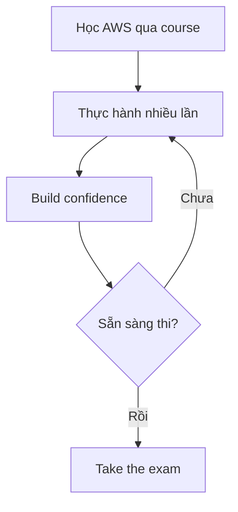
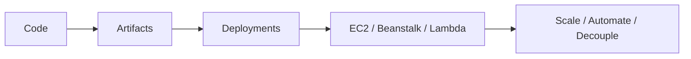

# 443. Exam Tips - AWS Certified Developer Associate

## 🎯 Giới thiệu
- Bài này là các lời khuyên thực chiến để chuẩn bị và vượt qua kỳ thi AWS Certified Developer Associate.
- Thông điệp chính: **practice makes perfect**.
- Nếu mới học AWS, cần thời gian tích lũy kinh nghiệm thực hành; không nên vội thi khi chưa thật sự tự tin.

## 1. 🛠️ Luyện tập trước khi thi
- Cần thực hành đủ lâu để quen với AWS trong công việc hằng ngày.
- Course này được xem như một “head start”, nhưng vẫn cần thêm thời gian để kiến thức thật sự chắc.
- Nếu cảm thấy chưa ổn, hãy học lại và luyện thêm thay vì vội nộp phí thi rồi thất vọng.
- Exam khuyến nghị có **one or more years of hands-on experience**, nên có những phần không thể “học vẹt” là xong.

## 2. 🚀 Cách tự luyện bằng project thực tế
- Nếu làm trong công ty, hãy tận dụng công việc thực tế để luyện.
- Nếu không, hãy lấy một application sẵn có và thử triển khai theo nhiều cách:
  - Deploy thủ công trên **EC2**
  - Deploy trên **Elastic Beanstalk**
  - Cho app scale với **Auto Scaling group**
  - Tạo **CI/CD pipeline** từ code đến artifacts đến deployments
- Có thể tách ứng dụng thành nhiều component và dùng **SQS** và **SNS** để decouple.
- Nếu dùng ngôn ngữ như **java**, **python**, **node**, có thể thử chạy bằng **AWS Lambda** và kết hợp với **DynamoDB**, **API Gateway**.
- Với **CLI** và **SDK**, có thể tạo các script:
  - Tắt **EC2** ban đêm và bật lại buổi sáng
  - Tự động tạo snapshots của **EBS volumes** hằng đêm
  - Liệt kê các **under-utilized EC2 instances** trong một region, ví dụ CPU Utilization dưới 10%

## 3. 🧠 Cách làm bài thi và nguồn ôn tập
- Nhiều câu hỏi là **scenario-based**, có thể có 1 hoặc nhiều đáp án đúng.
- Cách làm hiệu quả:
  - Loại ngay các đáp án chắc chắn sai
  - Dùng **sound judgment** cho các đáp án còn lại
  - Đừng overthink, vì rất ít **trick questions**
  - Nếu một đáp án quá phức tạp và đòi hỏi nhiều engineering, thường là không đúng
- Chú ý các **keywords** trong câu hỏi:
  - Ví dụ **serverless** thường gợi đến **AWS Lambda**, **DynamoDB**, **API Gateway**
- Nên skim qua các **AWS Whitepapers** quan trọng:
  - **Security Best Practices**
  - **Well-Architected Framework**
  - **Architecting for the Cloud**
  - **CI/CD paper**: **CodeBuild**, **CodeDeploy**, **CodePipeline**, **CodeCommit**
  - **Microservices on AWS**: **Lambda**, **ECS**
  - **Serverless Architecture with AWS Lambda**
  - **Optimizing Enterprise Economics with Serverless Architectures**
  - **Containerized Microservices on AWS**: focus high-level về **ECS**
  - **Blue/Green Deployments on AWS**
- Mỗi service đều có **FAQ**, ví dụ **/lambda/faqs**:
  - FAQ giúp xác nhận hiểu đúng service
  - Có thể làm rõ các điểm còn băn khoăn
- Học qua cộng đồng:
  - Tham gia **AWS community**
  - Trao đổi trong course Q&A
  - Giúp người khác trả lời câu hỏi
  - Đọc forum, blog, tham gia meetup
  - Xem **re:Invent videos** để học thêm từ presentation và demo

## 📊 Bảng tóm tắt
| Tiêu chí | Mô tả |
|----------|------|
| Tư duy ôn thi | Practice makes perfect, không nên thi khi chưa tự tin |
| Cách luyện | Làm project thật, deploy trên EC2, Beanstalk, Lambda, build CI/CD |
| Kỹ năng cần có | Dùng IAM roles, CLI, SDK, xử lý deployments, decoupling |
| Chiến thuật làm bài | Loại đáp án sai trước, dùng judgment, tránh overthink |
| Từ khóa quan trọng | Serverless, Lambda, DynamoDB, API Gateway, ECS, Blue/Green |
| Tài liệu ôn | Whitepapers, Service FAQs, community, forum, re:Invent videos |

## 💡 Mẹo ghi nhớ cho kỳ thi AWS
- **Practice first**: học xong phải làm thật nhiều.
- **Deploy nhiều kiểu**: EC2, Elastic Beanstalk, Lambda.
- **Nhìn keyword trước**: thấy `serverless` thì nghĩ ngay đến `Lambda`, `DynamoDB`, `API Gateway`.
- **Eliminate then decide**: loại đáp án sai trước, rồi chọn đáp án hợp lý nhất.
- **FAQ + Whitepapers + Community** là bộ ba ôn tập rất đáng giá.
- **Blue/Green**: nhớ ý tưởng là test version mới trong khi version cũ vẫn chạy, rồi mới switch.

## ✅ Kết luận
- Muốn qua kỳ thi này, trọng tâm là **thực hành đủ nhiều** và **tư duy làm bài đúng cách**.
- Hãy dùng project thật, ôn theo Whitepapers, đọc FAQ của từng service, và học từ cộng đồng.
- Nếu kiến thức chưa chắc, hãy luyện thêm trước khi thi để tránh lãng phí chi phí thi.
