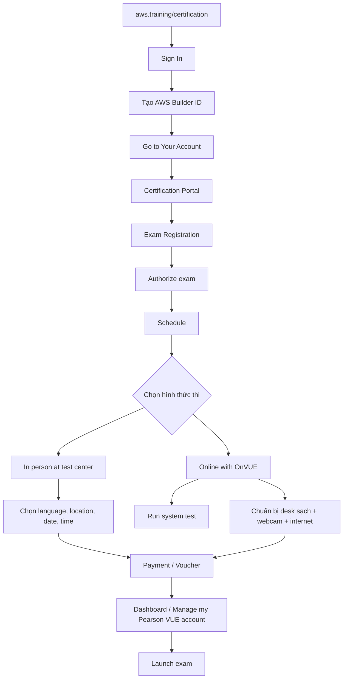

# 444. Exam Walkthrough and Signup

## 🎯 Giới thiệu
Bài này hướng dẫn toàn bộ quy trình đăng ký và bắt đầu thi AWS Certification: từ việc đăng nhập vào `aws.training/certification`, tạo `AWS Builder ID`, cho đến `schedule exam` trong `Pearson VUE` và cuối cùng là `Launch exam` khi đến giờ thi.

## 1. 🧾 Đăng nhập và tạo tài khoản
- Truy cập `aws.training/certification`.
- Chọn `Sign In`.
- Tạo `AWS Builder ID`, đây là tài khoản riêng cho AWS certifications.
- Sau khi đăng nhập xong, chọn `Go to Your Account` để vào `certification portal`.

## 2. 📅 Đăng ký và lên lịch thi
- Vào `Exam Registration` rồi chọn `schedule an exam`.
- Một số exam cần `Authorize` trước khi có thể `Schedule`.
- Ví dụ chọn `AWS Certified Developer Associate Exam`, sau đó hệ thống chuyển sang `Pearson VUE`.
- Trong `Pearson VUE`, bạn có 2 lựa chọn:
  - `In person at a test center`
  - `Online with OnVUE`
- Với thi tại test center:
  - Cần mang `photo ID`.
  - Làm theo các bước để chọn `language`.
  - Chọn địa điểm thi bằng cách nhập `address`.
  - Đồng ý các điều kiện trước khi tìm nơi thi.
- Với thi online `OnVUE`:
  - Cần `computer` có `webcam`.
  - Cần `good internet connection`.
  - Nên chạy `Run system test` rất sớm trước ngày thi.
  - Bàn làm việc phải `clear of everything`.
  - Có thể bị yêu cầu show `desk`.
  - Phải check in khoảng `30 minutes before` giờ hẹn.
- Khi hoàn tất:
  - Chọn `language`.
  - Đồng ý các điều khoản.
  - Chọn `time zone`.
  - Chọn `date` và `time`.
  - Hoàn tất `booking`.
  - Thanh toán và có thể thêm `voucher` nếu có.

## 3. 🚀 Trước giờ thi và bắt đầu thi
- Sau khi đã schedule xong, có thể vào `Home > Dashboard`.
- Khi sẵn sàng thi, chọn `Manage my Pearson VUE account`.
- Hệ thống sẽ đưa bạn lại trang chủ `Pearson VUE`.
- Ở đó sẽ có nút `Launch exam`.
- Chỉ cần bấm `Launch` để bắt đầu.

## 📊 Bảng tóm tắt
| Tiêu chí | Mô tả |
|----------|------|
| Nền tảng đăng ký | `aws.training/certification` |
| Tài khoản cần tạo | `AWS Builder ID` |
| Nơi quản lý thi | `Certification portal` |
| Bước trung gian | `Authorize` trước khi `Schedule` một số exam |
| Đối tác lịch thi | `Pearson VUE` |
| Hình thức thi | `In person at test center` hoặc `Online with OnVUE` |
| Yêu cầu thi online | `webcam`, `good internet connection`, `Run system test`, bàn thi trống |
| Thời điểm check in | Khoảng `30 minutes before` giờ thi |
| Bước vào thi | `Manage my Pearson VUE account` rồi `Launch exam` |

## 💡 Mẹo ghi nhớ cho kỳ thi AWS
- Nhớ chuỗi hành động: `Sign In -> AWS Builder ID -> Go to Your Account -> Exam Registration -> Authorize -> Schedule -> Pearson VUE -> Launch`.
- Nếu thi `OnVUE`, ưu tiên nhớ 3 điểm: `webcam`, `internet`, `system test`.
- Nếu thi tại test center, nhớ `photo ID` và chọn `location`.
- Trước giờ thi nên vào `Dashboard` để tìm nhanh nút `Launch exam`.
- Nếu có `voucher`, có thể dùng ở bước thanh toán.

## ✅ Kết luận
Quy trình thi AWS trong bài này rất rõ ràng: đăng nhập bằng `AWS Builder ID`, vào `certification portal`, `schedule exam` qua `Pearson VUE`, chọn thi tại trung tâm hoặc online `OnVUE`, rồi dùng `Launch exam` khi đến giờ. Đây là phần thao tác quan trọng cần nhớ để tránh nhầm lẫn trong ngày thi.
