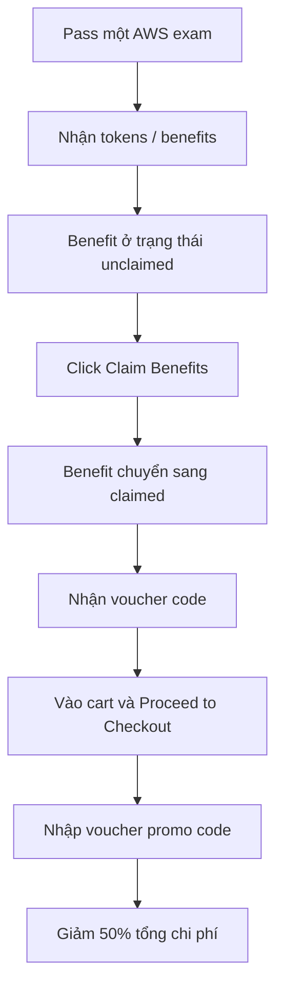

# 445. Save 50% on your AWS Exam Cost!

## 🎯 Giới thiệu
- Bài giảng này hướng dẫn một mẹo để giảm **50% chi phí kỳ thi AWS** nếu bạn đã từng **pass một AWS exam** trước đó.
- Sau khi pass exam, bạn sẽ nhận được **tokens/benefits** có thể dùng để lấy **voucher code** cho kỳ thi tiếp theo.

## 1. Cách nhận 50% discount
- Các benefit ban đầu sẽ ở trạng thái **unclaimed**.
- Những benefit này có **expiry date**.
- Khi muốn dùng, hãy nhấn **Claim Benefits**.
- Sau khi claim thành công, benefit sẽ chuyển sang trạng thái **claimed**.
- Bạn sẽ nhận được một **voucher code** để dùng cho lần thanh toán tiếp theo.

## 2. Cách áp dụng voucher code khi checkout
- Khi vào **cart** và chuẩn bị thanh toán, chọn **Proceed to Checkout**.
- Ở bước nhập payment, có một ô để thêm **voucher promo code**.
- Dán **voucher code** đã nhận vào ô này và áp dụng.
- Kết quả là tổng chi phí sẽ được giảm, trong ví dụ là **50% off**.

## 3. Điểm cần nhớ khi ôn thi
- Chỉ cần nhớ logic chính:
  - **Pass exam** trước
  - **Claim Benefits**
  - Lấy **voucher code**
  - Dùng ở **checkout**
- Mục tiêu của mẹo này là giúp bạn tiết kiệm chi phí cho **AWS exam** tiếp theo.

## 📊 Bảng tóm tắt
| Tiêu chí | Mô tả |
|----------|------|
| Điều kiện nhận ưu đãi | Đã pass một AWS exam trước đó |
| Trạng thái ban đầu | Benefit ở trạng thái `unclaimed` |
| Hành động cần làm | Click `Claim Benefits` |
| Kết quả | Nhận `voucher code` |
| Cách sử dụng | Nhập code ở ô `voucher promo code` khi checkout |
| Mức giảm giá | `50%` trên kỳ thi tiếp theo |

## 💡 Mẹo ghi nhớ cho kỳ thi AWS
- Nhớ chuỗi thao tác: **Pass exam -> Claim Benefits -> Get voucher code -> Apply at checkout**.
- Từ khóa quan trọng cần nhớ đúng: **tokens**, **unclaimed**, **claimed**, **voucher code**, **Proceed to Checkout**, **promo code**.
- Nếu thấy câu hỏi về cách giảm chi phí exam AWS, đáp án trọng tâm là **claim benefit để lấy voucher 50%**.

## ✅ Kết luận
- Transcript chỉ giới thiệu một mẹo thực tế để **giảm 50% phí thi AWS**.
- Quy trình rất đơn giản: **claim benefit sau khi pass exam**, lấy **voucher code**, rồi **áp dụng khi thanh toán**.
