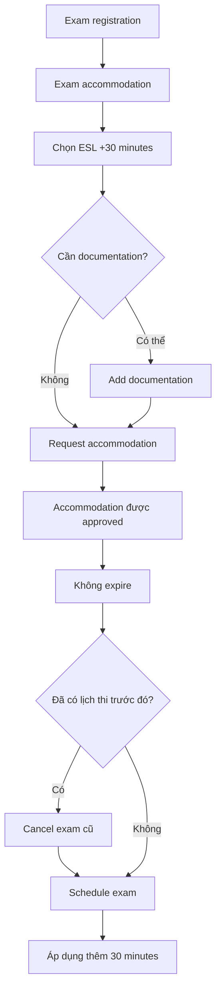

# 446. Get an Extra 30 Minutes on your AWS Exam - Non Native English Speakers only

## 🎯 Giới thiệu
Bài giảng hướng dẫn cách xin **exam accommodation** để được thêm **30 minutes** khi làm AWS exam nếu bạn là **non-native English speaker**. Quy trình này được thực hiện trong phần **exam registration** và có thể áp dụng trước khi schedule lại kỳ thi.

## 1. Cách yêu cầu thêm thời gian thi ⏱️
- Vào **exam registration**.
- Chọn **exam accommodation**.
- Chọn tùy chọn **ESL +30 minutes**.
- Có thể đính kèm **documentation** nếu cần.
- Gửi yêu cầu để được xét duyệt.

## 2. Sau khi được phê duyệt ✅
- Khi accommodation được approve, nó **không expire**.
- Nếu đã có lịch thi trước đó, bạn cần:
  - **cancel** lịch thi cũ
  - sau đó **schedule exam** lại
- Lúc này, hệ thống sẽ tính thêm **30 minutes accommodation** vào thời gian làm bài.

## 3. Các accommodation khác 📌
- Nếu cần accommodation khác, có thể request trực tiếp qua **Pearson VUE exam** trên website của họ.
- Theo bài giảng, cách **ESL +30 minutes** là lựa chọn được dùng nhiều nhất cho **non-native English speaker**.

## 📊 Bảng tóm tắt
| Tiêu chí | Mô tả |
|----------|------|
| Đối tượng áp dụng | Non-native English speaker |
| Loại hỗ trợ | Extra 30 minutes / ESL +30 minutes |
| Nơi thực hiện | Exam registration > exam accommodation |
| Tài liệu bổ sung | Có thể thêm documentation nếu cần |
| Trạng thái sau duyệt | Approved và không expire |
| Nếu đã đặt lịch thi | Cần cancel rồi schedule exam lại |
| Hỗ trợ khác | Request trực tiếp qua Pearson VUE website |

## 🔁 Mermaid Flow

## 💡 Mẹo ghi nhớ cho kỳ thi AWS
- Nhớ cụm: **exam registration -> exam accommodation -> ESL +30 minutes**.
- Nếu đã lỡ schedule trước đó, phải **cancel rồi reschedule**.
- Accommodation sau khi approve thì **không expire**.
- Nếu cần hỗ trợ khác, kiểm tra **Pearson VUE**.

## ✅ Kết luận
Transcript tập trung vào một mẹo thực tế cho AWS exam: nếu là **non-native English speaker**, bạn có thể xin **extra 30 minutes** bằng cách chọn **ESL +30 minutes** trong phần **exam accommodation**. Sau khi được duyệt, bạn chỉ cần **cancel** lịch cũ và **schedule** lại để thời gian bổ sung được áp dụng.
