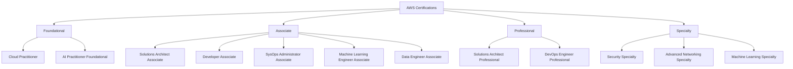

# 447. AWS Certification Paths

## 🎯 Giới thiệu
Transcript này nói về các **AWS certification paths** theo từng **role** khác nhau. AWS có nhiều tầng chứng chỉ:

- **Foundational**
- **Associate**
- **Professional**
- **Specialty**

Ý chính: không phải ai cũng đi cùng một lộ trình, mà nên chọn path theo công việc mục tiêu như **Solutions Architect**, **Developer**, **Ops**, **Security**, **Networking**, **Data Analytics**, **AI/ML**, hoặc **DevSecOps**.

## 1. Các nhóm chứng chỉ chính
AWS certification được chia thành các mức:

- **Cloud Practitioner Foundational**
- **Associate level certifications**
- **Professional level certifications**
- **Specialty level certifications**

Transcript nhấn mạnh rằng:
- Nếu đã biết về cloud và IT, thì **không bắt buộc** phải học Cloud Practitioner, nhưng đây vẫn là chứng chỉ tốt để bắt đầu.
- Với người muốn dùng AI, có thể bắt đầu với **AI Practitioner Foundational**.

### Mermaid - tổng quan các path

## 2. Lộ trình theo từng vai trò
### 🏗️ Architecture
Nếu muốn trở thành **Solutions Architect**:
- **Cloud Practitioner**  
- **AI Practitioner Foundational** nếu muốn leverage AI
- **Solutions Architect Associate**
- **Solutions Architect Professional**
- Đi sâu hơn: **Security Specialty**

### 🧩 Application Architecture
Nếu thiên về **application architecture**:
- **Cloud Practitioner**
- **Developer Associate**
- **DevOps Engineer Professional**
- Đi sâu hơn: **Solutions Architect Professional**

### ⚙️ Operations
Nếu làm **systems administrator**:
- **Cloud Practitioner**
- **SysOps Administrator Associate**
- Đi sâu hơn: **DevOps Engineer Professional**

### 🛡️ Cloud Engineer
Nếu là **cloud engineer**:
- **Cloud Practitioner Foundational**
- **SysOps Administrator Associate**
- **Security Specialty**
- Đi sâu hơn: **DevOps Engineer Professional**
- Và **Advanced Networking Specialty**

### 🧪 DevOps
Nếu làm **DevOps** hoặc **test engineer**:
- **Cloud Practitioner**
- **Developer**
- **DevOps Engineer**

Nếu là **cloud DevOps engineer**:
- **Cloud Practitioner Foundational**
- **Developer Associate**
- Có thể thêm **SysOps Administrator**

### 🤖 Machine Learning / AI
Nếu làm việc với **AI and ML**:
- Có thể chọn **Machine Learning Engineer Associate**

Nếu là **machine learning engineer**:
- **Cloud Practitioner**
- **AI Practitioner Foundational**
- **Solutions Architect Associate**
- **Machine Learning Engineer Associate**
- Đi sâu hơn: **Data Engineer Associate**
- Và **Machine Learning Specialty**

Nếu là **prompt engineer**:
- **Cloud Practitioner**
- **AI Practitioner Foundational**
- **Machine Learning Engineer Associate**
- Đi sâu hơn: **Machine Learning Specialty**

Nếu là **machine learning ops engineer**:
- **Cloud Practitioner**
- **AI Practitioner**
- **Solutions Architect Associate**
- **Machine Learning Associate**
- Đi sâu hơn: **Data Engineer**
- Và **DevOps Engineer**

### 🔐 Security
Nếu là **cloud security engineer**:
- **Cloud Practitioner Foundational**
- Nếu làm AI/ML projects: **AI Practitioner Foundational**
- **SysOps Administrator**
- **Security Specialty**
- Đi sâu hơn: **DevOps Engineer Professional**
- Và **Advanced Networking Specialty**

Nếu là **cloud security architect**:
- **Cloud Practitioner**
- **AI Practitioner Foundational**
- **Solutions Architect Associate**
- **Security Specialty**
- Đi sâu hơn: **Solutions Architect Professional**

### 🌐 Development + Networking
Nếu làm **software development engineer**:
- **Cloud Practitioner**
- **AI Practitioner Foundational**
- **Developer Associate**
- **DevOps Engineer**

Nếu là **network engineer**:
- **Cloud Practitioner Foundational**
- **Solutions Architect Associate**
- **Advanced Networking Specialty**
- Đi sâu hơn: **Security Specialty**

### 📊 Data Analytics
Nếu là **cloud data engineer**:
- **Cloud Practitioner**
- **Solutions Architect Associate**
- **Data Engineer**
- Đi sâu hơn: **Security Specialty**

Nếu làm **AI and ML projects**:
- **Machine Learning Engineer Associate**

Nếu là **data scientist**:
- **Cloud Practitioner Foundational**
- **AI Practitioner Foundational**
- **Solutions Architect Associate**
- **Machine Learning Engineer Associate**
- **Machine Learning Specialty**

### 🚀 DevSecOps
Nếu là **DevSecOps engineer**:
- **Cloud Practitioner**
- **SysOps Administrator Associate**
- Nếu làm AI/ML projects: **Machine Learning Associate**
- **DevOps Engineer**
- Cuối cùng: **Security Specialty**

## 3. Cách hiểu nhanh để ôn thi
- **Cloud Practitioner** thường là nền tảng khởi đầu trong nhiều path.
- **AI Practitioner Foundational** xuất hiện ở nhiều lộ trình liên quan AI/ML.
- **Solutions Architect Associate/Professional** phù hợp với hướng kiến trúc.
- **Developer Associate** và **DevOps Engineer** thường đi cùng hướng development và automation.
- **SysOps Administrator** gắn với operations.
- **Security Specialty** và **Advanced Networking Specialty** là các path sâu.
- **Machine Learning Engineer Associate** và **Machine Learning Specialty** dành cho AI/ML.
- **Data Engineer** xuất hiện nhiều trong các path về dữ liệu và vận hành ML.

## 📊 Bảng tóm tắt
| Tiêu chí | Mô tả |
|----------|------|
| Mục tiêu | Chọn **AWS certification path** theo role |
| Mức chứng chỉ | **Foundational**, **Associate**, **Professional**, **Specialty** |
| Vai trò nổi bật | Solutions Architect, Developer, SysOps, Security, Networking, Data, AI/ML, DevSecOps |
| Chứng chỉ nền tảng | **Cloud Practitioner**, **AI Practitioner Foundational** |
| Chứng chỉ kiến trúc | **Solutions Architect Associate**, **Solutions Architect Professional** |
| Chứng chỉ vận hành | **SysOps Administrator Associate**, **DevOps Engineer Professional** |
| Chứng chỉ bảo mật | **Security Specialty** |
| Chứng chỉ mạng | **Advanced Networking Specialty** |
| Chứng chỉ AI/ML | **Machine Learning Engineer Associate**, **Machine Learning Specialty** |
| Chứng chỉ dữ liệu | **Data Engineer** |

## 💡 Mẹo ghi nhớ cho kỳ thi AWS
- Nhớ rằng AWS certification **không đi theo một đường cố định**, mà theo **career path**.
- Nếu thấy từ khóa **architecture**, nghĩ ngay đến **Solutions Architect**.
- Nếu thấy **automation / CI/CD / lifecycle**, nghĩ đến **DevOps Engineer**.
- Nếu thấy **security**, ưu tiên **Security Specialty**.
- Nếu thấy **networking**, ưu tiên **Advanced Networking Specialty**.
- Nếu thấy **AI/ML**, nhớ chuỗi **AI Practitioner Foundational -> Machine Learning Engineer Associate -> Machine Learning Specialty**.
- Nếu thấy **data pipeline / semi-structured data / monitoring**, nhớ đến **Data Engineer**.

## ✅ Kết luận
Transcript này giúp định hướng chọn **AWS certification path** theo từng nghề nghiệp. Điểm cốt lõi là hiểu đúng mục tiêu công việc rồi chọn chuỗi chứng chỉ phù hợp, thay vì học dàn trải. Đây là phần quan trọng để lên kế hoạch ôn thi AWS một cách thực tế và có chiến lược.
