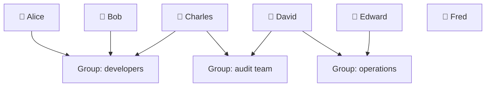

# 11. IAM Introduction: Users, Groups, Policies

## 🎯 Giới thiệu

**IAM** (Identity and Access Management) là một **global service** trong AWS, dùng để quản lý danh tính và quyền truy cập. Khi tạo tài khoản AWS, một **root account** sẽ được tạo mặc định — đây là tài khoản quan trọng nhất và chỉ nên dùng để thiết lập ban đầu, **không nên dùng hàng ngày hay chia sẻ**.

---

## 1. 👤 IAM Users

- Mỗi **user** trong IAM đại diện cho một người thực tế trong tổ chức.
- Nên tạo user riêng cho từng người, **không dùng chung tài khoản**.
- Ví dụ: Alice, Bob, Charles, David, Edward, Fred là 6 người trong tổ chức.

---

## 2. 👥 IAM Groups

- **Group** là tập hợp các users có cùng vai trò/phòng ban.
- Ví dụ:
  - Group `developers`: Alice, Bob, Charles
  - Group `operations`: David, Edward
  - Group `audit team`: Charles, David
- ⚠️ **Lưu ý quan trọng:**
  - Groups **chỉ chứa users**, không chứa groups khác.
  - Một user **có thể thuộc nhiều groups** cùng lúc (ví dụ: Charles thuộc cả `developers` và `audit team`).
  - Một user **có thể không thuộc group nào** (ví dụ: Fred) — không phải best practice nhưng hợp lệ.



---

## 3. 📋 IAM Policies

- **Policy** là một JSON document định nghĩa quyền hạn (permissions) cho users hoặc groups.
- Policy mô tả những gì một user/group **được phép hoặc bị cấm** làm trong AWS.
- Ví dụ một policy có thể cho phép:
  - Dùng **EC2** với action `describe`
  - Dùng **Elastic Load Balancing** với action `describe`
  - Dùng **CloudWatch**

### Cấu trúc JSON Policy (ví dụ):
```json
{
  "Version": "2012-10-17",
  "Statement": [
    {
      "Effect": "Allow",
      "Action": ["ec2:Describe*", "elasticloadbalancing:Describe*", "cloudwatch:*"],
      "Resource": "*"
    }
  ]
}
```

---

## 4. 🔒 Least Privilege Principle

- AWS áp dụng nguyên tắc **Least Privilege** (đặc quyền tối thiểu):
  - **Chỉ cấp đúng quyền mà user cần**, không cấp thừa.
  - Tránh rủi ro bảo mật và chi phí không kiểm soát được.
- Ví dụ: Nếu user chỉ cần dùng 3 dịch vụ, chỉ tạo permission cho 3 dịch vụ đó.

---

## 📊 Bảng tóm tắt

| Khái niệm | Mô tả |
|-----------|-------|
| **IAM** | Global service quản lý danh tính và quyền truy cập |
| **Root Account** | Tài khoản mặc định, chỉ dùng để setup, không dùng hàng ngày |
| **IAM User** | Đại diện cho một người thực, có credentials riêng |
| **IAM Group** | Nhóm các users, chỉ chứa users (không chứa group khác) |
| **IAM Policy** | JSON document định nghĩa permissions |
| **Least Privilege** | Chỉ cấp đúng quyền cần thiết, không cấp thừa |

---

## 💡 Mẹo ghi nhớ cho kỳ thi AWS

- 📌 **IAM là global** — không gắn với bất kỳ region nào.
- 📌 **Groups chỉ chứa users**, không chứa groups lồng nhau.
- 📌 **Root account** = nguy hiểm nếu dùng hàng ngày → luôn tạo IAM user riêng.
- 📌 **Least Privilege Principle** là nguyên tắc nền tảng của IAM.

---

## ✅ Kết luận

IAM là nền tảng bảo mật của AWS. Bài học này giới thiệu 3 thành phần cốt lõi: **Users** (người dùng cụ thể), **Groups** (nhóm người dùng), và **Policies** (quy tắc phân quyền dạng JSON). Nguyên tắc **Least Privilege** cần được áp dụng xuyên suốt để đảm bảo an toàn cho tài khoản AWS.
