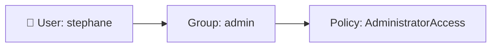
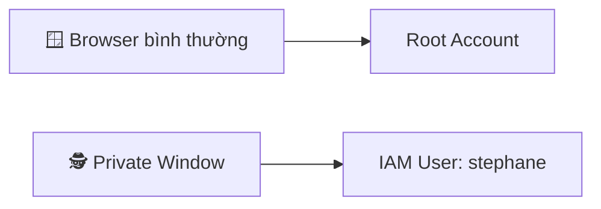

# 12. IAM Users & Groups Hands On

## 🎯 Giới thiệu

Bài thực hành này hướng dẫn cách tạo **IAM User** và **IAM Group** trong AWS Console, đồng thời hiểu cách phân quyền hoạt động qua group.

---

## 1. 🌍 IAM là Global Service

- Vào IAM Console → góc trên phải hiển thị **Global** (không chọn được region).
- User tạo trong IAM **có hiệu lực trên toàn bộ AWS**, không bị giới hạn theo region.

---

## 2. 👤 Tạo IAM User

Các bước tạo user `stephane`:
1. Vào **IAM → Users → Create User**
2. Nhập username (ví dụ: `stephane`)
3. Chọn **"Provide user access to the Management Console"**
4. Chọn **"Create an IAM user"** (thay vì Identity Center — phù hợp với thi cử)
5. Đặt password: custom hoặc auto-generated
6. Tùy chọn yêu cầu đổi password lần đầu đăng nhập

---

## 3. 👥 Tạo IAM Group và gán Policy

1. Tạo group tên `admin`
2. Gắn policy **AdministratorAccess** vào group
3. Thêm user `stephane` vào group `admin`

- User **kế thừa permissions** từ group → `stephane` có quyền admin.

---

## 4. 🏷️ Tags

- Tags là **metadata tùy chọn** gắn lên resources trong AWS.
- Ví dụ: `department = engineering`
- Không ảnh hưởng đến permissions, nhưng giúp quản lý và phân loại resources.

---

## 5. 🔗 Account Alias & Sign-in URL

- Mặc định, sign-in URL dạng: `https://<account-id>.signin.aws.amazon.com/console`
- Có thể tạo **Account Alias** để URL thân thiện hơn:
  - Ví dụ: `aws-stephane-v5` → URL: `https://aws-stephane-v5.signin.aws.amazon.com/console`
- Alias phải **duy nhất toàn cầu**.

---

## 6. 🪟 Đăng nhập đồng thời Root & IAM User

- Dùng **cửa sổ ẩn danh (private/incognito)** để đăng nhập IAM user trong khi root vẫn đăng nhập ở cửa sổ bình thường.
- Cửa sổ thường → Root account (chỉ hiện Account ID)
- Cửa sổ ẩn danh → IAM user (hiện `Account ID / IAM username`)

---

## 📊 Bảng tóm tắt

| Bước | Hành động |
|------|-----------|
| Tạo User | IAM → Users → Create User |
| Tạo Group | Đặt tên, gắn policy AdministratorAccess |
| Gán User vào Group | User kế thừa permissions từ group |
| Tạo Account Alias | Đơn giản hóa sign-in URL |
| Đăng nhập song song | Dùng private window cho IAM user |

---

## 💡 Mẹo ghi nhớ cho kỳ thi AWS

- 📌 Luôn dùng **IAM user** thay vì root account cho công việc hàng ngày.
- 📌 Permissions được **kế thừa từ group** — đây là cách quản lý tập trung hiệu quả.
- 📌 **Account Alias** phải unique toàn cầu.

---

## ✅ Kết luận

Bài hands-on cho thấy cách tạo IAM user, group, và gán AdministratorAccess policy qua group. Cơ chế **kế thừa permissions qua group** là cách AWS khuyến khích quản lý phân quyền một cách hiệu quả và có tổ chức.
