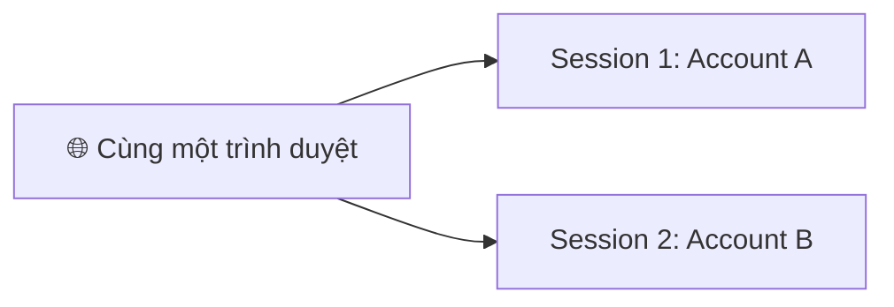

# 13. AWS Console Simultaneous Sign-in

## 🎯 Giới thiệu

Bài học giới thiệu tính năng **Multi-session support** trên AWS Console, cho phép đăng nhập nhiều tài khoản AWS cùng lúc **trong cùng một trình duyệt** — không cần dùng cửa sổ ẩn danh như trước.

---

## 1. 🪟 Multi-session Support

- Tính năng mới: **bật Multi-session** trực tiếp trong AWS Console.
- Sau khi bật, có thể **thêm session mới** (Add a session) và đăng nhập vào tài khoản AWS khác (dùng Account ID hoặc root).
- Mỗi session hiển thị một **Account ID riêng biệt** ở góc trên phải.

---

## 2. 💡 Ứng dụng thực tế

- Mở EC2 Console ở Account A → tạo EBS volume.
- Chuyển sang session Account B → vào EC2/EBS → **không thấy volume** vì đây là tài khoản khác.
- Minh chứng rõ ràng rằng **mỗi session là độc lập hoàn toàn**.

---

## 📊 Bảng tóm tắt

| Phương pháp | Mô tả |
|-------------|-------|
| **Trước đây** | Dùng cửa sổ ẩn danh để đăng nhập tài khoản thứ hai |
| **Multi-session** | Đăng nhập nhiều tài khoản trong cùng 1 trình duyệt |
| **Tính cô lập** | Mỗi session độc lập, resources không ảnh hưởng nhau |

---

## 💡 Mẹo ghi nhớ cho kỳ thi AWS

- 📌 Tính năng này tiện lợi cho người quản lý **nhiều AWS account** cùng lúc.
- 📌 Mỗi session vẫn bị giới hạn bởi **permissions của user đó**.

---

## ✅ Kết luận

Multi-session support cho phép làm việc với nhiều AWS account trong cùng một trình duyệt mà không cần cửa sổ ẩn danh. Đây là cải tiến giúp tăng hiệu suất làm việc, đặc biệt hữu ích khi quản lý nhiều môi trường AWS (dev, staging, production).
