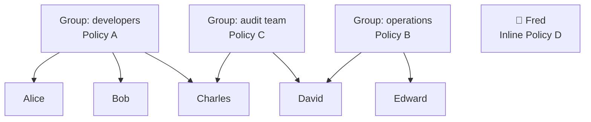

# 14. IAM Policies

## 🎯 Giới thiệu

Bài học đi sâu vào cách **IAM Policies** hoạt động: cách policy được kế thừa qua group, cách gắn inline policy, và cấu trúc JSON của một IAM Policy.

---

## 1. 📋 Cách Policy được áp dụng

### Kế thừa qua Group:
- Gắn policy vào group → **tất cả users trong group đều kế thừa** policy đó.
- Ví dụ: Group `developers` có policy X → Alice, Bob, Charles đều có policy X.

### Inline Policy:
- Gắn policy **trực tiếp lên một user cụ thể** (không qua group).
- User đó có thể thuộc hoặc không thuộc group nào.

### User thuộc nhiều Group:
- Charles thuộc `developers` và `audit team` → **kế thừa policy từ cả hai group**.
- David thuộc `operations` và `audit team` → tương tự.



---

## 2. 🧱 Cấu trúc IAM Policy (JSON)

```json
{
  "Version": "2012-10-17",
  "Id": "policy-id (optional)",
  "Statement": [
    {
      "Sid": "1 (optional)",
      "Effect": "Allow",
      "Principal": {
        "AWS": "arn:aws:iam::123456789012:root"
      },
      "Action": ["s3:GetObject", "s3:PutObject"],
      "Resource": "arn:aws:s3:::my-bucket/*"
    }
  ]
}
```

### Giải thích các thành phần:

| Thành phần | Ý nghĩa | Bắt buộc? |
|------------|---------|-----------|
| **Version** | Phiên bản ngôn ngữ policy (thường là `2012-10-17`) | ✅ |
| **Id** | Định danh của policy | ❌ Optional |
| **Statement** | Danh sách các quy tắc phân quyền | ✅ |
| **Sid** | Statement ID (định danh từng statement) | ❌ Optional |
| **Effect** | `Allow` hoặc `Deny` | ✅ |
| **Principal** | Tài khoản/user/role được áp dụng policy | ✅ |
| **Action** | Danh sách API calls được cho phép/từ chối | ✅ |
| **Resource** | Danh sách resources mà action áp dụng lên | ✅ |
| **Condition** | Điều kiện để áp dụng statement | ❌ Optional |

---

## 3. ⚠️ Lưu ý quan trọng

- **Effect** có thể là `Allow` hoặc `Deny` — cần hiểu rõ khi có policy conflict.
- **Action** dùng wildcard `*` để bao gồm nhiều API calls (ví dụ: `s3:*`, `ec2:Describe*`).
- **Resource** `*` nghĩa là áp dụng cho **tất cả resources**.
- Phần **Condition** là optional nhưng rất mạnh (giới hạn theo IP, thời gian, MFA...).

---

## 📊 Bảng tóm tắt

| Cách gán Policy | Mô tả |
|-----------------|-------|
| **Group Policy** | Gắn vào group → tất cả users trong group kế thừa |
| **Inline Policy** | Gắn trực tiếp lên user cụ thể |
| **Multi-group** | User thuộc nhiều group → kế thừa tất cả policies |

---

## 💡 Mẹo ghi nhớ cho kỳ thi AWS

- 📌 Trong kỳ thi, cần **đọc hiểu JSON policy** để xác định user có quyền gì.
- 📌 **Effect, Principal, Action, Resource** là 4 thành phần cốt lõi cần thuộc.
- 📌 `"Action": "*"` + `"Resource": "*"` = **AdministratorAccess**.
- 📌 **Deny luôn thắng Allow** khi có xung đột policy.

---

## ✅ Kết luận

IAM Policy là cơ chế trung tâm để kiểm soát quyền trong AWS. Policy có thể được kế thừa qua group hoặc gắn inline trực tiếp lên user. Hiểu rõ cấu trúc JSON policy — đặc biệt **Effect, Principal, Action, Resource** — là kỹ năng bắt buộc cho kỳ thi AWS.
