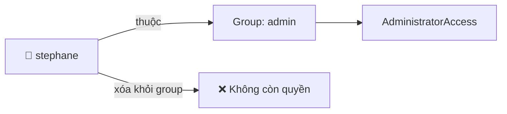
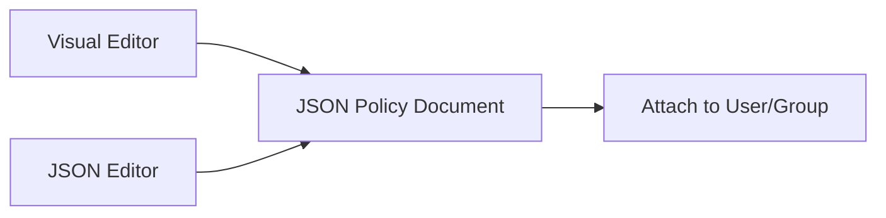

# 15. IAM Policies Hands On

## 🎯 Giới thiệu

Bài thực hành minh họa trực tiếp cách IAM Policies hoạt động: thêm/xóa user khỏi group, gắn policy trực tiếp, kiểm tra quyền thực tế, và tự tạo custom policy.

---

## 1. 🧪 Demo: Xóa user khỏi group và mất quyền

- User `stephane` thuộc group `admin` → có **AdministratorAccess**.
- Xóa `stephane` khỏi group `admin` → mất toàn bộ quyền.
- Khi refresh trang IAM → **Access Denied** trên `iam:ListUsers`.



---

## 2. ➕ Gắn Policy trực tiếp lên User

- Vào user `stephane` → **Add permissions → Attach policies directly**
- Gắn **IAMReadOnlyAccess** → user có thể xem thông tin IAM nhưng **không thể tạo/sửa**.
- Sau khi gắn: có thể xem danh sách users ✅, nhưng không thể tạo group ❌.

---

## 3. 📖 Xem chi tiết Policy

### AdministratorAccess:
```json
{
  "Effect": "Allow",
  "Action": "*",
  "Resource": "*"
}
```
→ Cho phép **mọi action trên mọi resource** = quyền admin tuyệt đối.

### IAMReadOnlyAccess:
```json
{
  "Effect": "Allow",
  "Action": ["iam:Get*", "iam:List*", ...],
  "Resource": "*"
}
```
→ Dùng wildcard `Get*` và `List*` để bao gồm nhiều API calls có cùng prefix.

---

## 4. 🛠️ Tạo Custom Policy

Có 2 cách tạo policy:

### Visual Editor:
- Chọn service (ví dụ: IAM)
- Chọn actions: `ListUsers`, `GetUser`
- Chọn resource: All resources (`*`)
- → Tự động sinh JSON tương ứng

### JSON Editor:
- Nhập trực tiếp JSON policy document



---

## 5. 🔄 Tổng kết cơ chế kế thừa Policy

- `stephane` sau khi thực hành có 3 permissions:
  1. **AdministratorAccess** — kế thừa từ group `admin`
  2. **AlexaForBusiness** — kế thừa từ group `developers`
  3. **IAMReadOnlyAccess** — gắn trực tiếp (inline)

---

## 📊 Bảng tóm tắt

| Policy | Nguồn gốc | Quyền |
|--------|-----------|-------|
| AdministratorAccess | Group `admin` | Toàn quyền |
| AlexaForBusiness | Group `developers` | Alexa |
| IAMReadOnlyAccess | Gắn trực tiếp | Chỉ đọc IAM |

---

## 💡 Mẹo ghi nhớ cho kỳ thi AWS

- 📌 Wildcard `*` trong Action bao gồm tất cả API calls khớp với pattern.
- 📌 `"Action": "*"` + `"Resource": "*"` = **AdministratorAccess**.
- 📌 Có thể tạo policy bằng **Visual Editor** rồi xem JSON để học cú pháp.
- 📌 Quyền từ **nhiều nguồn (group + direct)** được **cộng dồn** lại.

---

## ✅ Kết luận

Bài hands-on cho thấy rõ cách IAM Policy hoạt động trong thực tế: kế thừa qua group, gắn trực tiếp, và tạo custom policy. Quyền hạn cuối cùng của user là **tổng hợp từ tất cả các policies** được gán từ mọi nguồn.
