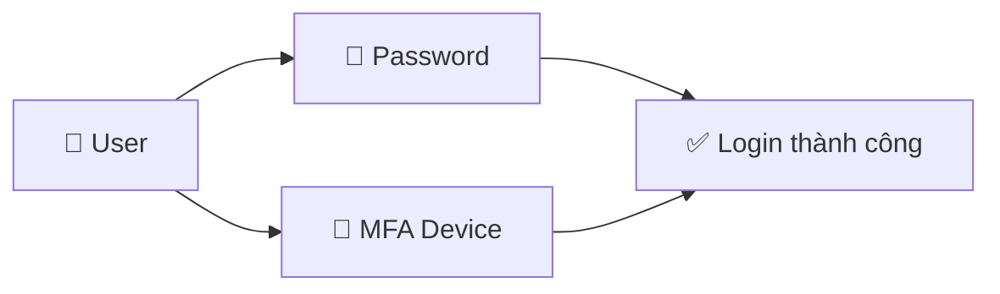

# 16. IAM MFA Overview

## 🎯 Giới thiệu

Bài học trình bày hai cơ chế bảo vệ tài khoản AWS: **Password Policy** và **Multi-Factor Authentication (MFA)** — cả hai đều quan trọng cho kỳ thi AWS CCP.

---

## 1. 🔑 Password Policy

AWS cho phép thiết lập các quy tắc mật khẩu để tăng cường bảo mật:

| Tùy chọn | Mô tả |
|----------|-------|
| Độ dài tối thiểu | Đặt số ký tự tối thiểu |
| Ký tự đặc biệt | Yêu cầu chữ hoa, chữ thường, số, ký tự đặc biệt |
| Cho phép tự đổi mật khẩu | IAM user có thể tự thay đổi password |
| Hết hạn mật khẩu | Bắt buộc đổi password định kỳ (ví dụ: 90 ngày) |
| Ngăn tái sử dụng | Không cho phép dùng lại mật khẩu cũ |

💡 Password policy giúp **chống brute force attacks**.

---

## 2. 🔒 Multi-Factor Authentication (MFA)

### MFA là gì?
- Kết hợp **password (thứ bạn biết)** + **thiết bị vật lý/ứng dụng (thứ bạn có)**.
- Dù mật khẩu bị lộ, hacker vẫn **không thể đăng nhập** nếu không có thiết bị MFA.

### ⚠️ Khuyến nghị:
- **Bắt buộc** bật MFA cho **root account**.
- **Nên bật** MFA cho tất cả IAM users, đặc biệt administrators.

---

## 3. 📱 Các loại MFA Device trong AWS

| Loại | Tên | Ghi chú |
|------|-----|---------|
| 🖥️ Virtual MFA | Google Authenticator | Chỉ 1 điện thoại |
| 🖥️ Virtual MFA | Authy | Hỗ trợ nhiều tokens trên 1 thiết bị |
| 🔑 U2F Security Key | YubiKey (Yubico) | Thiết bị vật lý, hỗ trợ nhiều users |
| 🔐 Hardware Key Fob | Gemalto | Third-party, thiết bị vật lý |
| 🏛️ Hardware Key Fob (GovCloud) | SurePassID | Dành riêng cho AWS GovCloud (US) |

---

## 📊 Bảng tóm tắt

| Cơ chế | Bảo vệ khỏi | Áp dụng cho |
|--------|-------------|-------------|
| Password Policy | Brute force, weak passwords | Tất cả IAM users |
| MFA | Mật khẩu bị đánh cắp | Root + IAM users (ưu tiên admin) |

---

## 💡 Mẹo ghi nhớ cho kỳ thi AWS

- 📌 **MFA = password + thiết bị** → bảo mật hai lớp.
- 📌 **Virtual MFA** (Google Authenticator, Authy) là phổ biến nhất.
- 📌 **YubiKey (U2F)** = thiết bị vật lý, hỗ trợ nhiều users.
- 📌 **AWS GovCloud** dùng MFA riêng (SurePassID).
- 📌 Đề thi có thể hỏi: "Thiết bị nào hỗ trợ nhiều root/IAM users?" → **YubiKey** hoặc **Authy**.

---

## ✅ Kết luận

Hai lớp bảo vệ quan trọng trong IAM là **Password Policy** (chống brute force) và **MFA** (chống mất mật khẩu). AWS hỗ trợ nhiều loại MFA device từ virtual đến hardware. Bật MFA cho root account là **bước bảo mật tối thiểu bắt buộc**.
