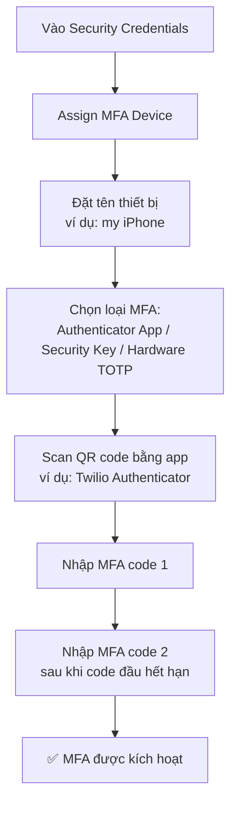

# 17. IAM MFA Hands On

## 🎯 Giới thiệu

Bài thực hành hướng dẫn: (1) thiết lập **Password Policy** và (2) bật **MFA** cho root account trên AWS Console.

---

## 1. 🔑 Thiết lập Password Policy

**Đường dẫn:** IAM Console → Account Settings → Password Policy → Edit

Các tùy chọn có thể cấu hình:
- ✅ Dùng **IAM default password policy** (mặc định)
- ✅ Hoặc **Customize**:
  - Độ dài tối thiểu
  - Yêu cầu chữ hoa, chữ thường, số, ký tự đặc biệt
  - Password expiration (ví dụ: 90 ngày)
  - Yêu cầu admin reset khi hết hạn
  - Cho phép user tự đổi password
  - Ngăn tái sử dụng password cũ

---

## 2. 📱 Bật MFA cho Root Account

**Đường dẫn:** Click vào tên account → Security Credentials → Multi-Factor Authentication

### Các bước thực hiện:

### ⚠️ Lưu ý quan trọng:
- Một số học viên đã **bị khóa tài khoản** vì mất điện thoại sau khi bật MFA.
- Nếu lo ngại mất thiết bị MFA → chỉ xem demo, **không thực hành** hoặc xóa MFA device ngay sau khi thực hành.
- AWS yêu cầu **2 MFA codes liên tiếp** để xác nhận thiết bị hoạt động đúng.

---

## 3. 🔐 Cách MFA hoạt động khi đăng nhập

1. Nhập username + password như bình thường.
2. Sau khi xác thực mật khẩu thành công → AWS yêu cầu **nhập MFA code**.
3. Mở app → lấy code hiện tại → nhập vào → đăng nhập thành công.

---

## 4. 🗂️ Quản lý MFA Devices

- AWS cho phép thêm **tối đa 8 MFA devices** cho 1 tài khoản.
- Có thể xem danh sách và **xóa MFA device** bất cứ lúc nào từ Security Credentials.

---

## 📊 Bảng tóm tắt

| Bước | Mô tả |
|------|-------|
| Password Policy | IAM → Account Settings → Edit |
| Bật MFA | Security Credentials → Assign MFA Device |
| Loại MFA | Authenticator App (phổ biến nhất cho thực hành) |
| Số MFA tối đa | 8 thiết bị/tài khoản |
| Đăng nhập với MFA | Password → MFA code → Vào được |

---

## 💡 Mẹo ghi nhớ cho kỳ thi AWS

- 📌 MFA bảo vệ account **ngay cả khi password bị lộ**.
- 📌 **Twilio Authenticator, Google Authenticator, Authy** đều là virtual MFA apps hợp lệ.
- 📌 Luôn bật MFA cho **root account** — đây là best practice bắt buộc.

---

## ✅ Kết luận

Bài hands-on hướng dẫn cách bật Password Policy để kiểm soát độ mạnh mật khẩu và kích hoạt MFA để thêm lớp bảo mật thứ hai. Đây là hai biện pháp bảo vệ cơ bản và quan trọng nhất cho mọi tài khoản AWS.
