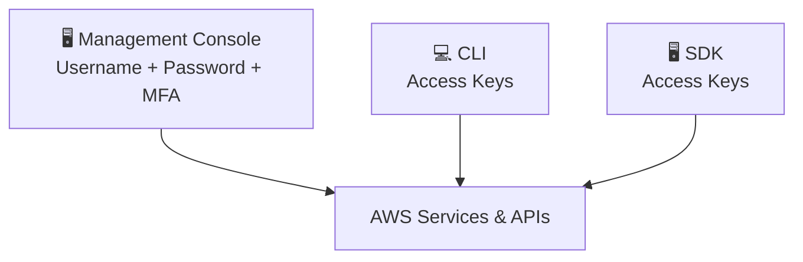

# 18. AWS Access Keys, CLI and SDK

## 🎯 Giới thiệu

Bài học giới thiệu 3 cách truy cập AWS và giải thích **Access Keys**, **CLI**, và **SDK** — cùng cách bảo mật chúng.

---

## 1. 🌐 Ba cách truy cập AWS

| Phương thức | Công cụ | Bảo vệ bởi |
|-------------|---------|------------|
| **Management Console** | Web browser | Username + Password + MFA |
| **CLI** (Command Line Interface) | Terminal / Command Prompt | Access Keys |
| **SDK** (Software Development Kit) | Code trong ứng dụng | Access Keys |

---

## 2. 🔑 Access Keys

- Được tạo qua **Management Console**.
- Mỗi user tự quản lý Access Keys của mình.
- Gồm 2 phần:
  - **Access Key ID** → tương đương username
  - **Secret Access Key** → tương đương password

### ⚠️ Quy tắc bảo mật bắt buộc:
- **KHÔNG chia sẻ** Access Keys với bất kỳ ai.
- **KHÔNG commit** Access Keys lên GitHub hay bất kỳ nơi công khai nào.
- Mỗi người tự tạo Access Keys riêng.

---

## 3. 💻 AWS CLI (Command Line Interface)

- Công cụ cho phép tương tác với AWS **qua terminal/command line**.
- Mọi lệnh bắt đầu bằng từ khóa `aws`.
- Ví dụ: `aws s3 cp`, `aws iam list-users`
- **Truy cập trực tiếp Public APIs** của các dịch vụ AWS.
- Có thể **viết scripts** để tự động hóa tác vụ.
- **Open-source** — code có trên GitHub.
- Là **thay thế hoàn toàn** cho Management Console.

---

## 4. 📦 AWS SDK (Software Development Kit)

- Là tập hợp **thư viện (libraries)** theo từng ngôn ngữ lập trình.
- Được **nhúng vào trong code ứng dụng** (không dùng trên terminal).
- Hỗ trợ nhiều ngôn ngữ:

| Ngôn ngữ | SDK có sẵn |
|----------|-----------|
| JavaScript | ✅ |
| Python | ✅ (Boto3) |
| PHP | ✅ |
| .NET | ✅ |
| Ruby | ✅ |
| Java | ✅ |
| Go | ✅ |
| Node.js | ✅ |
| C++ | ✅ |
| Android / iOS | ✅ (Mobile SDK) |
| IoT Devices | ✅ (IoT Device SDK) |

💡 **Thú vị:** AWS CLI được xây dựng trên **AWS SDK for Python (Boto)**.

---

## 📊 Bảng tóm tắt

| | Management Console | CLI | SDK |
|-|-------------------|-----|-----|
| **Dùng khi** | Thao tác thủ công qua UI | Lệnh terminal, scripts | Code ứng dụng |
| **Xác thực** | Username + Password + MFA | Access Keys | Access Keys |
| **Ngôn ngữ** | N/A | Shell commands | Python, JS, Java... |

---

## 💡 Mẹo ghi nhớ cho kỳ thi AWS

- 📌 **Access Key ID** = username, **Secret Access Key** = password → **không chia sẻ**.
- 📌 **CLI** dùng cho terminal/scripts, **SDK** nhúng vào ứng dụng.
- 📌 AWS CLI được build trên **AWS SDK for Python (Boto)**.
- 📌 Cả CLI và SDK đều dùng cùng **Access Keys** để xác thực.

---

## ✅ Kết luận

AWS cung cấp 3 phương thức truy cập: Management Console (UI), CLI (terminal), và SDK (lập trình). CLI và SDK đều dùng **Access Keys** để xác thực — cần bảo mật tuyệt đối, không chia sẻ, không để lộ. AWS CLI thực chất là ứng dụng được xây dựng trên **Python SDK (Boto)**.
