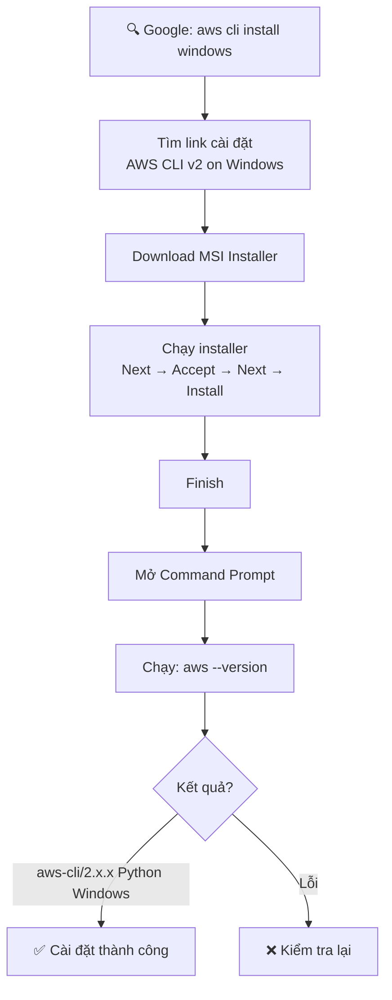

# 19. AWS CLI Setup on Windows

## 🎯 Giới thiệu

Hướng dẫn cài đặt **AWS CLI Version 2** trên hệ điều hành **Windows** sử dụng MSI Installer.

---

## 1. ⚙️ Các bước cài đặt



---

## 2. 📝 Chi tiết các bước

1. **Tìm kiếm:** Google "aws CLI install windows" → chọn link cài đặt AWS CLI version 2 on Windows
2. **Tải MSI Installer:** Click vào link tải file `.msi`
3. **Chạy Installer:** Next → Accept license → Next → Install → Finish
4. **Kiểm tra:** Mở **Command Prompt** → gõ `aws --version`

### ✅ Kết quả mong đợi:
```
aws-cli/2.x.x Python/x.x.x Windows/xx botocore/x.x.x
```
→ Version bắt đầu bằng `2` = **cài đặt thành công**.

---

## 3. 🔄 Nâng cấp AWS CLI

- Chỉ cần **tải lại MSI installer mới** và chạy lại → tự động upgrade.

---

## 📊 Bảng tóm tắt

| Thông tin | Chi tiết |
|-----------|----------|
| **OS** | Windows |
| **Phiên bản** | AWS CLI v2 (khuyến nghị) |
| **Cách cài** | MSI Installer |
| **Kiểm tra** | `aws --version` |
| **Nâng cấp** | Tải lại MSI và chạy lại |

---

## ✅ Kết luận

Cài đặt AWS CLI trên Windows rất đơn giản thông qua MSI Installer. Sau khi cài, dùng lệnh `aws --version` để xác nhận cài đặt thành công. CLI version 2 là phiên bản mới nhất với hiệu năng và tính năng cải tiến so với version 1.
