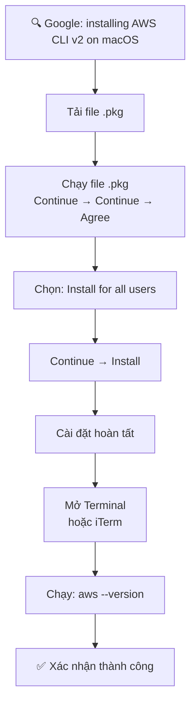

# 20. AWS CLI Setup on Mac OS X

## 🎯 Giới thiệu

Hướng dẫn cài đặt **AWS CLI Version 2** trên **macOS** sử dụng file `.pkg` (graphical installer).

---

## 1. ⚙️ Các bước cài đặt



---

## 2. 📝 Chi tiết

1. **Tìm kiếm:** Google "installing the AWS CLI version 2 on macOS"
2. **Tải file `.pkg`** từ trang chính thức AWS
3. **Chạy Installer:** Continue → Continue → Agree → Install for all users → Continue → Install
4. **Kiểm tra:**
   - Mở **Terminal** (hoặc **iTerm** — terminal miễn phí cho Mac)
   - Gõ: `aws --version`

### ✅ Kết quả mong đợi:
```
aws-cli/2.0.10 ...
```

---

## 📊 Bảng tóm tắt

| Thông tin | Chi tiết |
|-----------|----------|
| **OS** | macOS |
| **Phiên bản** | AWS CLI v2 |
| **Cách cài** | File `.pkg` (Graphical Installer) |
| **Terminal** | Terminal.app hoặc iTerm (miễn phí) |
| **Kiểm tra** | `aws --version` |

---

## ✅ Kết luận

Cài đặt AWS CLI trên macOS thông qua file `.pkg` rất trực quan với giao diện đồ họa. Sau khi cài, dùng Terminal hoặc iTerm để xác nhận bằng lệnh `aws --version`.
