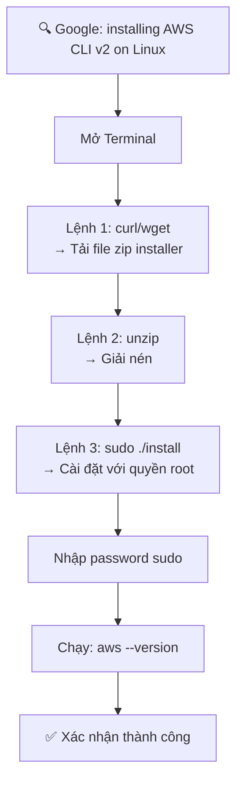

# 21. AWS CLI Setup on Linux

## 🎯 Giới thiệu

Hướng dẫn cài đặt **AWS CLI Version 2** trên **Linux** bằng 3 lệnh terminal.

---

## 1. ⚙️ Các bước cài đặt



---

## 2. 📝 Ba lệnh cài đặt

```bash
# Lệnh 1: Tải installer (zip file)
curl "https://awscli.amazonaws.com/awscli-exe-linux-x86_64.zip" -o "awscliv2.zip"

# Lệnh 2: Giải nén
unzip awscliv2.zip

# Lệnh 3: Cài đặt với quyền root
sudo ./aws/install
```

### ✅ Kiểm tra sau cài đặt:
```bash
aws --version
# Kết quả: AWS CLI/2.x.x Python/x.x.x Linux/xx botocore/x.x.x
```

---

## 3. 📌 Lưu ý

- Lệnh cài đặt dùng `sudo` → yêu cầu nhập **password** của user.
- Sau cài đặt có thể dùng `aws --version` hoặc `/usr/local/bin/aws --version`.
- Nếu gặp lỗi, đọc tài liệu chính thức trên trang AWS để troubleshoot.

---

## 📊 Bảng tóm tắt

| Thông tin | Chi tiết |
|-----------|----------|
| **OS** | Linux |
| **Phiên bản** | AWS CLI v2 |
| **Cách cài** | 3 lệnh terminal (curl/unzip/install) |
| **Quyền** | Cần `sudo` (quyền root) |
| **Kiểm tra** | `aws --version` |

---

## ✅ Kết luận

Cài đặt AWS CLI trên Linux thực hiện qua 3 lệnh: tải zip, giải nén, và cài đặt với `sudo`. Đây là cách đơn giản và nhanh chóng để có AWS CLI trên mọi bản phân phối Linux.
