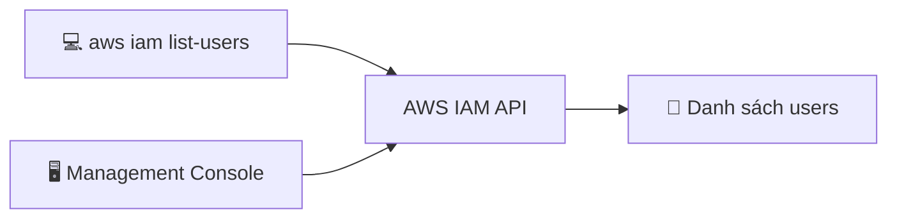

# 22. AWS CLI Hands On

## 🎯 Giới thiệu

Bài thực hành hướng dẫn tạo **Access Keys**, cấu hình **AWS CLI**, và thực thi lệnh CLI để truy cập AWS — đồng thời kiểm chứng rằng **quyền CLI = quyền IAM Console**.

---

## 1. 🔑 Tạo Access Keys

**Đường dẫn:** Click vào username → Security Credentials → Create Access Key

### Lưu ý khi tạo:
- AWS sẽ hỏi **mục đích sử dụng** và đưa ra khuyến nghị:
  - Dùng cho CLI → AWS khuyến nghị dùng **CloudShell** hoặc **IAM Identity Center** (an toàn hơn).
  - Tuy nhiên, để học và hiểu cơ bản → chọn "I understand..." và tiếp tục tạo.
- ⚠️ **Chỉ có thể xem Secret Access Key MỘT LẦN DUY NHẤT** ngay lúc tạo → lưu lại ngay!

---

## 2. ⚙️ Cấu hình AWS CLI

```bash
aws configure
```

Điền lần lượt:
```
AWS Access Key ID:     <dán Access Key ID vào>
AWS Secret Access Key: <dán Secret Access Key vào>
Default region name:   eu-west-1  (hoặc region của bạn)
Default output format: [Enter để bỏ qua]
```

💡 **Cách tìm region code:** Vào AWS Console → click dropdown region góc trên phải → thấy cả tên và code (ví dụ: `eu-west-1`).

---

## 3. 🖥️ Thực thi lệnh CLI

### Liệt kê users:
```bash
aws iam list-users
```

Kết quả trả về thông tin tương tự Management Console:
- `UserId`
- `UserName` (ví dụ: `stephane`)
- `ARN`
- `CreateDate`
- `PasswordLastUsed`



---

## 4. ⚠️ CLI và IAM Permissions hoàn toàn đồng bộ

- Xóa user `stephane` khỏi group `admin` → user mất quyền.
- Chạy lại `aws iam list-users` từ CLI → **bị từ chối (Access Denied)**.
- → Chứng minh: **CLI permissions = IAM Console permissions**.

---

## 5. 🔄 Khôi phục quyền

Sau khi demo, nhớ **thêm lại user vào group** để phục hồi quyền:
- IAM → Groups → Admins → Add users → Thêm `stephane`.

---

## 📊 Bảng tóm tắt

| Bước | Lệnh / Hành động |
|------|-----------------|
| Tạo Access Keys | Management Console → Security Credentials |
| Cấu hình CLI | `aws configure` |
| Kiểm tra users | `aws iam list-users` |
| Kết quả mong đợi | Danh sách users dạng JSON |

---

## 💡 Mẹo ghi nhớ cho kỳ thi AWS

- 📌 **Secret Access Key chỉ xem được 1 lần** → phải lưu ngay.
- 📌 **CLI và Console có cùng permissions** — không có quyền nào "đặc biệt" hơn.
- 📌 `aws configure` lưu credentials vào `~/.aws/credentials`.
- 📌 AWS khuyến nghị dùng **CloudShell** hoặc **IAM Identity Center** thay vì Access Keys cho CLI.

---

## ✅ Kết luận

Bài hands-on chứng minh CLI và Management Console là hai giao diện khác nhau cho cùng một hệ thống phân quyền IAM. Sau khi cấu hình `aws configure` với Access Keys, mọi lệnh CLI sẽ hoạt động với đúng quyền hạn mà IAM user đang có.
